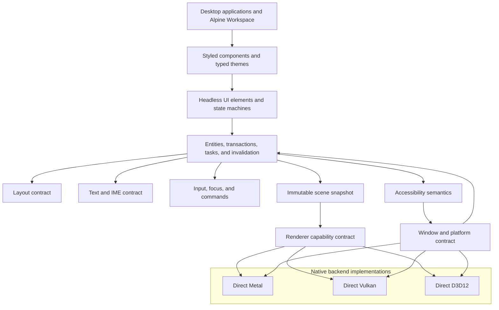
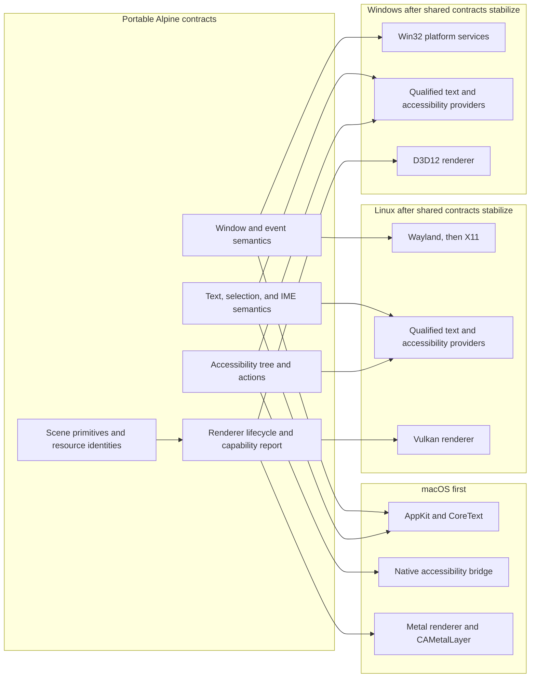
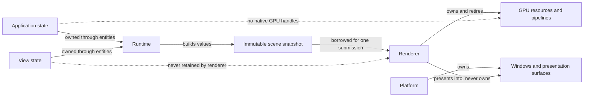
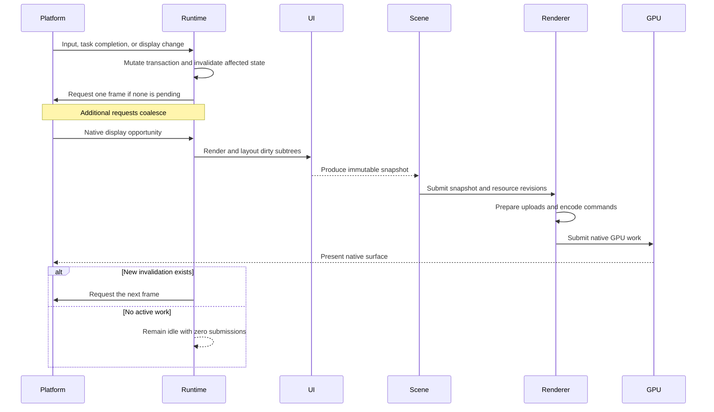
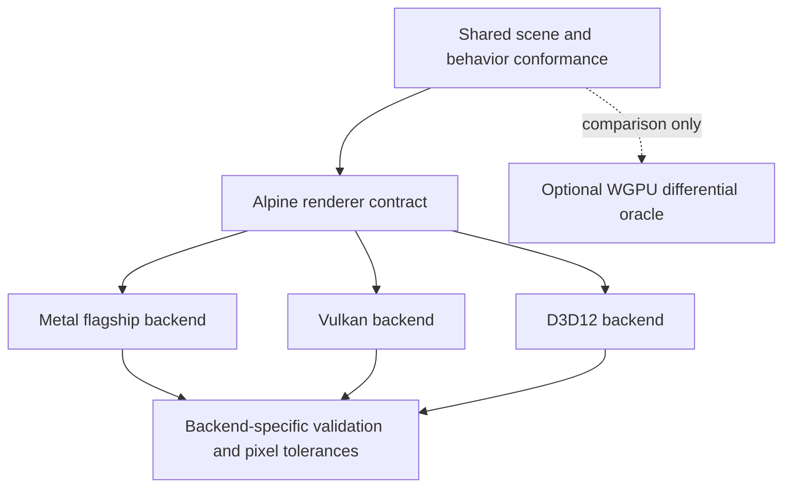

# Alpine GPUI Architecture

## Objective

Build a complete desktop application framework whose hot paths, resource
ownership, scheduling, native renderer, and platform integration are controlled
by this repository. The flagship target is Apple Silicon on macOS 15 or newer.

The framework must eventually support application state, views, layout, text,
input, accessibility, animation, windowing, rendering, diagnostics, and native
desktop services. Cross-platform support must not reduce Metal to the least
common denominator.

## Lineage and implementation boundary

Alpine's programming model is strongly inspired by the public architecture and
behavior of [Zed GPUI](https://github.com/zed-industries/zed/tree/1271f8b0e8f3278eed5dd3fc12ad4bd30dce2c5d/crates/gpui).
Entity-owned state, context-mediated mutation, hybrid immediate and retained UI
construction, element lifecycle phases, immutable renderer input, direct Metal,
headless testing, and virtualized workloads are the primary conceptual lineage.

Alpine independently specifies and implements those ideas. It does not inherit
Zed's workspace, API compatibility, release cadence, platform policy, or source
tree. GPUI-CE, `gpui-component`, WGPUI, the `gpui-wgpu` lineage, and Kael are
secondary specimens. Their permitted influence is recorded in the
[source map](docs/research/source-map.md), while actual copied or adapted source
would require an entry in the
[provenance ledger](docs/research/provenance-ledger.md).

## Product contract

- Optimize first for editors, terminals, database tools, and data-heavy
  productivity applications.
- Use familiar GPUI concepts without promising source compatibility.
- Use typed Rust styling and theme tokens without a CSS runtime.
- Adapt platform appearance and behavior while sharing portable semantics.
- Treat accessibility as part of every interactive component contract.
- Keep web, mobile, and Intel Macs outside the version 1 scope.
- Permit audited native bindings and standards-heavy Rust libraries behind
  Alpine-owned facades.
- Make embedded native GPU surfaces and custom materials first-class.

## Architectural shape

Portable semantics live above the scene boundary. Backend-specific capability
and performance decisions live below it.

## Contract and platform mapping

Shared contracts define observable behavior without erasing native capability.
Each platform implementation can specialize algorithms, resource formats, and
presentation while passing the same semantic conformance suite.

## Initial crates

### `alpine-core`

Typed geometry and color primitives. This crate has no allocator policy,
windowing, platform, or GPU dependencies.

### `alpine-scene`

The immutable renderer input protocol. It owns primitive ordering and scene
identity, but not GPU resources. A scene must be serializable into a diagnostic
form eventually, even if the optimized in-memory representation differs.

### `alpine-renderer`

Backend contracts and capability reports. Associated types keep the production
path monomorphized. The contract reports actual work, rather than hiding
allocation, upload, or submission costs.

## Planned crates

Crates are added only when a vertical slice needs the boundary. Empty
architecture crates are not created speculatively.

| Crate | Responsibility |
| --- | --- |
| `alpine-platform` | Portable event, display, clipboard, and window contracts |
| `alpine-macos` | AppKit, CoreText, accessibility, and presentation integration |
| `alpine-metal` | Metal devices, resources, pipelines, encoding, and readback |
| `alpine-runtime` | Entities, transactions, invalidation, tasks, and subscriptions |
| `alpine-layout` | Layout contract and measured provider boundary |
| `alpine-text` | Portable text semantics and platform shaping provider contract |
| `alpine-input` | Keyboard, pointer, IME, focus, command, and gesture semantics |
| `alpine-ui` | Headless elements, state machines, overlays, and accessibility |
| `alpine-components` | Typed themes and application-ready styled components |
| `alpine-test` | Deterministic runtime, scene, renderer, and platform harnesses |
| `alpine-lab` | Conformance stories and diagnostic workload application |
| `alpine-inspector` | Public-API diagnostics for frames, resources, and semantics |

## Planned ownership boundaries

| Layer | Owns | Must not own |
| --- | --- | --- |
| Core | Units, geometry, color | GPU handles, windows |
| Scene | Ordered primitives, clips, stable identity | Native objects, queues |
| Renderer | GPU resources, pipelines, uploads, submission | App state, event loops |
| Platform | Windows, events, displays, presentation clock | UI state, layout |
| Runtime | Entities, invalidation, tasks, subscriptions | Native GPU handles |
| Text | Shaping, fallback, glyph cache policy | Window event loop |
| UI | Elements, layout, focus, semantics | Backend-specific commands |
| Lab | Conformance scenes and diagnostics | Product-only behavior |

## Non-negotiable invariants

1. Rendering is demand-driven. An idle application does not redraw on every
   event-loop tick.
2. Scene construction and GPU submission are separately measurable.
3. Renderer input is immutable for the duration of submission.
4. A renderer cannot retain application or view objects.
5. Capabilities are queried at runtime and tested by behavior.
6. Device loss, allocation failure, and unsupported capabilities are errors,
   not process panics.
7. No cross-platform abstraction may prevent a Metal-specific fast path.
8. Safe crates contain no unsafe code. Native FFI is isolated behind reviewed
   safe APIs.
9. Steady-state rendering has explicit allocation and upload budgets.
10. Performance gates compare distributions on pinned hardware, not a single
    timing sample on an ephemeral runner.
11. Accessibility semantics exist before visual polish for an interactive
    component.
12. Public behavior is specified independently of any upstream implementation.

## Ownership and lifetime model

The principal safety boundary is the immutable scene snapshot. Application and
view objects remain runtime-owned. The renderer may retain only backend
resources addressed by stable scene identities, and the platform owns native
windows and presentation surfaces.

## Frame lifecycle

The scheduler owns frame coalescing. The renderer never requests continuous
redraw merely because a window exists.

## Backend strategy

- Metal is implemented first and directly.
- WGPU is permitted later as a development oracle or optional compatibility
  backend, never as the authority for Metal behavior.
- Vulkan and D3D12 receive direct backends after the scene and capability
  contracts have survived the Metal implementation.
- Shader source is backend-owned. MSL is permitted for Metal. A portable shader
  IR is a later decision and must not delay the direct Metal path.

## Dependency strategy

Owning the stack does not mean rewriting Unicode standards or native API
bindings. It means owning policy, scheduling, lifetime, and performance-critical
paths. Pure Rust standards libraries and generated FFI bindings may be adopted
behind narrow facades after review. See `docs/DEPENDENCIES.md`.
