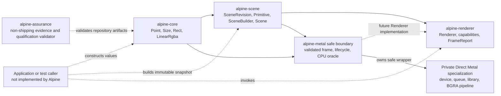
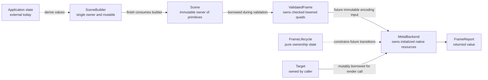
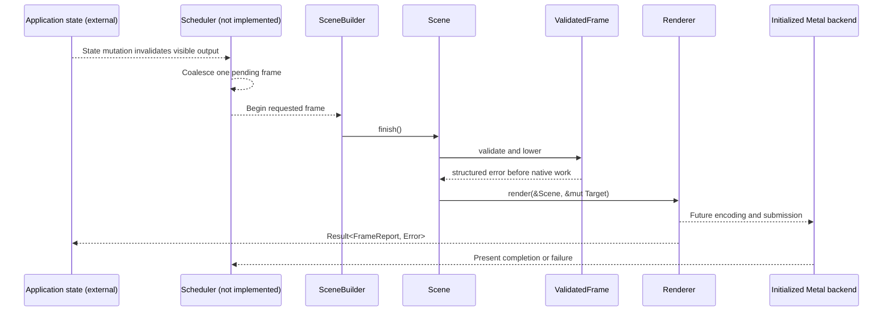
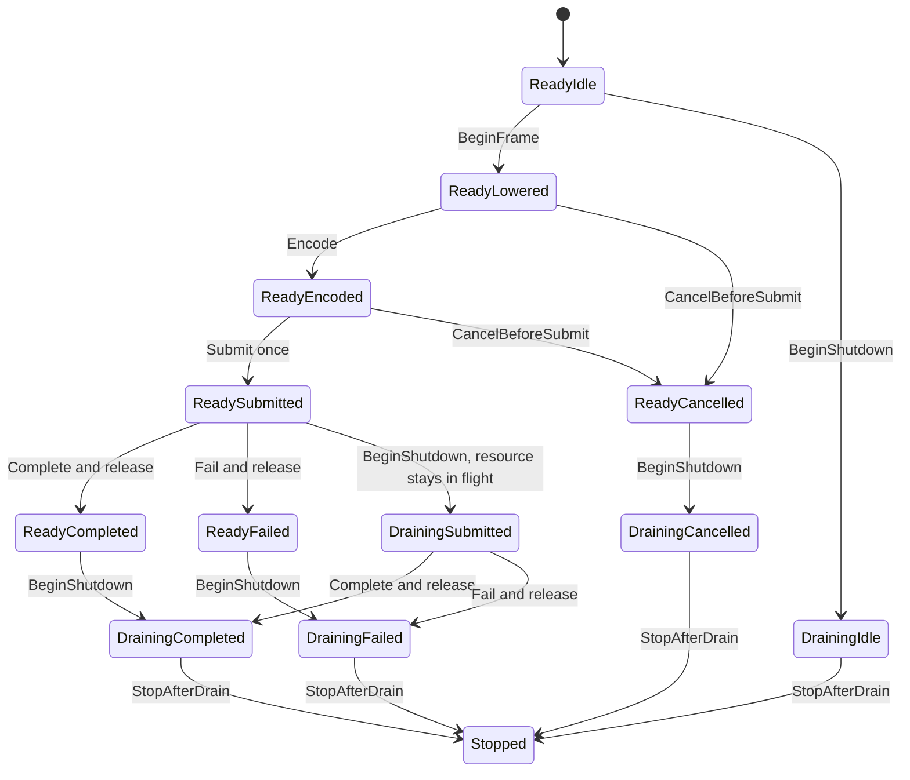
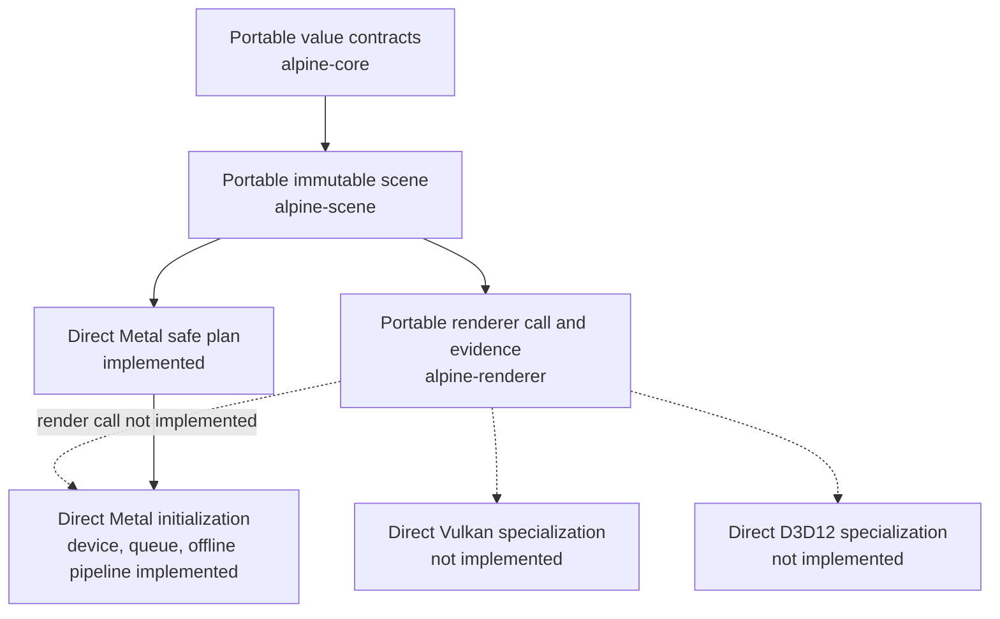
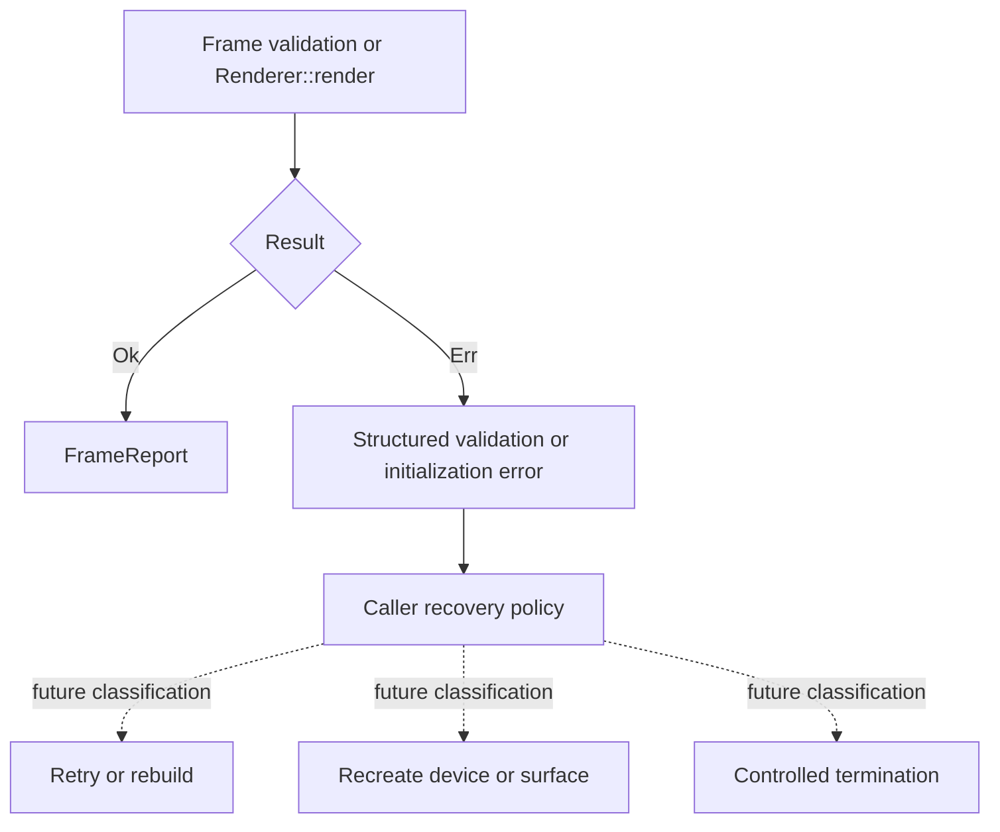
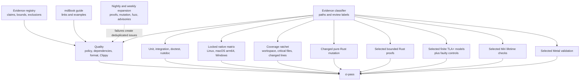

# Alpine GPUI Architecture

This document records implemented technical truth and binding invariants. Future
designs remain in linked GitHub issues until code makes them current.

## Implemented system

The workspace currently has four Rust shipping library crates. `alpine-core`,
`alpine-scene`, and `alpine-renderer` are fully safe and have no external
dependencies. `alpine-core` has no workspace dependencies.
`alpine-scene` depends on `alpine-core`, `alpine-renderer` depends on
`alpine-scene`, and `alpine-metal` depends on `alpine-core` and `alpine-scene`.
On Apple Silicon macOS only, `alpine-metal` uses narrowly featured, exact-version
`objc2`, `objc2-foundation`, `objc2-metal`, and `dispatch2` bindings. Other
targets neither compile nor link those dependencies.
The non-shipping `alpine-assurance` tool depends on audited `serde` and `toml`
crates to validate the evidence registry and versioned golden-workload
qualification manifests.

`alpine-core` uses private representations and validated constructors for
finite geometry, non-negative extents, rectangle intersection, and normalized
linear RGBA values. Read-only accessors preserve those invariants across crate
boundaries. `alpine-scene` freezes a
viewport, monotonically identified revision, and boxed painter-ordered primitive
slice. Its only primitive today is a solid axis-aligned quad.

`alpine-renderer` defines a monomorphized `Renderer` trait with backend-specific
`Target` and `Error` associated types. `render` borrows an immutable `Scene` and
mutable target, then returns a `FrameReport` containing submission, primitive,
draw-call, and upload counts. No implementation of that trait or shared
renderer error taxonomy exists yet.

`alpine-metal` validates a
non-empty BGRA8 offscreen descriptor, proves its logical viewport and rounded
physical extent agree, computes compact and 256-byte-aligned readback layouts,
clips and lowers all current solid quads in painter order, and accounts for
omitted primitives and upload bytes. Its deterministic CPU oracle samples pixel
centers and evaluates linear source-over composition into premultiplied BGRA8.
Its single-frame lifecycle is an executable transition system corresponding to
AEP 0025's finite TLA+ model. On Apple Silicon macOS, `MetalBackend::new`
creates the default device and one command queue, requires Metal 3 and unified
memory, loads an embedded offline library, resolves fixed vertex and fragment
entry points, and creates a premultiplied-source-over BGRA8Unorm pipeline. The
native objects remain private and live exactly as long as the safe backend.
Linux and Windows expose the same safe constructor but return a structured
unsupported-platform error without linking Apple frameworks. Command encoding,
submission, readback, and native pixels are not implemented yet.

## Ownership from state to submission

Application state and invalidation are outside the implemented workspace. The
current ownership boundary begins when a caller creates values and finishes a
`Scene`. Finishing transfers builder storage into an immutable snapshot. A
renderer may borrow that snapshot for one call but may not retain application
or view objects.

Binding ownership rules:

1. Renderer input is immutable for the duration of submission.
2. A renderer cannot retain application or view objects.
3. Native handles and GPU resources remain below the renderer boundary.
4. Scene values contain no native handles or backend-specific commands.
5. Scene construction and GPU submission remain separately measurable.

## Invalidation to present contract

There is no Alpine runtime, scheduler, native event loop, submission, or
presentation path yet. The solid nodes below are implemented. Dashed nodes mark
required future owners, not current capabilities.

Future scheduling must be demand-driven: no invalidation means no scene build,
submission, or present. Wakeups coalesce, and the renderer never creates a
continuous redraw loop merely because a window exists.

## Resource lifetime contract

The renderer trait deliberately leaves resource representation to each backend.
The Metal backend now retains one device, command queue, offline library, and
render-pipeline state. Initialization releases every partially created object on
failure through ordinary Rust drops. The production constructor rejects devices
without the Metal 3 family or unified memory. Hosted macOS runners currently
expose a paravirtual device that fails that baseline, so native CI first asserts
the production rejection and then uses a test-only route that bypasses only the
capability decision to validate real queue, library, function, and pipeline
operations. That route is not compiled into shipping artifacts and does not
qualify the virtual device as supported. There is no per-frame native resource,
cache, or eviction implementation. `FrameLifecycle` implements the accepted
synchronous single-frame state machine before command buffers and frame
resources exist.

Creation failure is returned, not panicked. Resources cannot be evicted or
destroyed while referenced by in-flight work. Steady-state allocation, upload,
retention, and eviction must be observable and bounded.

## Portable contracts and native specialization

Portable semantics stop at `Scene` and `Renderer`. Associated types prevent the
portable contract from dictating a target or error representation. A backend is
free to specialize formats, batching, atlases, synchronization, and
presentation while preserving observable behavior.

No portable abstraction may prevent a Metal-specific fast path. WGPU may be a
future differential oracle or optional compatibility backend, but it does not
define Metal behavior.

## Error and device-loss propagation

The renderer contract returns `Result<FrameReport, Renderer::Error>` directly
to the caller. `alpine-metal` now returns exhaustive `OffscreenError` values for
its pure descriptor, viewport, coordinate, byte-layout, capacity, and CPU-oracle
boundaries. Disabled lifecycle actions return `TransitionError` without partial
state mutation. `InitializationError` classifies unsupported platforms,
unavailable or unsupported devices, capability inspection, queue creation,
offline library loading, missing entry points, and pipeline creation. Native
error domain, code, and description values are copied into Alpine-owned memory.
Submission and device-loss classification are not implemented yet.

Future native errors must distinguish unsupported capability, transient surface
loss, device loss, and out-of-memory conditions without process panics. Recovery
must invalidate affected resources before another submission.

## Testing and evidence

Current unit tests cover valid and invalid values, rectangle intersection and
contact, color bounds, scene revision and painter order, empty scenes, checked
offscreen target and readback layouts, clipping and omission, CPU pixel-center
source-over semantics, deliberately reversed painter order, atomic lifecycle
rejection, and all terminal lifecycle paths. Initialization tests inject every
safe stage failure and assert exact release of partial state. Apple Silicon
tests create a real device, queue, library, and pipeline, then reject a corrupt
library and an absent shader entry point. They separately enforce the production
capability baseline so a hosted virtual GPU cannot be mistaken for qualified
physical hardware. Public integration tests exercise the safe offscreen
contract without crate-private access and reject Metal construction on portable
targets. The checked-in offline library is bound to its source, deployment
target, SDK, Xcode, and compiler identity by a strict manifest, SHA-256 checks,
a Metal-library magic check, and negative verifier fixtures. Kani proof harnesses
exhaust bounded geometry and color domains, complete `u16` readback extents, and
six arbitrary lifecycle actions against the Rust implementation. TLA+ models
check finite value-admission, assurance, qualification, and renderer-lifecycle
designs, including known-fault controls. The evidence registry maps atomic AEP
claims to qualified artifacts, bounds, assumptions, exclusions, and dynamic
companions. The repository
acceptance command validates policy and the registry, tests automation and core
contracts, then runs formatting, Clippy, all-target tests, doctests, and
rustdoc. mdBook builds the durable engineering guide as a private CI artifact.

Hosted CI classifies the changed paths and review labels, then runs the required
evidence fail-closed under one `ci-pass` result. Locked native tests always run
on Linux, Apple Silicon macOS, and Windows. Rust implementation changes add
shipping-crate coverage, changed-code mutation, and Kani as selected. The
non-shipping assurance tool has a separate coverage floor and fixture suite.
Unsafe and native Metal paths additionally select Miri or Metal API and Shader
Validation. The selected Metal job installs Xcode's optional Metal toolchain
when necessary, compiles the shader source offline, records toolchain and
artifact hashes, and tests initialization against that exact library. Unsafe
Rust is denied workspace-wide and permitted only in `alpine-metal`; its two
current uses are the CoreGraphics framework link declaration and checked access
to fixed color-attachment slot zero. Scheduled suites expand proofs, Miri,
dependency advisories, mutation, coverage, fuzzing when a target exists, and
Metal validation.

Tests must use the narrowest layer that proves the behavior. Renderer work will
require semantic scene checks, CPU geometry oracles, offscreen readback with
tolerances, lifecycle failure injection, and fixed-hardware distributions for
performance gates. Exact cross-GPU pixel hashes are not a sufficient oracle.
Coverage identifies unexercised code but does not prove correctness; mutation
tests whether assertions reject injected faults. Kani proves selected bounded
properties of Rust code. None of these substitutes for native driver behavior,
visual semantics, or qualified performance measurements.

The non-shipping golden-workload boundary implements
`alpine-scene-trace/v1`, `alpine-journey/v1`, and
`alpine-qualification/v1`. It validates immutable workload identity, ordered
operations and actions, comparison level, equivalence evidence, environment
identity, raw measurement references, assumptions, exclusions, and independent
hardware-window counts. Unsupported operations and measurement before
correctness fail closed. These manifests make no native or performance claim by
themselves, and no shipping crate depends on them.

## Binding invariants

1. Public behavior is specified independently of upstream implementations.
2. Safe crates deny unsafe code. The sole override is `alpine-metal`, where
   native FFI is isolated in one private module behind reviewed safe APIs,
   local safety arguments, and focused tests.
3. Capabilities are queried at runtime and verified by behavior.
4. Unsupported capability, allocation failure, surface loss, and device loss
   become structured errors rather than panics.
5. The committed lockfile is validated with `--locked`; CI never updates it.
6. Git dependencies are prohibited in shipping manifests.
7. Architecture boundaries are added only when an implemented vertical slice
   needs them.
8. Accessibility is part of every future interactive component contract.
9. Performance claims require reproducible evidence, and blocking regression
   gates require qualified fixed hardware.
10. Any architecture-changing pull request updates this document in the same
    change and links the accepted decision that authorized it.
