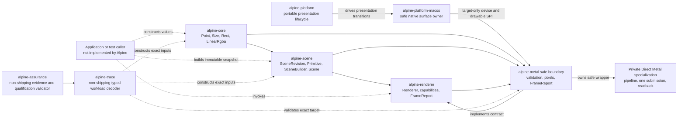
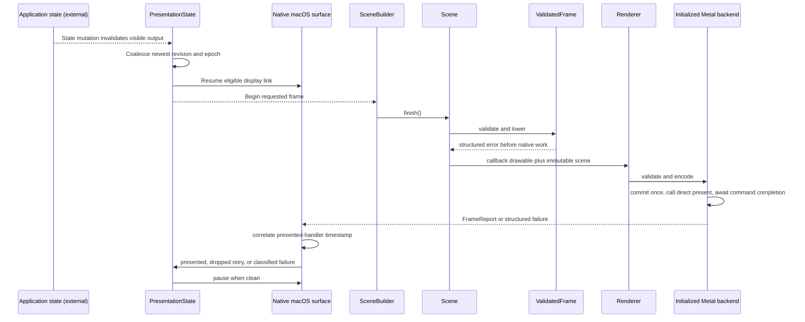
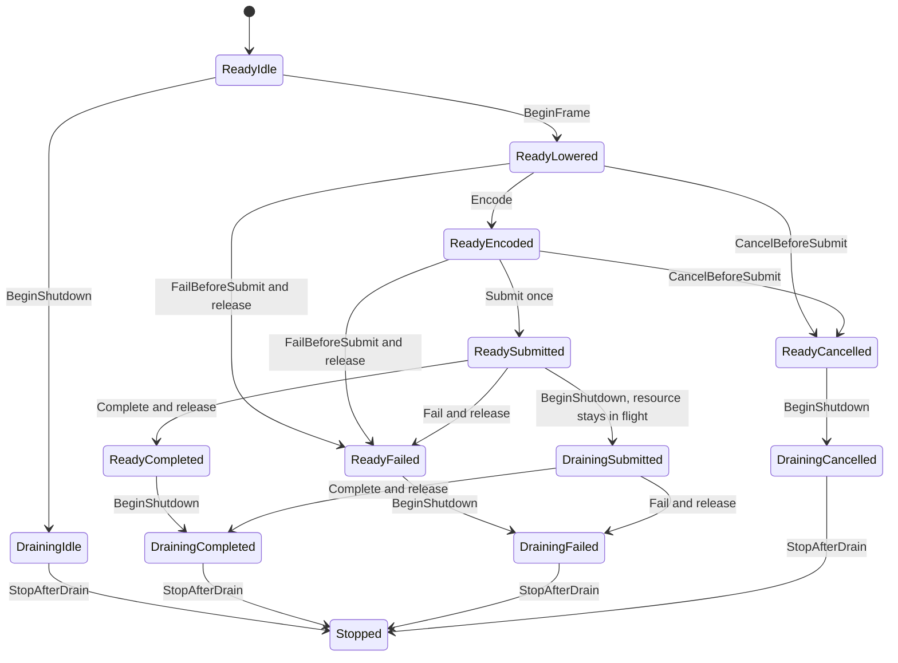
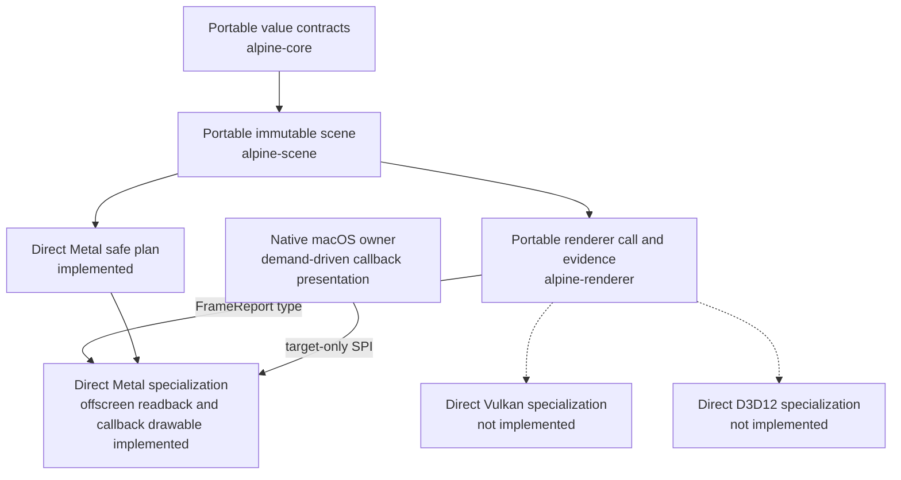
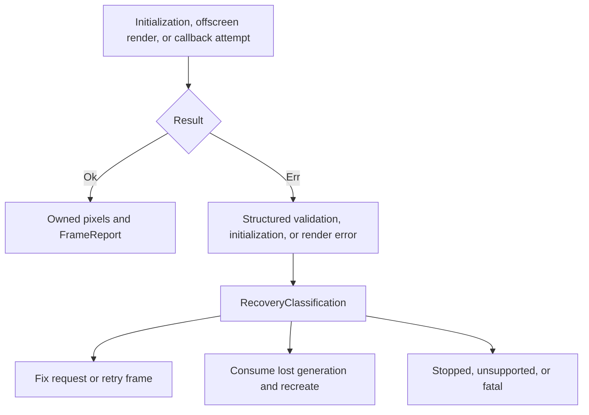
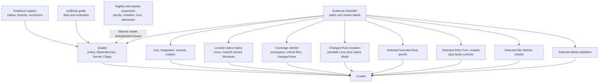

# Alpine GPUI Architecture

This document records implemented technical truth and binding invariants. Future
designs remain in linked GitHub issues until code makes them current.

## Implemented system

The workspace currently has six Rust shipping library crates. `alpine-core`,
`alpine-scene`, `alpine-renderer`, and `alpine-platform` are fully safe and have
no external dependencies. `alpine-core` has no workspace dependencies.
`alpine-scene` depends on `alpine-core`, `alpine-renderer` depends on
`alpine-scene`, `alpine-platform` is dependency-free, and `alpine-metal`
depends on the core, scene, and renderer crates.
On Apple Silicon macOS only, `alpine-metal` uses narrowly featured, exact-version
`objc2`, `objc2-foundation`, `objc2-metal`, and `dispatch2` bindings. Other
targets neither compile nor link those dependencies.
`alpine-platform-macos` depends on the portable platform, core, scene, and Metal
crates. On Apple Silicon macOS only, it uses narrowly featured, exact-version
`block2`, `objc2`, `objc2-app-kit`, `objc2-foundation`, `objc2-metal`, and
`objc2-quartz-core` bindings. Its safe application API exposes no native handle,
remains available on other targets, and returns a structured
unsupported-platform error without linking Apple frameworks.
The non-shipping `alpine-trace` crate depends only on Alpine workspace crates
and owns typed, fail-closed conversion from versioned workload values into an
immutable scene and exact offscreen target. The non-shipping
`alpine-assurance` tool depends on audited `serde` and `toml` crates to parse
repository manifests, validate the evidence registry and qualification state,
pass serialized trace values into `alpine-trace`, and validate versioned
renderer A/A calibration records. Calibration validation requires exact
workload and identical-revision identity, four or more distinct hardware
windows, twenty or more runs, balanced paired execution order, strict
separation of cold and warm samples, measurement stage and clock identity,
ordered window times, repository-normalized LF raw CSV structure, and
recomputed artifact SHA-256. Its deterministic integer report is descriptive
only and cannot establish an equivalence margin, sample size, confidence
interval, or performance claim.

`alpine-core` uses private representations and validated constructors for
finite geometry, non-negative extents, rectangle intersection, and normalized
linear RGBA values. Read-only accessors preserve those invariants across crate
boundaries. `alpine-scene` freezes a
viewport, monotonically identified revision, and boxed painter-ordered primitive
slice. Its only primitive today is a solid axis-aligned quad.

`alpine-renderer` defines a monomorphized `Renderer` trait with backend-specific
`Target` and `Error` associated types. `render` borrows an immutable `Scene` and
mutable target, then returns a `FrameReport` containing submission, primitive,
omission, draw-call, upload, allocation, retention, and readback counts.
`MetalBackend` is the first implementation. Its
portable `OffscreenTarget` owns only the descriptor and latest completed image;
all native resources remain private. A failed render clears any stale target
image before returning its structured `RenderError`.

`alpine-platform` is an allocation-free, `no_std` transition system for one
presentation surface. It owns monotonic invalidation revisions, surface epochs,
visibility and size eligibility, display-link intent, opaque frame tokens,
phase-to-resource ownership, command and direct-presentation counts, terminal
classification, and shutdown drain state. Disabled, stale, exhausted, or
token-mismatched actions restore the exact prior state and return structured
errors.

`alpine-platform-macos` now owns the first native object graph: the shared
`NSApplication`, one retained `NSWindow`, one custom `NSView`, one opaque
`CAMetalLayer`, one system Metal device, one retained display-link delegate,
and one `CAMetalDisplayLink` registered in the main run loop. Construction is
admitted only on the process main thread. The layer is framebuffer-only,
display synchronized, timeout-enabled, bounded to three drawables, and sized
from a validated logical extent and backing scale. The display link starts
paused, requests a two-frame render latency, resumes only for visible dirty
work, and pauses after the newest revision reaches a terminal result. The
native owner initializes the renderer from the exact device installed on the
layer, queues one immutable scene, and translates each admitted main-run-loop
callback into portable lifecycle actions. The Metal backend validates the
callback texture, commits one command buffer, and calls the drawable's direct
`present` method. A presented handler distinguishes a nonzero physical
presentation timestamp from a compositor-dropped frame. Dropped frames retain
or defer to the newest pending immutable scene and retry within a hard
600-callback bound aligned with the five-second native qualification window on
the primary 120 Hz target. Teardown first revokes callback admission, stops the
renderer, pauses and invalidates pacing, clears the weak delegate, and closes
the retained window. Native handles stay private. Resize, scale, occlusion,
qualified color, asynchronous GPU completion, and the shipping application
event loop remain unimplemented.

`alpine-metal` validates a
non-empty BGRA8 offscreen descriptor, proves its logical viewport and rounded
physical extent agree, computes compact and 256-byte-aligned readback layouts,
clips and lowers all current solid quads in painter order, and accounts for
omitted primitives and upload bytes. Its deterministic CPU oracle samples pixel
centers and evaluates linear source-over composition into premultiplied BGRA8.
Its single-frame lifecycle is an executable transition system corresponding to
AEP 0025's finite TLA+ model. On Apple Silicon macOS, `MetalBackend::new`
creates the default device and one command queue, requires Metal 3 and unified
memory, loads an embedded offline library, resolves fixed vertex and fragment
entry points, and creates a premultiplied-source-over BGRA8Unorm pipeline. The
native objects remain private and live exactly as long as the safe backend.
Linux and Windows expose the same safe constructor but return a structured
unsupported-platform error without linking Apple frameworks.
`MetalBackend::render_offscreen` validates a complete scene before native work,
allocates frame-local private texture, shared readback, and optional upload
resources, encodes one instanced quad draw and one texture-to-buffer blit in one
retained command buffer, commits once, and waits for terminal completion. Only
then does it remove row padding and return owned compact pixels plus a monotonic
`FrameReport`. Each accepted target is bounded by the Metal 3 guaranteed 16,384
pixel dimension. Every native attempt runs inside a frame-local Objective-C
autorelease pool; no native object escapes, while the owned image, copied error
data, and accounting report remain valid after the pool drains. Resource reuse
and asynchronous submission are not implemented.
Every render call updates a generation-scoped `BackendAccounting` snapshot.
Validated cancellation performs no native allocation or submission. Shutdown is
synchronous and closes admission only after the current exclusive call returns.
Upload and draw counters advance only after their corresponding native stage
succeeds, so cancellation and earlier failures cannot report planned work as
completed work.

## Ownership from state to submission

Application state remains outside the implemented workspace. Portable
invalidation and one-surface attempt ownership are implemented in
`alpine-platform`. Scene construction remains caller-owned. Finishing a
`SceneBuilder` transfers builder storage into an immutable snapshot. A renderer
may borrow that snapshot for one call but may not retain application or view
objects.

```mermaid
flowchart LR
    state["Application state<br/>external today"]
    presentation["PresentationState<br/>revision, epoch, token, pacing intent"]
    builder["SceneBuilder<br/>single owner and mutable"]
    snapshot["Scene<br/>immutable owner of primitives"]
    plan["ValidatedFrame<br/>owns checked lowered quads"]
    lifecycle["FrameLifecycle<br/>pure ownership state"]
    renderer["MetalBackend<br/>owns initialized native resources"]
    resources["Frame-local resources<br/>texture, upload, readback"]
    accounting["BackendAccounting<br/>terminal work and retained bytes"]
    result["OffscreenFrame<br/>owned pixels and FrameReport"]

    state -. "invalidate" .-> presentation
    state -. "derive values" .-> builder
    presentation -->|"correlates callback attempt"| lifecycle
    builder -->|"finish consumes builder"| snapshot
    snapshot -->|"borrowed during validation"| plan
    plan -->|"immutable encoding input"| renderer
    lifecycle -. "constrains transitions" .-> renderer
    renderer -->|"owns until terminal completion"| resources
    resources -->|"records allocation and one release"| accounting
    resources -->|"padding removed after wait"| result
```

Binding ownership rules:

1. Renderer input is immutable for the duration of submission.
2. A renderer cannot retain application or view objects.
3. Native handles and GPU resources remain below the renderer boundary.
4. Scene values contain no native handles or backend-specific commands.
5. Scene construction and GPU submission remain separately measurable.

## Invalidation to present contract

There is no Alpine application runtime yet, but one native surface now connects
portable invalidation through a callback-provided drawable to Direct Metal and
observed presentation. Scene construction remains caller-owned. The solid
messages below are implemented; application-state mutation remains an external
caller responsibility.

The portable contract is demand-driven: no clean or ineligible surface can
prepare a frame, and clean idle state requires paused pacing. The native surface
enacts resume, pause, and invalidate directives without introducing a
continuous redraw loop merely because a window exists. A compositor drop is
observable and triggers a bounded retry without overwriting a newer coalesced
scene.

Native surface construction uses a staged owner. Every acquired application,
device, renderer, window, view, layer, delegate, and display-link owner remains
inside that owner until construction commits. Dropping an incomplete owner first
revokes callback admission, pauses and invalidates any display link, clears its
delegate, orders out and closes any window, and only then releases retained
objects. A validation-only configuration injects failure after every stage and
tracks each Alpine acquisition and release. The instrumentation and injection
entry point are absent from shipping builds.

## Resource lifetime contract

The renderer trait deliberately leaves resource representation to each backend.
The Metal backend now retains one device, command queue, offline library, and
render-pipeline state. Initialization releases every partially created object on
failure through ordinary Rust drops. The production constructor rejects devices
without the Metal 3 family or unified memory. Hosted macOS runners currently
expose a paravirtual device that fails that baseline, so native CI first asserts
the production rejection and then uses a test-only route that bypasses only the
capability decision to validate real queue, library, function, and pipeline
operations. That route is not compiled into shipping artifacts and does not
qualify the virtual device as supported. Each synchronous render owns one
private texture, one shared readback buffer, an optional immutable upload
buffer, one retained command buffer, and its encoders until terminal completion.
The callback path instead borrows the layer-owned drawable texture, allocates
only an optional upload buffer, retains the callback drawable until its
presented handler fires, and accounts the drawable's native allocation as
retained but not Alpine-allocated bytes. The same exact layer device owns the
renderer queue and pipeline. Every attempt commits and calls direct presentation
at most once. A skipped drawable is released before a replacement attempt
acquires another callback drawable.
No resource is reused or exposed while in flight. Frame-local resources then
drop exactly once. Native `allocatedSize` and buffer length values populate the
frame report; cumulative accounting must return to zero current retention at
every synchronous API boundary. A test-only owner probe independently checks
one acquisition and one release across partial allocation, encoder, command,
terminal failure, cancellation, shutdown, and repeated-frame paths. There is no
cache or eviction implementation.
`FrameLifecycle` is the executable pure-Rust counterpart of this accepted
single-frame protocol.

Creation failure is returned, not panicked. Resources cannot be evicted or
destroyed while referenced by in-flight work. Steady-state allocation, upload,
retention, and eviction must be observable and bounded.

## Portable contracts and native specialization

Portable semantics stop at `Scene` and `Renderer`. Associated types prevent the
portable contract from dictating a target or error representation. A backend is
free to specialize formats, batching, atlases, synchronization, and
presentation while preserving observable behavior.

No portable abstraction may prevent a Metal-specific fast path. WGPU may be a
future differential oracle or optional compatibility backend, but it does not
define Metal behavior.

## Error and device-loss propagation

The renderer contract returns `Result<FrameReport, Renderer::Error>` directly
to the caller. `alpine-metal` now returns exhaustive `OffscreenError` values for
its pure descriptor, viewport, coordinate, byte-layout, capacity, and CPU-oracle
boundaries. Disabled lifecycle actions return `TransitionError` without partial
state mutation. `InitializationError` classifies unsupported platforms,
unavailable or unsupported devices, capability inspection, queue creation,
offline library loading, missing entry points, and pipeline creation. Native
error domain, code, and description values are copied into Alpine-owned memory.
`RenderError` separately classifies pure validation, unsupported targets,
submission-sequence exhaustion, texture limits, allocation stages, missing
encoders, terminal command failures, unexpected statuses, and readback length
or allocation failures. A committed failure increments observable submission
count but never returns pixels or a success report. Every error exposes a stable
recovery classification. Documented Metal command-domain codes distinguish
retryable memory pressure, unsupported access, fatal inconsistency, and device
loss. Device removal or access revocation invalidates the current backend
generation; later work is rejected until the owner consumes it through guarded
recovery into the next generation. Explicit shutdown similarly rejects later
work without hidden native activity. If cumulative accounting cannot represent
an already committed attempt, the backend stops admission so an unrecorded
submission sequence cannot continue.

Native surface descriptor, unsupported-platform, main-thread, device,
renderer-initialization, drawable validation, portable transition, presentation
correlation, driver, and bounded-retry errors are structured independently.
Callback failures are stored for the application to remove, increment terminal
failure evidence, restore active portable ownership, and pause pacing. A
dropped drawable is not reported as presented; it increments a separate counter
and retries the newest available immutable scene. This does not weaken the
current device-loss generation boundary.

## Testing and evidence

Current unit tests cover valid and invalid values, rectangle intersection and
contact, color bounds, scene revision and painter order, empty scenes, checked
offscreen target and readback layouts, clipping and omission, CPU pixel-center
source-over semantics, deliberately reversed painter order, atomic lifecycle
rejection, and all terminal lifecycle paths. Initialization tests inject every
safe stage failure and assert exact release of partial state. Apple Silicon
tests create a real device, queue, library, and pipeline, then reject a corrupt
library and an absent shader entry point. They separately enforce the production
capability baseline so a hosted virtual GPU cannot be mistaken for qualified
physical hardware. Native rendering fixtures cover clear-only output, clipping,
coverage edges, painter order, translucent overlap, aligned padding removal,
two sequential submission identifiers, validation before submission, and the
Metal 3 texture limit. GPU bytes agree with the independent CPU oracle within
one channel value, while a deliberately disabled-blend control is detected.
Native fault controls cover each allocation, encoder, command, unexpected
status, readback mismatch, memory-pressure, permission, and device-loss class.
A 512-frame validation soak requires constant per-frame retained accounting,
balanced cumulative totals, and zero active owner probes after every return.
After 4,096 warmup frames, the isolated native memory soak records process
resident bytes every 16 frames across a 256-frame measurement window. Those
samples permit a bounded eight-sample allocator-settlement window, then require
a nine-sample plateau within one host virtual-memory page. Negative controls
reject excessive settlement and continued late growth. This distinguishes a
one-time allocator step from retention without claiming a qualified performance
budget. The RSS probe itself is primed before warmup so its lazy measurement
allocation cannot contaminate the renderer baseline. Metal API and shader
validation cover the full suite first;
the process-memory sample then runs without validation-layer instrumentation so
debug allocations cannot be mistaken for shipping renderer retention. Exact
Alpine-owned retention remains the primary leak invariant.
Public integration tests exercise the safe offscreen contract without
crate-private access, render through the production constructor on supported
Apple Silicon, and reject Metal construction on portable targets. The checked-in
offline library is bound to its source, deployment
target, SDK, Xcode, and compiler identity by a strict manifest, SHA-256 checks,
a Metal-library magic check, and negative verifier fixtures. Kani proof harnesses
exhaust bounded geometry and color domains, complete `u16` readback extents, and
six arbitrary lifecycle actions plus symbolic frame-accounting updates against
the Rust implementation. The trace decoder additionally proves two-operation
painter-order and value preservation over bounded symbolic colors and extents,
plus fail-closed rejection of noncontiguous indices. TLA+ models
check finite value-admission, assurance, qualification, and renderer-lifecycle
designs, including known-fault controls. The evidence registry maps atomic AEP
claims to qualified artifacts, bounds, assumptions, exclusions, and dynamic
companions. Calibration fixtures exercise exact artifact identity, environment
qualification, minimum window and run counts, paired-order balance, and stable
fail-closed diagnostics. The boundary also binds sample class, warmup count,
measurement stage, clock, and window times while identifying fixtures as
synthetic and making no
hardware or performance claim. The repository
acceptance command validates policy and the registry, tests automation and core
contracts, then runs formatting, Clippy, all-target tests, doctests, and
rustdoc. mdBook builds the durable engineering guide as a downloadable CI
artifact.
The macOS platform crate separately tests all descriptor boundaries and runs
three harness-free integration executables on the process main thread. The
surface smoke test creates the complete native object graph, verifies layer
policy and paused pacing, then deterministically tears it down. The rollback
test injects every native initialization checkpoint and requires exact
per-owner release, callback revocation, display-link invalidation, window close,
and a closed lifecycle before each error returns. The presentation test runs an
active AppKit event loop, submits a deterministic solid-quad scene through the
callback drawable, observes a nonzero presented timestamp, exposes and retries
any compositor drops, then injects a pre-submit viewport failure and proves a
later valid revision recovers. It requires commit and direct-present counts to
match exactly and pacing to return to paused. Qualified color, resize, scale,
occlusion, leak, and soak evidence remain unimplemented.
On a hosted macOS runner without a qualifying display, the same executable uses
an explicit direct-presentation evidence mode: every admitted drawable must
complete GPU work and receive one direct present call, every completed native
handler must report a drop, and the single-frame owner permits at most one
drawable still in flight at the bounded cutoff. That mode cannot qualify a
displayed frame, recovery sequence, idle pause, or physical presentation time.

Hosted CI classifies the changed paths and review labels, then runs the required
evidence fail-closed under one `ci-pass` result. Locked native tests always run
on Linux, Apple Silicon macOS, and Windows. Rust implementation changes add
shipping-crate coverage, changed-code mutation, and Kani as selected. Portable
mutation runs on Linux, while changed Direct Metal native code receives a
second mutation pass on Apple Silicon macOS with the native tests and Metal
driver available. The
non-shipping assurance tool has a separate coverage floor and fixture suite.
Unsafe and native Metal paths additionally select Miri or native macOS and
Metal validation. The selected native job installs Xcode's optional Metal toolchain
when necessary, compiles the shader source offline, records toolchain and
artifact hashes, tests initialization and readback against that exact library,
and mutation-tests changed native platform code. Unsafe Rust is denied
workspace-wide and permitted only in the private native modules of
`alpine-metal` and `alpine-platform-macos`. Their boundaries cover checked Metal
resource binding, draw, blit, post-completion shared-buffer access, Objective-C
delegate conformance, AppKit construction, and run-loop registration. Every use
has a local safety argument and native validation coverage. Scheduled suites expand
proofs, Miri, dependency advisories, mutation, coverage, fuzzing when a target
exists, and Metal validation.

Tests must use the narrowest layer that proves the behavior. Renderer work will
require semantic scene checks, CPU geometry oracles, offscreen readback with
tolerances, lifecycle failure injection, and fixed-hardware distributions for
performance gates. Exact cross-GPU pixel hashes are not a sufficient oracle.
Coverage identifies unexercised code but does not prove correctness; mutation
tests whether assertions reject injected faults. Kani proves selected bounded
properties of Rust code. None of these substitutes for native driver behavior,
visual semantics, or qualified performance measurements.

The non-shipping golden-workload boundary implements
`alpine-scene-trace/v1`, `alpine-journey/v1`, and
`alpine-qualification/v1`. It validates immutable workload identity, ordered
operations and actions, comparison level, equivalence evidence, environment
identity, raw measurement references, assumptions, exclusions, and independent
hardware-window counts. A concrete `alpine-scene-trace/v1` solid quad carries
logical and physical viewport identity, scale, clear color, full-viewport clip,
geometry, linear color, and contiguous painter-order sequence. `alpine-trace`
decodes that data into `Scene` and `OffscreenDescriptor`; any unsupported clip,
operation, invalid value, target mismatch, or capacity excess fails. The
assurance CLI can render deterministic compact BGRA8 through the CPU oracle or
the production Direct Metal constructor. Unsupported operations and measurement
before correctness fail closed. A render command invalidates its requested
output before validation so rejected work cannot leave stale evidence behind.
These manifests make no performance claim by themselves. The separate
`alpine-aa-calibration/v1` boundary admits only identical-revision A/A evidence
with verified raw samples and qualified environments; its report remains
non-inferential until physical data supports a later statistical decision. No
shipping crate depends on either boundary.

## Binding invariants

1. Public behavior is specified independently of upstream implementations.
2. Safe crates deny unsafe code. The only overrides are `alpine-metal` and
   `alpine-platform-macos`, where native FFI is isolated in one private module
   per crate behind reviewed safe APIs, local safety arguments, and focused
   tests.
3. Capabilities are queried at runtime and verified by behavior.
4. Unsupported capability, allocation failure, surface loss, and device loss
   become structured errors rather than panics.
5. The committed lockfile is validated with `--locked`; CI never updates it.
6. Git dependencies are prohibited in shipping manifests.
7. Architecture boundaries are added only when an implemented vertical slice
   needs them.
8. Accessibility is part of every future interactive component contract.
9. Performance claims require reproducible evidence, and blocking regression
   gates require qualified fixed hardware.
10. Any architecture-changing pull request updates this document in the same
    change and links the accepted decision that authorized it.
