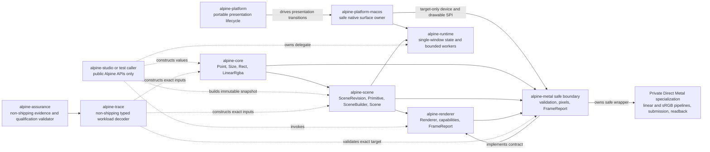
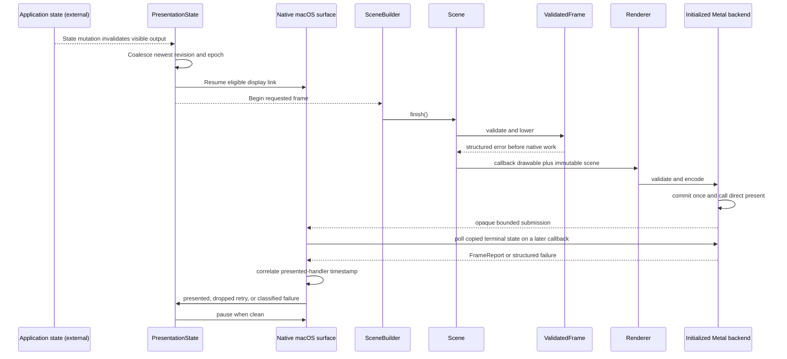
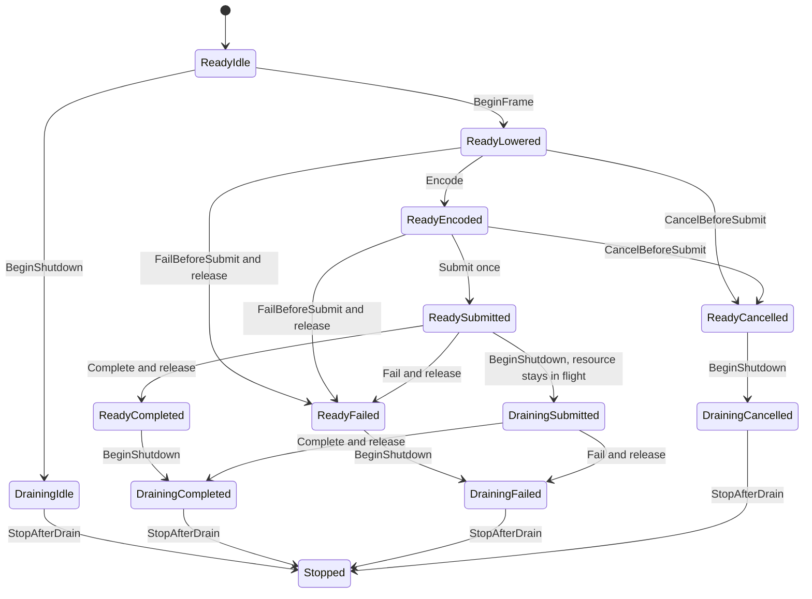
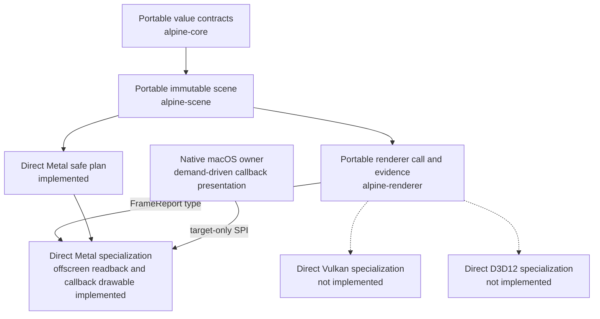
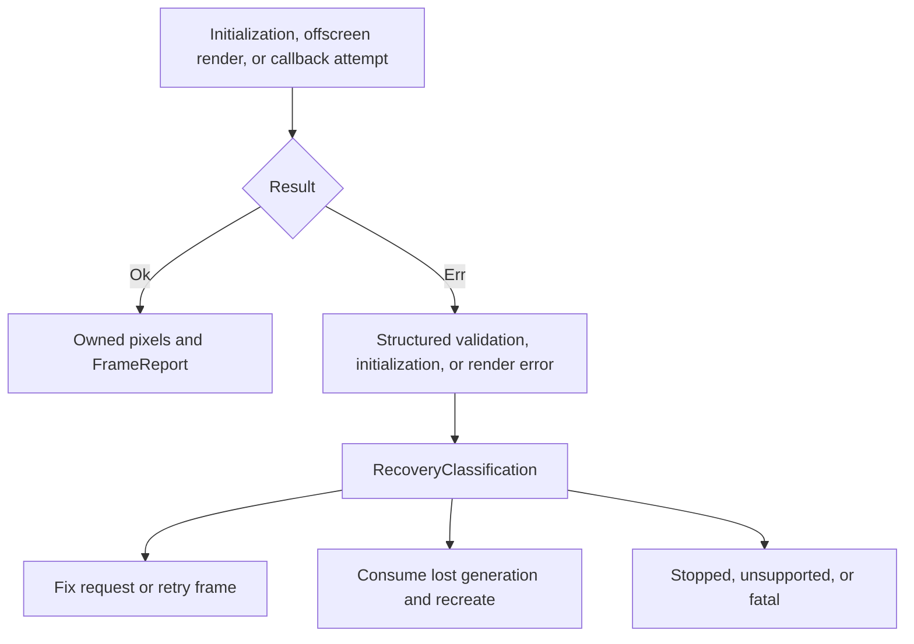
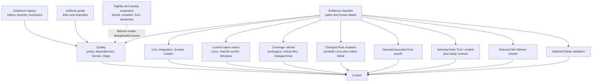

# Alpine GPUI Architecture

This document records implemented technical truth and binding invariants. Future
designs remain in linked GitHub issues until code makes them current.

## Implemented system

The workspace currently has eight Rust shipping library crates and one shipping
application crate. `alpine-core`,
`alpine-scene`, `alpine-renderer`, and `alpine-platform` are fully safe and have
no external dependencies. `alpine-core` has no workspace dependencies.
`alpine-scene` depends on `alpine-core`, `alpine-renderer` depends on
`alpine-scene`, `alpine-platform` is dependency-free, and `alpine-metal`
depends on the core, scene, and renderer crates.
On Apple Silicon macOS only, `alpine-metal` uses narrowly featured, exact-version
`block2`, `objc2`, `objc2-foundation`, `objc2-metal`, and `dispatch2` bindings. Other
targets neither compile nor link those dependencies.
`alpine-platform-macos` depends on the portable platform, core, scene, and Metal
crates. On Apple Silicon macOS only, it uses narrowly featured, exact-version
`block2`, `objc2`, `objc2-app-kit`, `objc2-foundation`, `objc2-metal`, and
`objc2-quartz-core` bindings. The same target uses the exact-version,
narrowly featured `objc2-core-graphics` binding to own a standard sRGB color
space. Its safe application API exposes no native handle,
remains available on other targets, and returns a structured
unsupported-platform error without linking Apple frameworks.
`alpine-text` owns the local-only text domain behind safe Alpine values. It
uses exact-version, default-feature-minimized Ropey and Unicode Segmentation
dependencies selected by [Decision #139](https://github.com/dbuddha/alpine-gpui/issues/139)
after Crop 0.4.3 failed the accepted nested-slice and UTF-16 boundary corpus.
Canonical coordinates are UTF-8 byte offsets. Every rope conversion is checked
for bounds and byte-to-character round-trip identity before mutation. Immutable
snapshots are copy-on-write, transactions are revision-bound and atomic,
selection transformation and undo/redo are deterministic, and retained history
has explicit entry and changed-byte ceilings. Global AppKit UTF-16, line-local
LSP UTF-16, line-column, and grapheme conversions return structured errors for
ambiguous boundaries. The one-file `Editor` fingerprints accepted disk bytes,
detects external replacement or deletion, and uses same-directory synchronized
temporary files plus atomic replacement on the v1 Unix platform family. It owns
no collaboration, replica, remote-operation, language-service, plugin, AI, or
native state.
`alpine-text-layout` is a safe portable boundary over immutable text snapshots.
It maps one fixed-height viewport to visible lines plus bounded overscan, owns
current-frame and previous-frame copied line layouts, confirms every streaming
fingerprint candidate with exact rope-range equality, and materializes text only
on a shaping miss. The combined layout payload and owned vector-capacity
metadata have a configurable hard ceiling, with 32 MiB as the default. Its A8
glyph atlas starts empty, grows geometrically, reserves metadata before
ownership mutation, removes least-recently-used entries, coalesces returned
rectangles, exposes exact pixel and metadata capacity, defaults to a 16 MiB hard
ceiling, and releases all storage under explicit pressure. Its audited Apple
Silicon boundary shapes and rasterizes through CoreText and CoreGraphics while
returning copied Alpine values. `alpine-scene` stores clips, quads, glyphs, and
ordered paint operations in separate immutable arrays, and the Metal path
samples the scene-owned A8 atlas without exposing native handles.
`alpine-runtime` depends on core, scene, and the safe cross-target
`alpine-platform-macos` facade. It owns one foreground application delegate,
monotonic workspace and document revisions, dirty-only scene construction, and
fixed standard worker threads connected by bounded request and result channels.
Worker results carry workspace, document, and process-local sequence identity;
stale worker results are rejected before delegate mutation. Independent local
sources use a separate fixed-capacity, byte-accounted producer queue and carry
application-owned identity for exact delegate admission across revisions. Both
sources share bounded fair foreground draining and coalesced run-loop wake, while
only the delegate can invalidate a frame. The runtime exposes no native handle
and adds no general async executor, timer poller, or reactive graph.
`alpine-studio` privately depends on exact-version, default-feature-disabled
`ignore` 0.4.33 for project-local recursive traversal. It uses only the serial
walker, disables global and parent ignore state, includes hidden paths except
`.git`, never follows symlinks, and exposes no dependency type outside the
application crate.
`alpine-studio` is the first shipping application. It owns exactly one local
document as either an unbound scratch `Buffer` or a path-bound `Editor`, plus
primary selection, IME composition, viewport state, two-frame layout cache, and
a hard-budgeted glyph atlas, as accepted by
[Decision #146](https://github.com/dbuddha/alpine-gpui/issues/146). One optional
process argument opens and validates
an existing UTF-8 file before native construction. Command-S reuses the
editor's conflict-aware atomic replacement and records structured save evidence
without changing document revision; scratch save is a deterministic no-op. Its
`AppDelegate` maps native events to checked local edits and builds only visible
text plus bounded overscan when dirty.

Studio privately compiles line-local syntax presentation for Rust, Markdown,
TOML, and JSON with plain text as the deterministic fallback. Syntax work is
admitted only for lines already selected by visible-range layout, stores ordered
UTF-16 spans for direct projection onto shaped glyph source positions, and
reuses exact current-frame or previous-frame content after fingerprint
confirmation. The cache has a 4 MiB logical metadata and span ceiling, each
line scans at most 64 KiB and retains at most 1,024 spans, and oversized or
over-complex lines degrade to unstyled text. This initial compiled lexer adds no
runtime grammar loading, plugin boundary, background work, dependency, native
handle, or syntax authority outside Alpine Studio.

Studio also owns a private local language-server process boundary under
Requirement #34 and Task #128. Construction canonicalizes one explicit local
executable and optional working directory, bounds argument count and bytes, and
never performs network or extension discovery. One fixed supervisor owns one
child plus dedicated standard threads for stdin, stdout, and stderr so foreground
submission never waits on process I/O. Control, input, output, write-result, and
foreground-event queues have fixed capacities. Input and copied output share a
16 MiB retained-payload ceiling, output is read in 64 KiB chunks, and overflow
terminates the affected child rather than growing or blocking rendering.
Workspace identity, process generation, epoch, and input sequence classify every
event; restart advances the epoch and stale events are discarded before a future
protocol layer can mutate editor state. Shutdown kills and waits for the child,
closes its pipes, joins every helper, and releases queued payloads. This slice
does not decode JSON-RPC, launch during startup, mutate Studio state, expose a
public API, or add a dependency, network client, plugin host, or async runtime.

Studio also owns the dependency-free byte-framing boundary for that local
Language Server Protocol path. It incrementally accepts ASCII headers and
byte-counted bodies, requires exactly one bounded `Content-Length`, accepts only
the specified UTF-8 JSON-RPC content type, and poisons the stream after malformed,
unsupported, oversized, allocation-failed, or truncated input. One header retains
at most 8 KiB, one message at most 16 MiB, and one admission returns at most 32
frames and 16 MiB of bodies. Fragmented and pipelined reads preserve exact bytes
and monotonic frame identity while current and peak buffer accounting remains
observable. This slice decodes no JSON and creates no language-service state
before the separately approved parser and revision-admission slices consume it.

Studio owns a private JSON-RPC peer core and pinned local-server compatibility
path under Tasks #205 and #208 and Research #204. An Alpine envelope visitor
rejects duplicate critical fields,
unsupported IDs, batches, invalid response shapes, wrong protocol versions,
excess depth, excess structural items, and excess raw string bytes before any
message can reach application state. One peer admits at most 64 monotonically
identified pending requests and accounts its exact retained vector and method
storage. Initialize, initialized, cancellation, shutdown, and exit are explicit
states; cancellation removes local admission, and a complete workspace and
document revision stamp is compared before a response is exposed. Outbound
messages are framed directly for the existing bounded process owner. A
checksum-pinned Apple Silicon rust-analyzer fixture qualifies initialize,
document open, bounded diagnostics, cancellation, stale rejection, restart, and
shutdown without adding discovery, download, network, or startup work.

Task #210 composes that path into one active Rust document. Studio sends a full
document `didOpen` and revision-monotonic whole-document incremental `didChange`
replacements matching rust-analyzer's declared synchronization capability, admits
diagnostics only for the exact workspace, document, buffer, selection, process
generation, process epoch, URI, and LSP document version, and clears prior
diagnostics before a newer edit can paint. Each foreground turn polls at most
eight process events, each frame projects at most 256 visible quad underlines,
and diagnostic payloads retain at most the existing 256 KiB language boundary.
Process callbacks publish one latest-generation wake through the runtime's
bounded external producer. A lock-free foreground latch preserves that wake if
shared result admission is temporarily saturated; unrelated current work then
recovers polling without a timer, blocking wait, idle redraw, or duplicate
document owner. Missing or failed servers leave editing and saving available and
surface only bounded local status.

Task #218 adds one private completion owner to that same active Rust session.
An explicit request captures workspace, document, buffer, selection, process,
request, URI, and LSP-version identity. Supersession cancels and locally revokes
the prior request; a bounded cancelled-ID tombstone classifies late responses
without allowing them to clear a newer admitted list. One response retains at
most 64 items and 256 KiB across labels, documentation, and edits, while frames
project at most eight rows. Plain and insert-replace edits map through checked
line-local UTF-16 coordinates and apply as one revision-bound undoable
transaction. Snippets, nonempty additional edits, ambiguous ranges, malformed
or oversized results, and queue saturation fail visibly without mutating the
document. Focus loss, editor change, restart, and shutdown release pending and
admitted completion state. The keyboard and accessibility dialog reuse the
dirty-only frame path, so one admitted result creates no subsequent idle frame.

Production typography uses the safe
CoreText service; deterministic test typography proves portable editor behavior
without claiming native validation. It runs through one `Application` until the
owned AppKit window closes and has no native handles, collaboration state,
extension host, telemetry, AI, or general async runtime.

One optional process path now admits either the existing direct-file journey or
one canonical local folder. Production folder admission owns only the canonical
root and performs no directory enumeration before the first frame. The fixed
sidebar activates explicitly and submits one immediate-directory request on the
existing serial bounded worker. Each request inspects at most 16,384 entries,
retains at most 4,096 children and 1 MiB of path bytes, and never recurses.
The private cache retains at most 4,096 directory nodes, 65,536 entries, 8 MiB
of path bytes, 4 KiB per path, and 256 path components. Project-local ignore
rules are evaluated from root to the requested directory, hidden paths remain
eligible, `.git` is omitted, and symlinks are never traversed. Workspace, tree,
directory, and request generations reject stale publication. Prefix row counts
project at most 512 rows including three-row overscan without flattening the
complete project. A selected file is revalidated component by component under
the canonical root before the existing `Editor` opens it. Failures preserve the
current document and paint local status. File replacement advances a
Studio-owned monotonic document identity before runtime publication.

Studio also owns one bounded in-file find and replacement surface. Query and
replacement fields retain at most 4 KiB each. A literal background scan clones
the immutable buffer snapshot but materializes at most 16 MiB of UTF-8 text,
then retains at most 16,384 non-overlapping ranges or 256 KiB of exact metadata.
Document, buffer, and query-generation identity gate completion publication;
stale work cannot select or replace text. Frames project only visible matches
with a separate 2,048-range ceiling. Replace-all is one checked transaction,
refuses truncated results and more than 16 MiB of changed transaction bytes,
and adds no dependency, timer, polling loop, native handle, regex engine, or
startup work.

Studio owns one separate lazy quick-open inventory for an admitted local
workspace. Command-P is the only initial admission point, so direct-file
launch, folder construction, and the first frame perform no recursive walk.
The existing bounded worker builds one serial inventory of at most 250,000
inspected entries, 100,000 regular UTF-8 root-relative paths, 16 MiB of path
bytes, 4 KiB per path, and 256 levels. A second worker request ranks at most
1,024 index and score records for the current 4 KiB query. Workspace,
inventory, and query generations reject stale publication. Frames clone only
visible labels plus three overscan rows and at most 256 rows. Selection
revalidates every path component, rejects symlinks and canonical mismatch, and
then reuses the existing atomic tab-open path. There is no startup index,
watcher, parallel traversal, global ignore state, plugin API, or network path.

Studio now also owns an application-private bounded split-view tree under
[Requirement #32](https://github.com/dbuddha/alpine-gpui/issues/32) and
[Task #127](https://github.com/dbuddha/alpine-gpui/issues/127). The tree uses
fixed storage for at most four pane leaves and seven total nodes, so split,
focus, close, and geometry projection allocate no heap state. Row and column
splits use a fixed two-pixel divider, refuse leaves narrower than 120 pixels or
shorter than 80 pixels, retain monotonic pane identities, and preserve one
independent non-negative finite scroll offset per leaf. Every visible leaf
renders simultaneously from the same immutable active-document snapshot and
the existing bounded line-layout cache and glyph atlas. Only the focused leaf
accepts pointer selection, caret, and IME composition; pointer focus restores
that leaf's retained scroll before hit testing. The command palette provides
static split-right, split-down, focus-next, and close-pane commands. This slice
does not duplicate a buffer, create another document authority, add a layout
framework, or allocate work on startup. Independent pane tab groups and bounded
file-tree identities are retained in the session graph, and dirty text is
protected by the private recovery journal described below. Conflict-resolution
commands remain an unimplemented part of Task #127.

The native event handler returns one bounded `SurfaceResponse`. AppKit
Command-C and Command-X writes complete through a typed later event, allowing
Studio to defer cut mutation until native success. Command-V checks the native
UTF-8 byte length before allocating Alpine-owned text and reports unavailable,
oversize, or successful bounded text explicitly. `windowShouldClose` resolves
allow or cancel synchronously and fails closed when a handler is missing or
reentrant; only an admitted `windowWillClose` begins irreversible presentation
drain. Validation builds use an isolated pasteboard while shipping builds use
the general pasteboard, with identical conversion functions.
The non-shipping `alpine-trace` crate depends only on Alpine workspace crates
and owns typed, fail-closed conversion from versioned workload values into an
immutable scene and exact offscreen target. The non-shipping
`alpine-assurance` tool depends on audited `serde` and `toml` crates to parse
repository manifests, validate the evidence registry and qualification state,
pass serialized trace values into `alpine-trace`, and validate versioned
renderer A/A calibration records. It also validates accepted Zed-lab evidence
without importing raw GPL artifacts: one immutable record binds the lab, Zed,
Alpine, trace, patch, hosted artifact, physical machine, readback, coverage, and
mutation identities. The first accepted record composes hosted offline-shader
GPUI-to-CPU equivalence with physical Direct-Metal-to-CPU equivalence and
rejects timing or performance claims. Calibration validation requires exact
workload and identical-revision identity, four or more distinct hardware
windows, twenty or more runs, balanced paired execution order, strict
separation of cold and warm samples, measurement stage and clock identity,
ordered window times, repository-normalized LF raw CSV structure, and
recomputed artifact SHA-256. Its deterministic integer report is descriptive
only and cannot establish an equivalence margin, sample size, confidence
interval, or performance claim.

`alpine-core` uses private representations and validated constructors for
finite geometry, non-negative extents, rectangle intersection, and normalized
linear RGBA values. Read-only accessors preserve those invariants across crate
boundaries. `alpine-scene` freezes a
viewport, monotonically identified revision, and boxed painter-ordered primitive
slice. Its only primitive today is a solid axis-aligned quad.

`alpine-renderer` defines a monomorphized `Renderer` trait with backend-specific
`Target` and `Error` associated types. `render` borrows an immutable `Scene` and
mutable target, then returns a `FrameReport` containing submission, primitive,
omission, draw-call, upload, allocation, retention, and readback counts.
`MetalBackend` is the first implementation. Its
portable `OffscreenTarget` owns only the descriptor and latest completed image;
all native resources remain private. A failed render clears any stale target
image before returning its structured `RenderError`.

`alpine-platform` is an allocation-free, `no_std` transition system for one
presentation surface. It owns monotonic invalidation revisions, surface epochs,
visibility and size eligibility, display-link intent, opaque frame tokens,
phase-to-resource ownership, command and direct-presentation counts, terminal
classification, and shutdown drain state. Disabled, stale, exhausted, or
token-mismatched actions restore the exact prior state and return structured
errors.
It also owns an independent allocation-free `FrameSlotRing` for the accepted
asynchronous presentation design. Exactly three slots transition through free,
encoding, and submitted ownership. Opaque leases bind slot, monotonic sequence,
owner generation, frame token, revision, and surface epoch. Saturation is an
observable bounded admission result; terminal completion always releases the
exact lease but classifies publication as current only when generation,
revision, and epoch still match. The native macOS owner binds every committed
drawable submission to one exact portable slot lease and releases it only after
the Metal completion boundary reports a terminal result.

`alpine-platform-macos` now owns the first native object graph: the shared
`NSApplication`, one retained `NSWindow`, one custom `NSView`, one opaque
`CAMetalLayer`, one retained standard sRGB `CGColorSpace`, one system Metal
device, one retained main-thread-only delegate implementing both window and
display-link protocols, and one
`CAMetalDisplayLink` registered in the main run loop. Construction is admitted
only on the process main thread. The layer is framebuffer-only, display
synchronized, timeout-enabled, bounded to three drawables, and sized from a
validated logical extent and backing scale. AppKit resize, backing-property,
screen, occlusion, miniaturize, and restore callbacks produce one validated
effective configuration. Distinct geometry, scale, or screen identity updates
the layer and advances exactly one portable surface epoch; equivalent
notifications and visibility-only changes do not churn epochs. A zero physical
extent or non-visible window pauses pacing, while an eligible restore resumes
only if dirty work remains. Invalid native geometry leaves the last valid layer
extent intact, records a structured error, and fails closed as ineligible.

The display link starts paused, requests a two-frame render latency, resumes
only for visible dirty work backed by an owned pending or active frame, and
pauses after the newest revision reaches a terminal result. Its callback commits
and directly presents, then returns without waiting for GPU completion. Later
display-link callbacks poll only Alpine-owned terminal state on the main thread.
A delayed native
configuration notification cannot restart pacing after terminal failure unless
the driver owns replacement work. The native owner initializes the renderer
from the exact device installed on the layer and queues one immutable scene
plus clear value.
The current physical extent and scale become the render descriptor only inside
the admitted callback, preventing a queued scene from retaining an obsolete
target descriptor. The Metal backend validates the callback texture, commits
one command buffer, and calls the drawable's direct `present` method. A
presented handler distinguishes a nonzero physical presentation timestamp from
a compositor-dropped frame. Dropped frames retain or defer to the newest
pending immutable scene and retry within a hard 600-callback bound aligned with
the five-second native qualification window on the primary 120 Hz target.
Snapshots expose the current epoch, size and visibility eligibility, configured
SDR contract, extended-dynamic-range state, cumulative native allocation, and
terminal retained bytes without exposing a native handle. The implemented
presentation contract consumes linear sRGB shader values, blends in linear
space, stores to `BGRA8Unorm_sRGB`, declares the layer's standard sRGB color
space, and disables extended-dynamic-range compositing. Teardown first revokes
callback admission, classifies active work as cancelled, stops the renderer,
pauses and invalidates pacing, clears both weak delegate registrations, and
closes the retained window. Callback admission and rejection are counted
independently. A closing owner advances its generation, rejects new frame
admission, and keeps only drain callbacks alive until committed work terminates.
Stale completions release their exact leases but cannot publish success. Native
handles stay private. Physical multi-display qualification and onscreen pixel
capture remain unimplemented.

`alpine-metal` validates a
non-empty BGRA8 offscreen descriptor, proves its logical viewport and rounded
physical extent agree, computes compact and 256-byte-aligned readback layouts,
clips and lowers all current solid quads in painter order, and accounts for
omitted primitives and upload bytes. Its deterministic CPU oracle samples pixel
centers and evaluates linear source-over composition into premultiplied BGRA8.
Its single-frame lifecycle is an executable transition system corresponding to
AEP 0025's finite TLA+ model. On Apple Silicon macOS, `MetalBackend::new`
creates the default device and one command queue, requires Metal 3 and unified
memory, loads an embedded offline library, resolves fixed vertex and fragment
entry points, and creates two premultiplied-source-over pipelines. The existing
offscreen oracle retains linear `BGRA8Unorm`; native presentation uses
`BGRA8Unorm_sRGB` so Metal encodes linear RGB only after linear blending. The
native objects remain private and live exactly as long as the safe backend.
Linux and Windows expose the same safe constructor but return a structured
unsupported-platform error without linking Apple frameworks.
`MetalBackend::render_offscreen` validates a complete scene before native work,
allocates frame-local private texture, shared readback, and optional upload
resources, encodes one instanced quad draw and one texture-to-buffer blit in one
retained command buffer, commits once, and waits for terminal completion. Only
then does it remove row padding and return owned compact pixels plus a monotonic
`FrameReport`. Each accepted target is bounded by the Metal 3 guaranteed 16,384
pixel dimension. Every native attempt runs inside a frame-local Objective-C
autorelease pool; no native object escapes, while the owned image, copied error
data, and accounting report remain valid after the pool drains.
The target-only platform SPI also owns three private presentation-resource
slots. Each slot retains at most one committed command, one reusable shared
upload buffer, and one bounded completion signal. Presentation upload capacity
grows geometrically to 8 MiB per slot, never exceeds 24 MiB across the three
slots, records exact current and peak retention, and can shed free capacity on
pressure. A typed Metal completion block copies terminal status and native error
details into Alpine-owned state without exposing a handle. The split-phase SPI
can commit and directly present, return immediately, and later consume that
terminal state on the owner thread. The AppKit callback uses this split-phase
path directly. The synchronous compatibility wrapper remains only for narrow
renderer callers outside the production presentation loop. Offscreen readback
remains intentionally synchronous.
Every render call updates a generation-scoped `BackendAccounting` snapshot.
Validated cancellation performs no native allocation or submission. Shutdown is
synchronous and closes admission only after the current exclusive call returns.
Upload and draw counters advance only after their corresponding native stage
succeeds, so cancellation and earlier failures cannot report planned work as
completed work.

## Ownership from state to submission

Application state remains outside the implemented workspace. Portable
invalidation and one-surface attempt ownership are implemented in
`alpine-platform`. Scene construction remains caller-owned. Finishing a
`SceneBuilder` transfers builder storage into an immutable snapshot. A renderer
may borrow that snapshot for one call but may not retain application or view
objects.

```mermaid
flowchart LR
    state["Application state<br/>external today"]
    presentation["PresentationState<br/>revision, epoch, token, pacing intent"]
    builder["SceneBuilder<br/>single owner and mutable"]
    snapshot["Scene<br/>immutable owner of primitives"]
    plan["ValidatedFrame<br/>owns checked lowered quads"]
    lifecycle["FrameLifecycle<br/>pure ownership state"]
    renderer["MetalBackend<br/>owns initialized native resources"]
    resources["Frame-local resources<br/>texture, upload, readback"]
    accounting["BackendAccounting<br/>terminal work and retained bytes"]
    result["OffscreenFrame<br/>owned pixels and FrameReport"]

    state -. "invalidate" .-> presentation
    state -. "derive values" .-> builder
    presentation -->|"correlates callback attempt"| lifecycle
    builder -->|"finish consumes builder"| snapshot
    snapshot -->|"borrowed during validation"| plan
    plan -->|"immutable encoding input"| renderer
    lifecycle -. "constrains transitions" .-> renderer
    renderer -->|"owns until terminal completion"| resources
    resources -->|"records allocation and one release"| accounting
    resources -->|"padding removed after wait"| result
```

Binding ownership rules:

1. Renderer input is immutable for the duration of submission.
2. A renderer cannot retain application or view objects.
3. Native handles and GPU resources remain below the renderer boundary.
4. Scene values contain no native handles or backend-specific commands.
5. Scene construction and GPU submission remain separately measurable.

## Invalidation to present contract

There is no Alpine application runtime yet, but one native surface now connects
portable invalidation through a callback-provided drawable to Direct Metal and
observed presentation. Scene construction remains caller-owned. The solid
messages below are implemented; application-state mutation remains an external
caller responsibility.

The portable contract is demand-driven: no clean or ineligible surface can
prepare a frame, and clean idle state requires paused pacing. The native surface
enacts resume, pause, and invalidate directives without introducing a
continuous redraw loop merely because a window exists. A compositor drop is
observable and triggers a bounded retry without overwriting a newer coalesced
scene.

Native surface construction uses a staged owner. Every acquired application,
device, renderer, window, view, layer, delegate, and display-link owner remains
inside that owner until construction commits. Dropping an incomplete owner first
revokes callback admission, pauses and invalidates any display link, clears its
delegate, orders out and closes any window, and only then releases retained
objects. A validation-only configuration injects failure after every stage and
tracks each Alpine acquisition and release. The instrumentation and injection
entry point are absent from shipping builds. Successful teardown and a
thirty-two-cycle owner soak require one acquisition and one release for every
tracked owner kind, one run-loop registration, link invalidation, delegate
revocation, and window close, no active lease, and no release-order violation.

## Resource lifetime contract

The renderer trait deliberately leaves resource representation to each backend.
The Metal backend now retains one device, command queue, offline library, and
two render-pipeline states. Initialization releases every partially created
object on failure through ordinary Rust drops. The production constructor
rejects devices without the Metal 3 family or unified memory. Hosted macOS runners currently
expose a paravirtual device that fails that baseline, so native CI first asserts
the production rejection and then uses a test-only route that bypasses only the
capability decision to validate real queue, library, function, and pipeline
operations. That route is not compiled into shipping artifacts and does not
qualify the virtual device as supported. Each synchronous render owns one
private texture, one shared readback buffer, an optional immutable upload
buffer, one retained command buffer, and its encoders until terminal completion.
The callback path instead borrows the layer-owned drawable texture, allocates
only an optional upload buffer, retains the callback drawable until its
presented handler fires, and accounts the drawable's native allocation as
retained but not Alpine-allocated bytes. The same exact layer device owns the
renderer queue and pipeline. Every attempt commits and calls direct presentation
at most once. A skipped drawable is released before a replacement attempt
acquires another callback drawable.
No resource is reused or exposed while in flight. Frame-local resources then
drop exactly once. Native `allocatedSize` and buffer length values populate the
frame report; cumulative accounting must return to zero current retention at
every synchronous API boundary. A test-only owner probe independently checks
one acquisition and one release across partial allocation, encoder, command,
terminal failure, cancellation, shutdown, and repeated-frame paths. There is no
cache or eviction implementation.
`FrameLifecycle` is the executable pure-Rust counterpart of this accepted
single-frame protocol.

Creation failure is returned, not panicked. Resources cannot be evicted or
destroyed while referenced by in-flight work. Steady-state allocation, upload,
retention, and eviction must be observable and bounded.

## Portable contracts and native specialization

Portable semantics stop at `Scene` and `Renderer`. Associated types prevent the
portable contract from dictating a target or error representation. A backend is
free to specialize formats, batching, atlases, synchronization, and
presentation while preserving observable behavior.

No portable abstraction may prevent a Metal-specific fast path. WGPU may be a
future differential oracle or optional compatibility backend, but it does not
define Metal behavior.

## Error and device-loss propagation

The renderer contract returns `Result<FrameReport, Renderer::Error>` directly
to the caller. `alpine-metal` now returns exhaustive `OffscreenError` values for
its pure descriptor, viewport, coordinate, byte-layout, capacity, and CPU-oracle
boundaries. Disabled lifecycle actions return `TransitionError` without partial
state mutation. `InitializationError` classifies unsupported platforms,
unavailable or unsupported devices, capability inspection, queue creation,
offline library loading, missing entry points, and pipeline creation. Native
error domain, code, and description values are copied into Alpine-owned memory.
`RenderError` separately classifies pure validation, unsupported targets,
submission-sequence exhaustion, texture limits, allocation stages, missing
encoders, terminal command failures, unexpected statuses, and readback length
or allocation failures. A committed failure increments observable submission
count but never returns pixels or a success report. Every error exposes a stable
recovery classification. Documented Metal command-domain codes distinguish
retryable memory pressure, unsupported access, fatal inconsistency, and device
loss. Device removal or access revocation invalidates the current backend
generation; later work is rejected until the owner consumes it through guarded
recovery into the next generation. Explicit shutdown similarly rejects later
work without hidden native activity. If cumulative accounting cannot represent
an already committed attempt, the backend stops admission so an unrecorded
submission sequence cannot continue.

Native surface descriptor, unsupported-platform, main-thread, device,
renderer-initialization, drawable validation, portable transition, presentation
correlation, driver, and bounded-retry errors are structured independently.
Callback failures are stored for the application to remove, increment terminal
failure evidence, include renderer recovery guidance when applicable, and pause
pacing. A dropped drawable is not reported as presented; it increments a
separate counter and retries the newest available immutable scene. A committed
attempt that becomes stale records a superseded terminal result and retains the
same immutable scene for a current-epoch retry, while the physical observation
counter remains distinct from current-state qualification. Device loss records
the failed committed attempt, invalidates the Metal backend generation, and
rejects later surface attempts before another native submission. Automatic
backend recreation remains outside this slice. Cancellation is a distinct
portable and native terminal result, never an alias for stale work or execution
failure. Precommit shutdown releases immediately. A committed native attempt is
cancelled only after shutdown enters its draining state and the asynchronous
Metal boundary has reached command completion, and it cannot increment
qualified-presentation evidence.
Dirty work closed before `Prepare` receives separate pending-cancellation
evidence with its requested revision and surface epoch, rather than a fabricated
attempt identity or commit count.

## Testing and evidence

Current unit tests cover valid and invalid values, rectangle intersection and
contact, color bounds, scene revision and painter order, empty scenes, checked
offscreen target and readback layouts, clipping and omission, CPU pixel-center
source-over semantics, deliberately reversed painter order, atomic lifecycle
rejection, and all terminal lifecycle paths. Initialization tests inject every
safe stage failure and assert exact release of partial state. Apple Silicon
tests create a real device, queue, library, and pipeline, then reject a corrupt
library and an absent shader entry point. They separately enforce the production
capability baseline so a hosted virtual GPU cannot be mistaken for qualified
physical hardware. Native rendering fixtures cover clear-only output, clipping,
coverage edges, painter order, translucent overlap, aligned padding removal,
two sequential submission identifiers, validation before submission, and the
Metal 3 texture limit. GPU bytes agree with the independent CPU oracle within
one channel value, while a deliberately disabled-blend control is detected.
Native fault controls cover each allocation, encoder, command, unexpected
status, readback mismatch, memory-pressure, permission, and device-loss class.
A 512-frame validation soak requires constant per-frame retained accounting,
balanced cumulative totals, and zero active owner probes after every return.
After 4,096 warmup frames, the isolated native memory soak records process
resident bytes every 16 frames across a 1,024-frame measurement window. The
complete 65-sample observation must remain within 16 host virtual-memory pages
of its first sample, and its final nine samples must plateau within one page.
Negative controls admit delayed but bounded allocator settlement while rejecting
excessive total growth and continued terminal growth. This distinguishes a
bounded allocator step from retention without claiming a qualified performance
budget. Samples are printed before qualification so a failure retains its full
distribution. The RSS probe itself is primed before warmup so its lazy
measurement allocation cannot contaminate the renderer baseline. Metal API and shader
validation cover the full suite first;
the process-memory sample then runs without validation-layer instrumentation so
debug allocations cannot be mistaken for shipping renderer retention. Exact
Alpine-owned retention remains the primary leak invariant.
Public integration tests exercise the safe offscreen contract without
crate-private access, render through the production constructor on supported
Apple Silicon, and reject Metal construction on portable targets. The checked-in
offline library is bound to its source, deployment
target, SDK, Xcode, and compiler identity by a strict manifest, SHA-256 checks,
a Metal-library magic check, and negative verifier fixtures. Kani proof harnesses
exhaust bounded geometry and color domains, complete `u16` readback extents, and
six arbitrary lifecycle actions plus symbolic frame-accounting updates against
the Rust implementation. The trace decoder additionally proves two-operation
painter-order and value preservation over bounded symbolic colors and extents,
plus fail-closed rejection of noncontiguous indices. TLA+ models
check finite value-admission, assurance, qualification, and renderer-lifecycle
designs, including known-fault controls. The evidence registry maps atomic AEP
claims to qualified artifacts, bounds, assumptions, exclusions, and dynamic
companions. Calibration fixtures exercise exact artifact identity, environment
qualification, minimum window and run counts, paired-order balance, and stable
fail-closed diagnostics. The boundary also binds sample class, warmup count,
measurement stage, clock, and window times while identifying fixtures as
synthetic and making no
hardware or performance claim. The repository
acceptance command validates policy and the registry, tests automation and core
contracts, then runs formatting, Clippy, all-target tests, doctests, and
rustdoc. mdBook builds the durable engineering guide as a downloadable CI
artifact.
The macOS platform crate separately tests all descriptor boundaries and runs
seven harness-free integration executables on the process main thread. The
surface smoke test creates the complete native object graph, verifies layer
policy and paused pacing, then deterministically tears it down. The rollback
test injects every native initialization checkpoint and requires exact
per-owner release, callback revocation, display-link invalidation, window close,
and a closed lifecycle before each error returns. The presentation test runs an
active AppKit event loop, submits a deterministic solid-quad scene through the
callback drawable, observes a nonzero presented timestamp, exposes and retries
any compositor drops, then injects a pre-submit viewport failure and proves a
later valid revision recovers. It requires commit and direct-present counts to
match exactly and pacing to return to paused. The surface-epoch test drives a
real AppKit content resize and deterministic scale, display, visibility,
zero-size, invalid-geometry, restore, and close events through the same native
configuration boundary. It requires idempotent epochs, exact layer extents,
no hidden submission or allocation while ineligible, recovery without epoch
churn, and closed callback admission. Native color qualification additionally
checks the actual layer format, standard sRGB color-space identity, disabled
EDR state, linear offscreen bytes, sRGB presentation bytes after overlapping
linear blending, and a deliberately wrong direct-linear transfer control. The
native recovery executable injects a display change immediately after real
Metal commit and direct present, proves that the old epoch cannot qualify,
retries the retained scene across bounded later AppKit configuration churn
until a current epoch qualifies, and correlates every attempt with target
timestamps, native observation, counts, terminal retention, and recovery. It
separately injects Metal device removal after real command
completion and proves that the lost backend generation rejects later work
before a second native submission. The presented-handler observation and
post-commit configuration timing in this executable are deterministic
validation controls at the production Rust correlation seams, not evidence of
Core Animation scanout or physical notification timing. The lifecycle
executable holds a visible clean surface idle and requires stable callback,
submission, allocation, and retention counts; closes a hidden pending request
without native work; injects close at the exact post-commit lifecycle recheck;
requires distinct cancelled evidence and no qualification or retained bytes;
rejects a synthetic late display-link callback through the production admission
guard; ignores late AppKit configuration notifications without manufacturing a
driver failure after revocation; and
repeats complete native construction and exact ordered teardown thirty-two
times. Physical multi-display, onscreen pixel capture, actual post-commit AppKit
notification timing, process-level multi-hour platform soak, and fixed-hardware
wakeup or energy evidence remain unimplemented.
On a hosted macOS runner without a qualifying display, the same executable uses
an explicit direct-presentation evidence mode: every admitted drawable must
complete GPU work and receive one direct present call, every completed native
handler must report a drop, and the single-frame owner permits at most one
drawable still in flight at the bounded cutoff. That mode cannot qualify a
displayed frame, physical wakeup or energy behavior, or physical presentation
time. It can still require an explicitly paused display link and stable admitted
callback counts during a bounded clean-idle interval. Deterministic
validation controls can qualify state correlation and guarded recovery there,
but they remain labeled separately from physical display evidence.

Hosted CI classifies the changed paths and review labels, then runs the required
evidence fail-closed under one `ci-pass` result. Locked native tests always run
on Linux, Apple Silicon macOS, and Windows. Rust implementation changes add
shipping-crate coverage, changed-code mutation, and Kani as selected. Portable
mutation runs on Linux, while changed Direct Metal native code receives a
second mutation pass on Apple Silicon macOS with the native tests and Metal
driver available. The
non-shipping assurance tool has a separate coverage floor and fixture suite.
Unsafe and native Metal paths additionally select Miri or native macOS and
Metal validation. The selected native job installs Xcode's optional Metal toolchain
when necessary, compiles the shader source offline, records toolchain and
artifact hashes, tests initialization and readback against that exact library,
and mutation-tests changed native platform code. Unsafe Rust is denied
workspace-wide and permitted only in the private native modules of
`alpine-metal` and `alpine-platform-macos`. Their boundaries cover checked Metal
resource binding, draw, blit, post-completion shared-buffer access, Objective-C
delegate conformance, AppKit construction, and run-loop registration. Every use
has a local safety argument and native validation coverage. Scheduled suites expand
proofs, Miri, dependency advisories, mutation, coverage, fuzzing when a target
exists, and Metal validation.

Tests must use the narrowest layer that proves the behavior. Renderer work will
require semantic scene checks, CPU geometry oracles, offscreen readback with
tolerances, lifecycle failure injection, and fixed-hardware distributions for
performance gates. Exact cross-GPU pixel hashes are not a sufficient oracle.
Coverage identifies unexercised code but does not prove correctness; mutation
tests whether assertions reject injected faults. Kani proves selected bounded
properties of Rust code. None of these substitutes for native driver behavior,
visual semantics, or qualified performance measurements.

The non-shipping golden-workload boundary implements
`alpine-scene-trace/v1`, `alpine-journey/v1`, and
`alpine-qualification/v1`. It validates immutable workload identity, ordered
operations and actions, comparison level, equivalence evidence, environment
identity, raw measurement references, assumptions, exclusions, and independent
hardware-window counts. A concrete `alpine-scene-trace/v1` solid quad carries
logical and physical viewport identity, scale, clear color, full-viewport clip,
geometry, linear color, and contiguous painter-order sequence. `alpine-trace`
decodes that data into `Scene` and `OffscreenDescriptor`; any unsupported clip,
operation, invalid value, target mismatch, or capacity excess fails. The
assurance CLI can render deterministic compact BGRA8 through the CPU oracle or
the production Direct Metal constructor. Unsupported operations and measurement
before correctness fail closed. A render command invalidates its requested
output before validation so rejected work cannot leave stale evidence behind.
These manifests make no performance claim by themselves. The separate
`alpine-aa-calibration/v1` boundary admits only identical-revision A/A evidence
with verified raw samples and qualified environments; its report remains
non-inferential until physical data supports a later statistical decision. No
shipping crate depends on either boundary.

### Bounded static command discovery

Alpine Studio owns a closed compile-time command registry and a private bounded
palette state. Command availability is derived from current Studio state, and
execution refreshes that availability before dispatching an existing typed
transition. Matching is deterministic and allocation ceilings cover query,
composition, results, visible rows, and diagnostics. There is no runtime
registration, plugin hook, closure registry, worker, timer, or public framework
API at this boundary. See AEP-0177.

Studio also owns one immutable active settings value under Requirement #36 and
Task #129. Compiled defaults use borrowed font and keymap storage and perform no
heap registration. A settings state resolves one complete candidate in fixed
compiled, global, then project order. Editor fields merge independently while
themes and keymaps replace as closed typed values; every layer is validated with
its source before mutation. Stale generations, invalid values, binding conflicts,
retained-byte excess, and revision exhaustion preserve the prior active value.
Accepted changes publish monotonic revision identity, source provenance, exact
current and peak retained bytes under a 64 KiB ceiling, and separate typography,
theme, and keymap effects. Direct shortcuts resolve to the existing closed
command vocabulary or one of three local editing actions, and the same binding
table supplies bounded shortcut labels for visible command-palette rows, so
dispatch and discovery cannot drift. File parsing, watching, migration, and
reload submission remain pending the separate serialization dependency decision;
there is still no runtime registration, executable discovery, plugin lookup, or
network work during startup.

### Bounded streaming local project search

Alpine Studio privately owns a lazy local project-search state machine. One
explicit Command-Shift-F or static command opens it; no inventory or content
read exists on direct-file launch, folder admission, first frame, or idle. A
serial project-local ignore-aware inventory admits at most 250,000 entries,
100,000 regular UTF-8 relative paths, and 16 MiB of path bytes. Content work
then advances through bounded worker continuations, each covering at most 64
files, 16 MiB read bytes, 256 matches, and 256 KiB of result data.

One query reads at most 512 MiB, one file at most 16 MiB, and retained results
at most 16,384 matches or 4 MiB. Invalid UTF-8, NUL-bearing, unreadable,
oversized, replaced, and non-regular files are skipped with separate counters.
Inventory, query, and request generations reject stale publication. A bounded
file buffer may move between worker continuations while one file has later
matches, but no result retains source contents and close releases foreground
search allocations. Selection revalidates the canonical path and exact current
buffer bytes before any tab mutation. The boundary adds no public API,
dependency, persistent index, watcher, regex engine, plugin path, network path,
telemetry, or startup work. See AEP-0180.

## Binding invariants

1. Public behavior is specified independently of upstream implementations.
2. Safe crates deny unsafe code. The only overrides are `alpine-metal` and
   `alpine-platform-macos`, where native FFI is isolated in one private module
   per crate behind reviewed safe APIs, local safety arguments, and focused
   tests.
3. Capabilities are queried at runtime and verified by behavior.
4. Unsupported capability, allocation failure, surface loss, and device loss
   become structured errors rather than panics.
5. The committed lockfile is validated with `--locked`; CI never updates it.
6. Git dependencies are prohibited in shipping manifests.
7. Architecture boundaries are added only when an implemented vertical slice
   needs them.
8. Accessibility is part of every future interactive component contract.
9. Performance claims require reproducible evidence, and blocking regression
   gates require qualified fixed hardware.
10. Any architecture-changing pull request updates this document in the same
    change and links the accepted decision that authorized it.

### Accessibility semantics (Task #130)

Studio derives a bounded semantic tree from the authoritative tab, focus,
status, selection, and immutable buffer state. Tree and action identities carry
both document and buffer revisions; stale assistive-technology actions fail
before mutation. Text remains in the copy-on-write snapshot and is materialized
only for an explicitly bounded UTF-16 range request. Existing AppKit UTF-16
conversion walks rope storage directly without allocating a whole-document
string. The model exposes stable roles for the window, tabs, active code editor,
file tree, transient search and command surfaces, and announcing status.

This safe internal slice adds no native object, callback, dependency, or public
API. A separately reviewed `alpine-platform-macos` adapter will translate these
semantics to AppKit accessibility objects and marshal actions back to the main
thread; it may not retain Studio objects or mutate text outside the
revision-checked action boundary.

### Pane document ownership (Task #127)

Pane leaves retain a stable document-tab identity and pane-local view state. The global document-tab store remains the sole owner of document payloads and buffers; panes never clone an editor or buffer. Scene construction resolves each pane identity to an immutable snapshot, while focus activates that identity through the existing checked tab transition. Selection state follows the document revision and is synchronized across panes showing the same tab, while scroll remains pane-local. Closing a tab retargets every referencing pane to the replacement active tab before the next scene is admitted.

The top-level tab strip controls the focused pane in this slice. Pane-local tab strips, duplicated document stores, GPUI-compatible entities, collaboration clocks, and a general reactive component graph are intentionally excluded. This keeps tab/pane composition bounded and local while leaving a narrow path to independent pane tab groups without changing buffer ownership.

### Local session persistence (Task #127)

Studio owns one private binary session manifest under the user's macOS application-support directory. Version 2 writes at most 32 tabs, four panes, seven split-tree nodes, 256 expanded directory identities, one selected file-tree identity, 4 KiB per path, 64 KiB of aggregate path bytes, and 128 KiB for the complete file. Runtime tab, pane, worker, cache, and filesystem identities are never serialized. Stable tab indices, fixed split nodes, active focus, directional selections, pane-local scroll, and strictly ordered UTF-8 root-relative tree paths are validated as one graph before publication. Version 1 remains readable and migrates to an empty tree snapshot so an upgrade cannot strand an existing recovery journal.

The payload carries a CRC-32 corruption check and is written through a unique mode-0600 temporary file, flush, file synchronization, atomic rename, and parent-directory synchronization. Restore occurs before native surface creation. Only the active tab and tabs visible in restored panes are opened before the first scene, with at most four unique visible documents under the fixed pane bound. Inactive non-visible tabs retain only validated path and view metadata until checked activation. Expanded tree paths restore as empty dormant nodes and the selected path remains an identity until checked directory results make it visible. No restored directory is enumerated before explicit tree activation, and then the existing one-request serial loader repopulates immediate directories under the same cache and byte ceilings. Missing or changed directories fail visibly, cannot open an unrelated row, and discard an unresolved selected identity after all admitted restoration work becomes terminal. A failed deferred document load leaves the active document and tab identity unchanged and the target deferred. These bounded active and visible file reads are still synchronous before surface creation; background restoration enrichment is not claimed by this slice. Missing, incompatible, corrupt, stale, or structurally invalid state cannot mutate files and falls back to a clean application with a bounded local diagnostic. Session capture occurs only after the event loop releases `StudioApp`, so persistence performs no typing or rendering work.

The clean session manifest remains unchanged while any tab is dirty. A separate private version-1 recovery journal retains the same validated session graph plus exact accepted-base and local UTF-8 bytes for at most 32 dirty documents. Revision-dirty documents remain journaled even when undo makes their local bytes equal the accepted base. Each base or local document is capped at 32 MiB, aggregate retained text is capped at 64 MiB, and an over-budget document degrades visibly rather than being truncated. Foreground event handling clones copy-on-write buffer snapshots and replaces one latest pending request. It never materializes text, waits for file I/O, or creates an unbounded queue. One owned worker materializes snapshots and performs mode-0600, checksummed, file-synchronized atomic replacement. Structurally equivalent session state and unchanged monotonic buffer revisions suppress redundant writes, including caret-only and scroll-only churn. Shutdown publishes the latest state and joins the worker before attempting the clean session manifest. An explicit file or folder launch refuses to replace an unresolved dirty or corrupt journal; launching Studio without a path remains the recovery entry point.

Recovery compares the exact retained base bytes with the current file, not a collision-prone summary. An unchanged file is reopened through the normal `Editor` authority, receives the recovered transaction, and retains its existing external-change and atomic-save protection. A modified, unreadable, invalid-UTF-8, or deleted file restores the local bytes into an explicitly conflicted document whose save operation fails closed; external bytes are never replaced or recreated. During dirty recovery, an unavailable prior workspace does not hide recoverable document tabs, and an unrelated clean active or visible file that became unavailable is represented by an empty, clean, save-blocked placeholder. Normal clean-session restoration remains strict, and non-visible unavailable clean tabs still fail checked activation. An unexpected failure while restoring a valid dirty journal aborts startup without replacing that journal. The local status reports recovered, conflicted, and unavailable counts. Atomic journal consistency is guaranteed, but asynchronous publication does not claim preservation of a keystroke when the process or machine fails before the corresponding generation reaches durable storage. Conflict-resolution commands and generation visibility in the diagnostic overlay remain follow-up daily-driver work.
