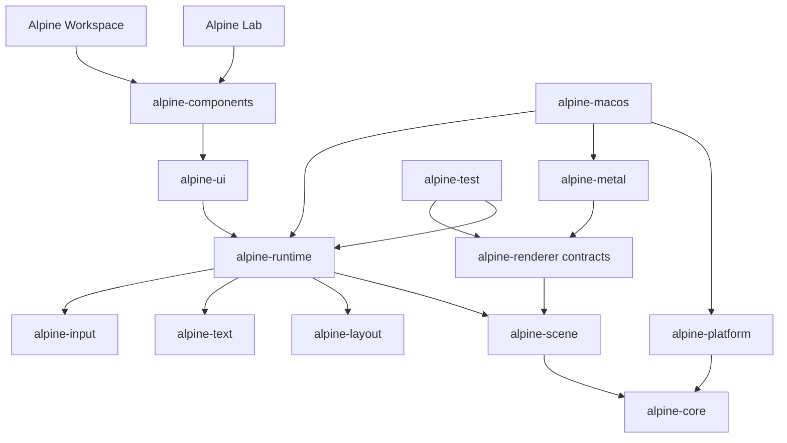

# Crate Architecture

Alpine GPUI uses small crates with explicit ownership boundaries. A crate split
must isolate a real policy, platform, testing, or dependency boundary. It must
not exist only to make the workspace look modular.

Only the first three contract crates exist today:

- `alpine-core` owns backend-neutral scalar and geometry types.
- `alpine-scene` owns immutable scene data and validation.
- `alpine-renderer` owns renderer contracts and capability reporting.

The remaining crates are introduced only when their milestone begins and their
contract can be tested independently. See
[`docs/MASTER_PLAN.md`](../docs/MASTER_PLAN.md) for sequencing and
[`ARCHITECTURE.md`](../ARCHITECTURE.md) for invariants.

Every crate must have crate-level Rust documentation, focused tests, no hidden
global mutable state, and no dependency that bypasses the repository dependency
policy. Public APIs remain provisional until the v1 stabilization milestone.
