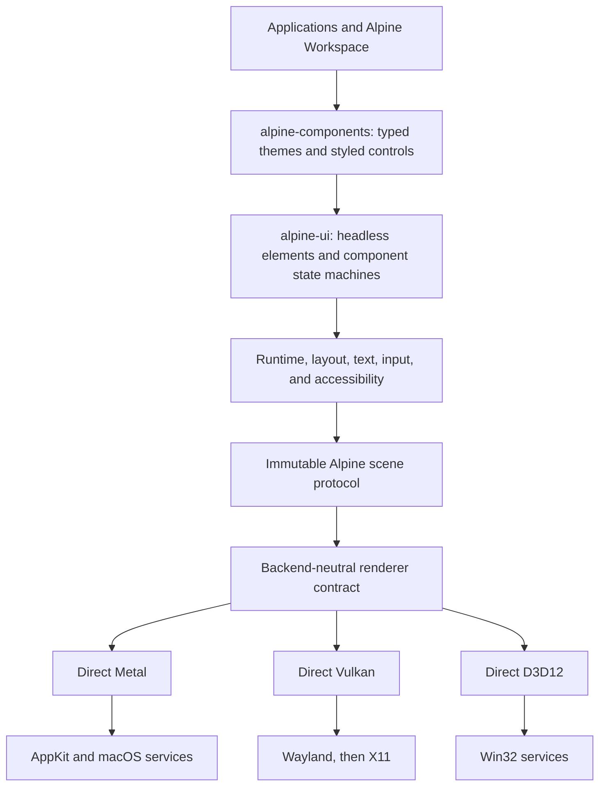
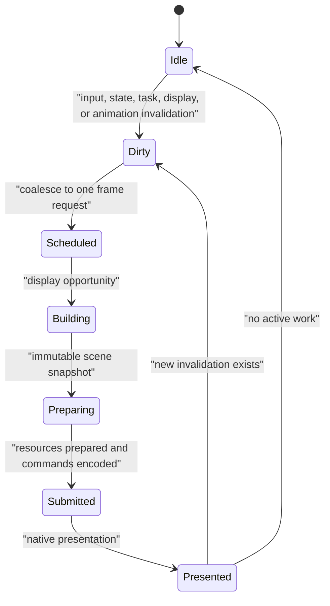
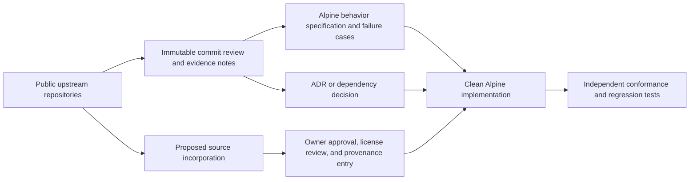

# Alpine GPUI Internal Engineering Guide

This is the internal entry point for architecture, implementation planning,
source influence, verification, and release evidence. Read it after the root
`AGENTS.md` and before modifying framework behavior.

## Fixed direction

Alpine GPUI is a proprietary Rust desktop framework with direct Metal as its
first renderer. It targets Apple Silicon on macOS 15 or newer, then direct
Vulkan on Linux and direct D3D12 on Windows. Version 1 does not target Intel
Macs, web, or mobile.

The first optimized workload class is data-heavy productivity software:
editors, terminals, database tools, large tables, docking, multiple windows,
and background tasks.

## System architecture

Portable semantics stop at explicit contracts. Native backends are free to use
platform-specific fast paths and capabilities.

## Frame lifecycle

An event-loop tick is not an invalidation. The framework must settle at `Idle`
with no renderer submissions or framework-triggered redraws.

## How upstream work influences Alpine

The default path studies architecture and observable behavior, then implements
Alpine-owned code. Copying is an exceptional path with explicit approval and
symbol-level provenance. See the [source map](research/source-map.md),
[upstream analysis](research/upstream-analysis.md), and
[provenance ledger](research/provenance-ledger.md).

## Agentic change flow

```mermaid
flowchart LR
    request["Owner request or accepted task"]
    context["Read scoped instructions and durable decisions"]
    plan["State scope, risks, owner decisions, and acceptance gate"]
    branch["Create one short-lived branch"]
    implement["Implement a narrow vertical slice"]
    local["Run focused tests and scripts/check.sh"]
    review["Inspect status, diff, provenance, and change fragment"]
    approval["Obtain approval to push and open PR"]
    ci["Protected PR with strict latest-SHA CI"]
    merge["Squash one logical change into main"]
    release["Assemble fragments, attest artifacts, and release"]

    request --> context --> plan --> branch --> implement --> local --> review
    review --> approval --> ci --> merge --> release
```

Chat is coordination, not the system of record. Decisions belong in ADRs,
source observations in research notes, copied material in the provenance
ledger, user-visible changes in fragments, and verification in CI.

## Documentation ownership

| Artifact | Question it answers |
| --- | --- |
| `ARCHITECTURE.md` | What are the enduring boundaries and invariants? |
| `docs/MASTER_PLAN.md` | In what order will the complete framework be built? |
| `docs/ROADMAP.md` | What are the milestone exit gates? |
| `docs/adr/` | Why was an architectural choice accepted? |
| `docs/research/` | What did upstream evidence show, at which commit? |
| `docs/DEPENDENCIES.md` | Which dependency boundaries and candidates exist? |
| `docs/ci/` | Which runner and gate proves each claim? |
| `changes/` | What user-visible change will appear in the next release? |
| `CHANGELOG.md` | What changed in each released version? |

## Core references

- [Architecture](../ARCHITECTURE.md)
- [Master plan](MASTER_PLAN.md)
- [Roadmap](ROADMAP.md)
- [Accepted product contract](adr/0002-product-contract.md)
- [Source map](research/source-map.md)
- [Agentic engineering research and workflow](engineering/agentic-workflow.md)
- [Changelog policy](engineering/changelog.md)
- [CI strategy](ci/strategy.md)
