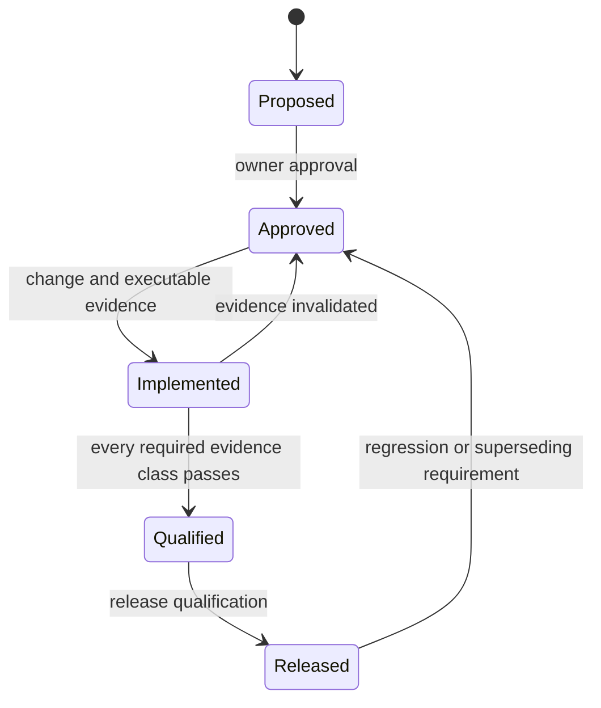

# AEP 0009: Multi-layer assurance and traceability

- Status: accepted bootstrap
- Capability: [#9](https://github.com/dbuddha/alpine-gpui/issues/9)
- Requirement: [#14](https://github.com/dbuddha/alpine-gpui/issues/14)
- Decision: [#13](https://github.com/dbuddha/alpine-gpui/issues/13)
- Motivating research: [#8](https://github.com/dbuddha/alpine-gpui/issues/8)
- Mission: MP-03 and MP-04

## Motivation and journey

The owner, humans, and agents need to know which evidence supports each claim,
what that evidence excludes, and whether a Capability is actually ready to
close. A green tool invocation without requirement lineage or qualifications is
not sufficient.

## Goals and non-goals

The system must validate stable IDs, issue hierarchy, AEP anchors, formal
artifacts, dynamic companions, required evidence kinds, and claim-specific
qualifications. It must emit a human-readable revision-scoped report. It does
not prove native rendering, convert research findings into evidence, establish
formal refinement, introduce shipping dependencies, or make hosted timing a
blocking performance gate.

## Atomic claims

- **AEP-0009-C01:** A Requirement cannot qualify when a declared evidence class
  is missing or references an absent artifact.
- **AEP-0009-C02:** A Capability cannot qualify through an unapproved or
  incorrectly parented Requirement.
- **AEP-0009-C03:** Formal evidence discloses bounds and exclusions, and TLA+ or
  Kani evidence links executable implementation evidence.
- **AEP-0009-C04:** Case-study findings can motivate claims but cannot satisfy a
  required verification evidence class.
- **AEP-0009-C05:** CI selects affected evidence and one fail-closed `ci-pass`
  result rejects every required job that is absent, skipped, cancelled, or
  unsuccessful.

## TLA+ model

[`AssuranceLifecycle.tla`](../../formal/tla/aep-0009/AssuranceLifecycle.tla)
models approval, implementation, evidence recording, Requirement closure, and
Capability closure. `QualifiedClosure` and `CapabilityClosure` are safety
invariants. `CanComplete` is the bounded progress property. The pull-request
model uses two Requirements and two evidence kinds; nightly expands to three of
each. `Faulty.cfg` relaxes the Requirement closure guard and must produce a
counterexample.

## Rust and ownership boundaries

The non-shipping `alpine-assurance` binary owns TOML parsing, structural
validation, optional GitHub hierarchy checks, and report rendering. GitHub owns
live approval and parent state. The repository owns immutable AEP, formal, and
registry artifacts. CI owns revision-scoped results. No production crate
depends on the assurance tool or its dependencies.

## Correctness, performance, memory, and accessibility

Malformed, duplicate, missing, unqualified, or unsupported entries fail with a
nonzero status and stable diagnostics. Registry order does not change validity.
The tool is not on an application hot path, so no runtime budget is claimed.
Reports use plain text and stable headings suitable for GitHub artifacts and
assistive technology.

## Failure and recovery

A missing local file, unavailable selected tool, unreachable private issue, or
failed proof remains an explicit failure. Scheduled failures create or update a
deduplicated Defect. Recovery changes the model, implementation, mapping, or
test; it does not weaken a threshold or assumption merely to pass.

## Evidence and model-to-implementation mapping

| TLA+ action | Repository event or function | Conformance evidence |
| --- | --- | --- |
| `Approve` | GitHub `owner:approved` | GitHub validation in `alpine-assurance` |
| `Implement` | linked Task and pull request | policy fixture suite |
| `RecordEvidence` | committed registry entry and CI result | validator tests and report |
| `CloseRequirement` | hierarchy reconciliation | hierarchy fixture suite |
| `CloseCapability` | all Requirements qualified and closed | hierarchy and registry checks |

The TLA+ model is design evidence. The validator and workflow tests are
implementation evidence. Alpine makes no formal refinement claim.

## Risks and reversal conditions

The registry can become clerical if claims are too small or evidence records
duplicate CI logs. AEP review must keep claims consequential and records stable.
Replace TOML or the validator only when scale, usability, or expressiveness is a
measured problem. Introduce Lean only through a separate decision with a genuine
mathematical and refinement target.
