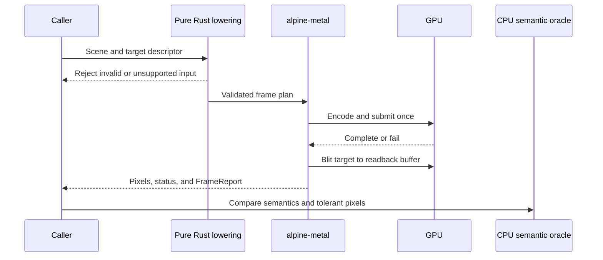

# AEP 0025: Direct Metal offscreen renderer

- Status: proposed
- Capability: [#25](https://github.com/dbuddha/alpine-gpui/issues/25)
- Decision: [#46](https://github.com/dbuddha/alpine-gpui/issues/46)
- Research: [#45](https://github.com/dbuddha/alpine-gpui/issues/45), [#27](https://github.com/dbuddha/alpine-gpui/issues/27)
- Mission: MP-01, MP-02, MP-03, and MP-05
- Motivating findings: RS-METAL-001 through RS-METAL-006, CS-ZED-002, CS-ZED-003, CS-ZED-005, and CS-ZED-006

## Motivation and journey

Alpine needs one independently owned, runnable renderer slice before it can
support a native window or make a performance claim. An application submits an
immutable solid-quad scene to a safe Alpine API. The backend validates and
lowers the complete scene, encodes one direct Metal submission, waits for its
terminal status, copies a deterministic BGRA8 target into CPU-visible storage,
and returns pixels plus explicit work and memory accounting.

This slice is synchronous and single-frame by design. It establishes ownership,
failure, readback, and accounting before later native presentation introduces
multiple in-flight frames.

## Goals and non-goals

Goals are deterministic offscreen rendering of every current `Scene` primitive,
checked pure-Rust lowering, a narrow reviewed native boundary, offline shader
compilation, structured failures, explicit resource ownership, semantic and
pixel oracles, and observable work and memory. The slice must run independently
on Apple Silicon macOS and keep portable crates buildable on Linux and Windows.

This AEP does not specify windows, presentation, event-loop scheduling, text,
images, paths, transforms, clipping trees, Vulkan, D3D12, Metal 4, multiple
in-flight frames, asynchronous readback, runtime shader compilation, elapsed
time budgets, or a claim that Alpine outperforms Zed. It does not copy GPUI or
Zed source.

## Atomic claims

- **AEP-0025-C01:** Initialization either creates one supported Apple Silicon
  Metal device, command queue, offline library, and pipeline set or returns a
  structured error without panic or process exit.
- **AEP-0025-C02:** Pure lowering accepts only finite, representable target and
  primitive values, preserves clipping and painter order, rejects every
  unsupported operation, and checks endpoint, byte-size, offset, alignment,
  row-pitch, and capacity arithmetic before native submission.
- **AEP-0025-C03:** One accepted render request creates at most one command
  submission, and no render request creates no submission. Validation failure
  occurs before submission.
- **AEP-0025-C04:** A frame resource has one exclusive lifecycle from encoding
  through in-flight ownership to a single terminal release. It cannot be
  reused, evicted, or destroyed in flight, and shutdown cannot finish while it
  remains in flight.
- **AEP-0025-C05:** Successful completion returns deterministic compact BGRA8
  readback whose coverage, clipping, painter order, and source-over result agree
  with an independent CPU semantic oracle under a versioned tolerance contract.
- **AEP-0025-C06:** A command failure, cancellation, unsupported capability,
  allocation failure, or device loss returns a stage-classified error, never
  qualifies pixels or a frame report as successful, and releases owned
  resources exactly once.
- **AEP-0025-C07:** Every accepted frame reports primitive count, draw count,
  submission count, upload bytes, allocated bytes, retained bytes, and readback
  bytes. Repeated steady-state workloads expose unbounded growth or hidden work.
- **AEP-0025-C08:** Native handles, raw pointers, shader ABI, and Objective-C
  ownership remain inside `alpine-metal`. Performance measurement is admissible
  only after semantic and native validation pass, with validation state and
  environment identity recorded.

## Formal model

[`RendererLifecycle.tla`](../../formal/tla/aep-0025/RendererLifecycle.tla)
models one renderer, one synchronous frame, one resource owner, submission,
completion, failure, cancellation, shutdown, and release. The safety properties
cover single submission, exclusive in-flight ownership, terminal release,
success and failure classification, and drained shutdown. Progress properties
require an in-flight submission to terminate and a requested shutdown to stop.

`Faulty.cfg` enables early resource reuse while a submission is in flight. TLC
must expose `InFlightOwnsResource` or `FreeResourceIsInactive`. The model is
finite and intentionally excludes actual Metal behavior, pixels, byte
arithmetic, device discovery, memory allocation, and elapsed time.

## Rust and native ownership boundaries

The proposed `alpine-metal` crate contains a portable pure-Rust lifecycle and
scene-lowering core plus an `aarch64-apple-darwin` native module. Other targets
compile the contract without linking Apple frameworks. The native module uses
the minimal target-specific `objc2 0.6.4`, `objc2-metal 0.3.2`, and required
`objc2-foundation 0.3.2` features selected by Decision #46. Adding those
dependencies and any unsafe code requires separate owner approval on the
implementing Requirements and pull requests.

The safe public boundary accepts an immutable `Scene` and a validated offscreen
target descriptor containing physical extent, logical-to-physical scale, linear
clear color, and the fixed BGRA8Unorm format. Lowering verifies that viewport,
scale, and physical extent describe the same target under one documented
rounding rule. The call returns an owned compact image and structured report or
a structured error. No Objective-C object, Metal handle, raw buffer, callback,
or uninitialized storage crosses that boundary.

The initial backend uses retained command-buffer references and one synchronous
submission. An offline `.metallib` supplies a fixed shader ABI. A private
BGRA8Unorm render texture is copied by a blit encoder into CPU-visible storage
with checked 256-byte row pitch. CPU access begins only after command-buffer
completion and status inspection. The returned image removes row padding.

## Scene semantics and oracle

The current scene contains painter-ordered, axis-aligned solid quads. Lowering
derives rectangle endpoints with checked finite arithmetic, clips against the
viewport, deterministically omits empty or fully clipped quads while accounting
for them, validates scale conversion, and ensures all buffer sizes and offsets
fit their native integer types. This closes endpoint overflow that AEP 0016
intentionally left to its first consumer.

The CPU oracle samples pixel centers, applies viewport clipping, preserves scene
order, and computes source-over blending in linear color space from
unpremultiplied scene colors into a premultiplied composited target. The shader,
blend factors, clear color, byte encoding, and alpha convention are independent
test inputs, not inferred from screenshots. GPU output uses a documented BGRA8
encoding and explicit rounding tolerance. Exact hashes are allowed only within
one qualified device and shader identity; cross-device qualification uses
semantic structure plus per-channel and image-level tolerances. Unsupported
primitives fail rather than disappear.

## Failure, recovery, and teardown

Errors identify initialization, lowering, allocation, encoding, submission,
completion, readback, and device stages. Native command errors retain stable
status, domain, code, and description data without exposing native error
objects. No native failure panics or exits the process.

Cancellation before submission releases reserved resources without submitting.
After submission, shutdown enters a draining state and waits for completion or
failure before teardown. Device loss invalidates all device-owned identities;
recovery creates a new backend generation rather than reusing old resources.
Fault injection must exercise every terminal path.

## Correctness, accessibility, performance, and memory

Correctness evidence includes unit and property tests for lowering and the CPU
oracle, Kani for checked indices, sizes, row pitch, and lifecycle transitions,
native Metal API and Shader Validation, deterministic offscreen readback,
negative shader-ABI tests, command failure injection, and changed-code mutation.
The TLA+ action mapping is replayed through pure Rust transition tests. Miri
checks the isolated unsafe boundary where supported.

Offscreen output has no interactive accessibility surface, but geometry and
paint semantics cannot contradict later semantic-tree coordinates. Pixels are
never accepted as accessibility evidence.

No fixed latency or memory threshold is approved in this AEP. The backend must
separate validation and measurement modes, disclose warmup, expose all work and
resource accounting, and make renderer-only Zed trace comparisons possible.
Blocking budgets begin only after A/A calibration on qualified fixed hardware.
API or Shader Validation is enabled for correctness runs and disabled for
performance runs, with that state recorded.

## Model-to-implementation and evidence mapping

| TLA+ action or property | Planned Rust or native boundary | Required implementation evidence |
| --- | --- | --- |
| `BeginFrame` | validate descriptor and lower immutable scene | unit, property, Kani, mutation |
| `Encode` | acquire resource and encode fixed pipeline | Rust transition tests and native validation |
| `Submit` and `SingleSubmission` | commit one retained command buffer | integration count and native trace |
| `Complete` | inspect terminal status then make readback visible | native success, readback, CPU oracle |
| `Fail` | classify terminal command error | injected native failure and E2E error assertion |
| `CancelBeforeSubmit` | abandon a lowered or encoded frame | transition and resource-accounting tests |
| `BeginShutdown` and `StopAfterDrain` | reject new work, drain, teardown | TLA+, Rust replay, leak and soak tests |
| `InFlightOwnsResource` | frame-resource owner and completion boundary | Kani for pure state, native lifetime tests, Miri |

| Claim | Minimum qualifying evidence |
| --- | --- |
| AEP-0025-C01 | initialization unit cases, native capability tests, structured-error integration tests |
| AEP-0025-C02 | unit, property, Kani, changed-code mutation, CPU semantic oracle |
| AEP-0025-C03 | TLA+, Rust action replay, submission instrumentation, native integration |
| AEP-0025-C04 | TLA+, Kani transition properties, native lifetime injection, leak and soak |
| AEP-0025-C05 | deliberately faulty oracle control, deterministic readback, native validation, tolerant image comparison |
| AEP-0025-C06 | TLA+, failure injection at every stage, terminal accounting, controlled recovery tests |
| AEP-0025-C07 | accounting unit tests, steady-state integration, memory distributions on qualified hardware |
| AEP-0025-C08 | dependency and feature audit, unsafe safety review, Miri where supported, qualification-manifest validation |

TLA+ checks the abstract design. Kani checks bounded compiled Rust properties.
Native tests check the actual Metal boundary. This AEP does not claim formal
refinement between the model and Rust.

## Platform scope and requirement decomposition

The shipping backend supports Apple Silicon on macOS 15 or newer. Linux and
Windows must continue compiling portable contracts and tests, but they do not
receive a Metal implementation.

After this AEP is accepted, Capability #25 should derive owner-approved atomic
Requirements for: safe lifecycle and initialization; checked scene lowering and
CPU oracle; native pipeline, submission, and readback; structured failure and
resource accounting; and renderer-only golden-workload qualification. Claims
must be registered only when each Requirement names its actual evidence.

## Risks and reversal conditions

Synchronous readback is deterministic but slow and cannot define the later
present path. BGRA8 quantization can obscure linear-color mistakes. Generated
bindings can contain defects. Validation can change scheduling and memory.
Unified memory can hide missing synchronization during ordinary tests. A simple
quad pipeline can produce misleading early performance wins.

Move to multiple in-flight frames only through a new approved lifecycle design
with Loom evidence. Change bindings only under Decision #46 reversal
conditions. Change texture format, blending semantics, or tolerance only with
new qualification evidence. If the CPU oracle cannot distinguish a deliberately
faulty shader, neither pixels nor timing may qualify.

## Primary references

- Apple, [Validating your app's Metal API usage](https://developer.apple.com/documentation/xcode/validating-your-apps-metal-api-usage)
- Apple, [Validating your app's Metal shader usage](https://developer.apple.com/documentation/xcode/validating-your-apps-metal-shader-usage)
- Apple, [`MTLCommandBuffer.status`](https://developer.apple.com/documentation/metal/mtlcommandbuffer/status)
- Apple, [`MTLDevice.supportsFamily`](https://developer.apple.com/documentation/metal/mtldevice/supportsfamily%28_%3A%29)
- Apple, [Metal feature-set tables](https://developer.apple.com/metal/capabilities/)
