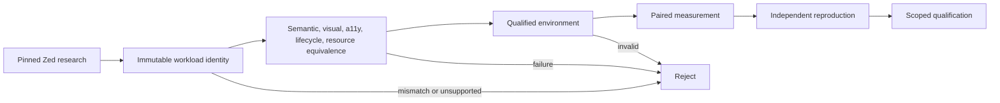

# AEP 0028: Zed golden-workload qualification

- Status: accepted foundation
- Capability: [#28](https://github.com/dbuddha/alpine-gpui/issues/28)
- Requirement: [#29](https://github.com/dbuddha/alpine-gpui/issues/29)
- Decision: [#41](https://github.com/dbuddha/alpine-gpui/issues/41)
- Research: [#27](https://github.com/dbuddha/alpine-gpui/issues/27)
- Mission: MP-02, MP-03, and MP-04

## Motivation and journey

Alpine needs to learn from a production editor, prove that its framework can
support the same local outcomes, and measure renderer changes without rewarding
omitted behavior. Zed is both a demanding editor workload and an upstream
implementation with a different license boundary. One unqualified benchmark
cannot establish application parity, renderer isolation, or performance.

## Goals and non-goals

The foundation defines immutable scene, journey, and qualification identities;
separates renderer-only, full-Zed-path, and product-journey comparisons; makes
correctness precede measurement; rejects unsupported operations; and emits a
scope-qualified report. It does not implement Metal, adapt Zed source, create a
benchmark result, set a performance budget, or claim daily-driver parity.

## Atomic claims

- **AEP-0028-C01:** Every accepted comparison identifies one protocol version,
  comparison level, workload hash, full Zed and Alpine revisions, and exact
  scene and journey inputs.
- **AEP-0028-C02:** Performance measurements cannot qualify before every
  required equivalence gate passes and the execution environment is qualified.
- **AEP-0028-C03:** Mismatched workload identities, unsupported operations,
  incomplete evidence, and invalid reproduction counts fail closed and cannot
  produce a qualified report.
- **AEP-0028-C04:** The future GPL lab preserves separate upstream-GPUI and
  Alpine-adapter variants and accounts for adaptation outside renderer-only
  timing.
- **AEP-0028-C05:** Fixed-hardware dominance requires calibrated equivalence
  margins, raw paired samples, and at least three independent qualification
  windows.
- **AEP-0028-C06:** Daily-driver parity cannot close until every included local
  feature Requirement supplies functional, accessibility, lifecycle, memory,
  and performance evidence selected by its risk.
- **AEP-0028-C07:** Optical results name their endpoints precisely; software
  timestamps cannot be reported as photon evidence.

Claims C01 through C03 are implemented by the foundation Requirement. C04 is
implemented for the first solid-quad renderer-only slice by Requirement #31 and
task #61, with its composed hosted and physical evidence registered in Alpine.
C05 through C07 remain approved design direction and unimplemented until their
Requirements receive owner approval and evidence.

## Formal model

[`GoldenQualification.tla`](../../formal/tla/aep-0028/GoldenQualification.tla)
models workload equivalence, environment qualification, measurement,
reproduction, rejection, and completion. `MeasurementRequiresEquivalence` and
`QualificationRequiresReproduction` are safety invariants. `CanTerminate` is
the bounded progress property. `Faulty.cfg` admits measurement directly from
the loaded state and must expose an invariant violation.

## Rust and ownership boundaries

The non-shipping `alpine-assurance` tool parses and validates the three versioned
TOML protocols. Scene traces own ordered portable operation identities. Journeys
own deterministic actions and expected semantic hashes. Qualification manifests
own comparison level, revisions, equivalence evidence, environment identity,
raw measurement references, assumptions, and exclusions. No shipping crate
depends on these protocols.

The validator accepts only repository-relative normal artifact paths. It does
not execute workload code, interpret Zed source, or calculate statistics. Those
owners arrive through later approved Requirements.

Kani is not applicable to the implemented claims. The boundary is TOML parsing,
filesystem evidence, strings, and dynamically sized records rather than a small
bounded pure Rust algorithm. TLA+ checks abstract ordering; Rust unit and
integration tests check the concrete validator. Bounded scene decoders or
resource indices added later receive a new Kani review.

## Correctness, performance, memory, and accessibility

Renderer-only comparisons require semantic, visual, lifecycle, and resource
equivalence. Full-Zed-path and product journeys additionally require
accessibility equivalence. A measured state requires a qualified environment,
raw artifacts, at least two samples per metric, assumptions, and exclusions.
Reproduced and qualified states require at least three independent windows.

The fixture samples prove validator behavior only. They establish no real
latency, memory, GPU, energy, accessibility, or Zed-relative result.

## Failure and recovery

Unknown protocol versions, operations, actions, gates, states, hashes, or
comparison levels fail. Missing artifacts, duplicate records, noncontiguous
ordering, failed equivalence, and measurement on an unqualified environment
also fail. Recovery changes the fixture, evidence, implementation, or approved
Requirement. It never removes a gate to obtain green CI.

## Evidence and model-to-implementation mapping

| TLA+ action | Manifest or Rust boundary | Conformance evidence |
| --- | --- | --- |
| `ValidateEquivalent` | workload hashes and equivalence records | validator unit tests and invalid fixtures |
| `QualifyEnvironment` | environment identity and qualified flag | unqualified-environment fixture |
| `Measure` | measurement artifact records | performance-before-correctness fixture |
| `Reproduce` | independent hardware windows | valid and insufficient-window validation |
| `Qualify` | qualified state and complete records | valid report fixture |
| `Reject` | fail-closed diagnostics | integration fixture suite |

The TLA+ model is design evidence. Rust tests are implementation evidence. No
formal refinement is claimed.

## Risks and reversal conditions

Hashes can identify equal inputs without proving equal semantics. Evidence
references can exist while their contents are wrong. Hardware qualification and
statistical inference can still be biased. Later Requirements must add semantic
oracles, native readback, accessibility inspection, attestation, raw-sample
analysis, and adversarial review before making product or performance claims.

Replace the protocol encoding only through a compatible versioned migration.
Replace Zed as the primary comparator only when another application supplies a
more demanding and reproducible daily-driver workload.
