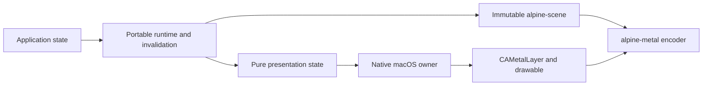

# AEP 0064: Native macOS presentation

- Status: proposed 2026-08-14
- Capability: [#64](https://github.com/dbuddha/alpine-gpui/issues/64)
- Requirement: [#67](https://github.com/dbuddha/alpine-gpui/issues/67)
- Decision: [#66](https://github.com/dbuddha/alpine-gpui/issues/66)
- Research: [#65](https://github.com/dbuddha/alpine-gpui/issues/65), [#27](https://github.com/dbuddha/alpine-gpui/issues/27)
- Mission: MP-01, MP-02, MP-03, MP-04, and MP-05
- Motivating findings: RS-PRESENT-001 through RS-PRESENT-008,
  CS-ZED-PRESENT-001 through CS-ZED-PRESENT-006, CS-ZED-002, CS-ZED-003,
  and CS-ZED-008

## Motivation and journey

Alpine has a deterministic Direct Metal offscreen renderer but no native
application surface. The next vertical slice lets an ordinary Alpine
application create a macOS window, invalidate immutable scene state, and
present the newest eligible revision through an Alpine-owned AppKit and Metal
path. It must remain idle when nothing visible changed.

```mermaid
sequenceDiagram
    participant App
    participant Surface as Pure surface state
    participant Link as CAMetalDisplayLink
    participant Metal as alpine-metal
    participant Display

    App->>Surface: invalidate revision N
    Surface->>Surface: coalesce newest revision
    Surface->>Link: resume while visible and dirty
    Surface->>Surface: prepare immutable scene N
    Link->>Surface: update with drawable and deadline
    Surface->>Surface: verify revision and surface epoch
    Surface->>Metal: encode and commit once
    Metal->>Display: directly present callback drawable
    Display-->>Surface: correlate terminal evidence
    Surface->>Link: pause when clean
```

The first shipping slice is one window and one main-thread-owned presentation
surface. It establishes demand-driven scheduling, drawable ownership, resize
and scale epochs, terminal evidence, bounded failure, and safe shutdown before
multi-window behavior or background rendering expands the state space.

## Goals and non-goals

Goals are an independently owned AppKit boundary, one `CAMetalLayer` per native
surface, variable-refresh pacing through `CAMetalDisplayLink`, immutable scene
handoff, invalidation coalescing, explicit surface epochs, bounded drawable and
frame ownership, an explicit standard-dynamic-range color contract, classified
terminal outcomes, zero idle submissions, and native evidence that is separate
from offscreen correctness evidence.

This AEP does not specify input delivery, focus traversal, IME, accessibility
semantics beyond a compatible native root, multi-window completion, embedded
surfaces, transparent windows, background render threads, HDR, wide color,
formats, Linux or Windows presentation, optical input-to-photon claims, or a
performance win over Zed. It does not copy GPUI or Zed source.

## Atomic claims

- **AEP-0064-C01:** Initialization and teardown occur on the macOS main thread.
  An Alpine owner either creates one AppKit application, window, view,
  `CAMetalLayer`, and paused display link or returns a structured error without
  panic, process exit, leaked delegate, or partially live native surface.
- **AEP-0064-C02:** Invalidations are monotonic revisions. Before a frame
  attempt begins, all pending invalidations coalesce to the newest immutable
  scene revision. A clean, hidden, occluded, zero-sized, stopping, or stopped
  surface causes no new command submission and no persistent pacing wakeups.
- **AEP-0064-C03:** Resize, backing-scale, and display changes advance a
  surface epoch. Prepared work is submitted only when its revision and epoch
  are current. Work superseded after commit can finish, but it cannot qualify
  as the current presented state.
- **AEP-0064-C04:** A display-link update transfers one callback drawable into
  one exclusive frame attempt. The attempt encodes and commits at most once,
  calls the drawable's direct presentation method according to Apple's
  `CAMetalDisplayLink` contract, and releases every owned resource exactly once
  after presentation, supersession, failure, cancellation, or drain.
- **AEP-0064-C05:** Missing or invalid display updates, missed deadlines,
  invalid native state, encoding or command failure, device loss,
  cancellation, close, and shutdown produce
  stage-classified terminal evidence. Shutdown invalidates pacing, rejects new
  attempts, releases pre-submit ownership, drains committed work, and then
  destroys native owners.
- **AEP-0064-C06:** Every attempt reports requested revision, frame revision,
  surface epoch, pixel-format and color-space identity, target and presentation
  timestamps, preparation and commit events, terminal outcome, submission
  count, missed-deadline classification, and retained frame resources.
  Evidence never classifies a superseded or failed attempt as a successful
  current presentation.
- **AEP-0064-C07:** Separate surfaces will own independent revisions, epochs,
  display links, and frame resources. Later multi-window implementation must
  preserve bounded application-level event servicing and cannot let one
  occluded or blocked surface stall another.
- **AEP-0064-C08:** Objective-C classes, delegates, AppKit objects,
  `CAMetalLayer`, callback drawables, and unsafe ownership remain inside the
  native platform and Metal boundaries. Applications and portable crates see
  safe Alpine window, invalidation, scene, and outcome contracts only.

## Platform and pacing decision

Alpine supports Apple Silicon on macOS 15 or newer. `CAMetalDisplayLink` has
been available since macOS 14 and is the initial pacing primitive. It is tied
to one `CAMetalLayer`, supplies a drawable plus target timestamps, supports
variable frame-rate ranges, can be paused, and has explicit invalidation.

The display link starts paused. An eligible invalidation resumes it. Scene
preparation happens before the update callback where practical so callback
work is limited to checking the newest revision and surface epoch, encoding
the supplied drawable, committing the command buffer, and calling the
drawable's direct `present` method. Apple documents time-targeted alternative
presentation methods as invalid with `CAMetalDisplayLink`, so Alpine does not
use them.

The initial production surface is opaque. Layers use `framebufferOnly = true`,
`allowsNextDrawableTimeout = true`, display synchronization enabled, and the
supported upper queue bound of three drawables. Keeping framebuffer-only
storage permits display-specific optimization. Keeping timeout enabled avoids
an indefinite wait in any fallback path that requests a drawable directly.
Deterministic readback remains an offscreen operation.

The implementation Requirement must select and test one explicit SDR sRGB
contract across shader values, render-target conversion, `CAMetalLayer` pixel
format, and layer color space. `BGRA8Unorm` and `BGRA8Unorm_sRGB` are
candidates, not interchangeable spellings. The current offscreen format and
Zed's pinned choice do not establish correct onscreen color. A deliberately
wrong transfer-function control must fail before visual or performance
evidence qualifies.

The callback's target timestamps guide scheduling and explain missed
deadlines. They do not establish scanout time or input-to-photon latency.
Presented handlers and a later optical rig provide separate evidence.

## Formal model

[`PresentationLifecycle.tla`](../../formal/tla/aep-0064/PresentationLifecycle.tla)
models one app owner, one layer-bound display link, one active attempt, bounded
invalidations, bounded surface changes, exclusive drawable ownership,
submission, presentation or supersession, failure, cancellation, and
shutdown.

Safety properties cover link ownership, phase-to-resource ownership, one
submission per attempt, historical eligibility at submission, current-state
qualification, clean idle pacing, and drained shutdown. Progress properties
require submitted work to terminate, stopping owners to stop, and visible
dirty work to settle or leave the running state. The model includes a terminal
reachability property.

`Faulty.cfg` enables stale presentation qualification after a revision or
surface epoch changes. TLC must expose `PresentedIsCurrent`. The model is
finite, discloses its event bounds, and does not model native APIs, pixels,
actual callback timing, scanout, or Rust refinement.

## Rust and native ownership boundaries

The planned platform split is:



Pure presentation state owns revisions, epochs, visibility, logical and
physical extent, scale, frame phase, and terminal evidence. It contains no
Objective-C object and is executable on every CI platform. The native macOS
owner enforces main-thread creation and teardown, owns the AppKit objects,
retains the display-link delegate, translates native lifecycle changes into
pure transitions, and prevents callbacks after invalidation.

`alpine-metal` accepts one validated drawable texture and immutable scene plan
without owning application scheduling. Native handles do not cross the safe
boundary. A frame token correlates preparation, callback, submission,
completion, presentation, and release without permitting duplicate terminal
transitions.

Exact target-specific `objc2-app-kit 0.3.2` and
`objc2-quartz-core 0.3.2` are the selected binding candidates. Dependency
addition, minimal feature selection, and every unsafe boundary require a later
owner-approved implementation PR. This proposal adds neither dependency nor
shipping unsafe code.

## Invalidation, resize, and terminal semantics

Application mutation does not render directly. It marks the surface dirty and
publishes a new immutable revision. Repeated invalidations overwrite only the
pending revision identity, not in-flight ownership. The display link resumes
only when the surface is visible, nonzero, running, and dirty.

Window size, backing scale, and display identity combine into a surface epoch.
An epoch change invalidates prepared work and requests a replacement frame.
The framework checks revision and epoch immediately before command commit. A
frame can become outdated after commit because native state can change before
physical presentation. Alpine allows the committed work to terminate, records
it as superseded, and refuses to count it as the current presented state. It
does not claim that Core Animation can retract already committed display work.

Occlusion and zero size pause pacing. Becoming visible or nonzero resumes only
if dirty work remains. Close invalidates the display link before releasing its
delegate. Pre-submit drawables are released immediately. Submitted work drains
to one terminal result before device-owned frame resources are destroyed.

## Failure, recovery, and teardown

Errors identify application initialization, window, view, layer, display-link,
surface-state, deadline, encoding, submission, command, presentation,
pacing, device, cancellation, and shutdown stages. Native errors become
owned stable Alpine data without exposing framework objects.

The first slice stops after device loss and requires explicit creation of a new
backend generation. Automatic recovery is a later Requirement. A callback
that races with shutdown observes an invalid owner generation and can only
release its transferred ownership. It cannot publish success or schedule new
work.

## Correctness, accessibility, performance, and memory

Offscreen semantic and pixel evidence must pass before onscreen evidence can
qualify. Color tests independently verify transfer function, layer color-space
identity, blending, and readback-to-display expectations. Native tests then
verify window creation, layer configuration,
display-link pause and resume, one commit, presentation correlation, resize,
scale, visibility, zero size, cancellation, close, command failure, and device
loss. Deliberate fault controls must show that stale qualification, duplicate
submission, and hidden work are observable failures.

The initial native window exposes a semantic root and correct coordinate and
scale conversion, but this AEP does not qualify keyboard input, focus, IME, or
accessibility behavior. Those require native semantic and interaction E2E.

Instrumentation separates scene preparation, callback encoding, command
commit, GPU completion, direct present call, and observed presentation. It
counts submissions, display-link callbacks, idle callbacks, acquired and
retained frame resources, upload bytes, missed target deadlines, and terminal
outcomes. No fixed budget is approved until A/A calibration on qualified
hardware. Hosted timing remains informational.

## Model-to-implementation and evidence mapping

| TLA+ action or property | Planned Rust or native boundary | Required implementation evidence |
| --- | --- | --- |
| `Invalidate` | publish newest immutable scene revision | unit, property, Kani, integration |
| `Resume` and `Prepare` | demand-driven scheduler and pure surface state | TLA+, Rust trace replay, idle-wakeup E2E |
| `BeginUpdate` | display-link delegate receives callback drawable | native ownership tests and Miri where supported |
| `Submit` | epoch check, encode, and one command commit | Kani transition proof, native validation, submission counter |
| `FinishSubmitted` | direct present and terminal evidence correlation | native E2E, presented handler, supersession injection |
| `AdvanceSurfaceEpoch` | resize, scale, or display change | property tests, native resize and migration E2E |
| `BeginShutdown*` | invalidate link, reject work, release or drain | TLA+, Rust replay, native failure injection, leak and soak |
| `PresentedIsCurrent` | qualification rejects stale revision or epoch | known-fault TLC, Kani, integration, native E2E |

| Claim | Minimum qualifying evidence |
| --- | --- |
| AEP-0064-C01 | main-thread assertions, partial-init injection, native launch and teardown, unsafe review |
| AEP-0064-C02 | TLA+, unit, property, Kani, model-trace replay, idle submission and wakeup E2E |
| AEP-0064-C03 | TLA+, Kani epochs, resize, scale, migration, and supersession native E2E |
| AEP-0064-C04 | TLA+, Kani lifecycle, native drawable ownership, Metal validation, Miri where supported |
| AEP-0064-C05 | TLA+, failure injection, command and device errors, cancellation, leak and soak |
| AEP-0064-C06 | evidence-schema tests, native timestamp correlation, accounting, coverage, mutation |
| AEP-0064-C07 | later multi-window model extension, isolation E2E, Loom if concurrency exists |
| AEP-0064-C08 | dependency and feature audit, provenance review, unsafe review, portable contract builds |

The proposal's TLC result is design evidence only. Claims enter
`assurance/evidence.toml` only with their actual implementation evidence. No
formal refinement between TLA+ and Rust is claimed.

## Platform scope and requirement decomposition

Shipping presentation supports `aarch64-apple-darwin` on macOS 15 or newer.
Linux and Windows compile the pure presentation state and conformance tests but
do not link Apple frameworks.

Requirement #67 covers the first single-window slice. Follow-up Requirements
will separately close native multi-window independence, embedded surfaces,
input wakeups, qualified frame pacing, and device recovery. The M2 milestone
does not exit until every stated native lifecycle condition and the first
complete application workflow pass end to end.

## Risks and reversal conditions

Run-loop scheduling may add latency or reentrancy hazards. Weak delegate
ownership can hide use-after-free defects. Three layer drawables do not by
themselves bound Alpine resource retention. A callback deadline can encourage
too much mutable work in the native boundary. Presented timestamps can be
mistaken for physical scanout. Resizing can reveal old committed content even
when qualification correctly rejects it.

Reconsider the pacing primitive if fixed-hardware evidence misses approved
latency or energy budgets, embedded surfaces cannot use it, maintained bindings
cannot express its lifecycle safely, or Apple introduces a materially stronger
API. Add background rendering only through an approved ownership design with
Loom evidence. Change drawable count, pixel format, HDR, timeout, or
framebuffer-only policy only with new correctness and performance evidence.

## Primary references

- Apple, [`CAMetalDisplayLink`](https://developer.apple.com/documentation/quartzcore/cametaldisplaylink)
- Apple, [`CAMetalDisplayLinkDelegate`](https://developer.apple.com/documentation/quartzcore/cametaldisplaylinkdelegate/metaldisplaylink%28_%3Aneedsupdate%3A%29)
- Apple, [Managing your game window for Metal in macOS](https://developer.apple.com/documentation/metal/managing-your-game-window-for-metal-in-macos)
- Apple, [`CAMetalLayer`](https://developer.apple.com/documentation/quartzcore/cametallayer)
- Apple, [Reading pixel data from a drawable texture](https://developer.apple.com/documentation/metal/reading-pixel-data-from-a-drawable-texture)
- Apple, [Synchronizing CPU and GPU work](https://developer.apple.com/documentation/metal/synchronizing-cpu-and-gpu-work)
- Apple, [`MTLDrawable`](https://developer.apple.com/documentation/metal/mtldrawable)
- `madsmtm/objc2`, [frameworks 0.3.2](https://github.com/madsmtm/objc2/tree/7b1abfd750a2cacaea71d6a56ecfb83cb7de560b)
