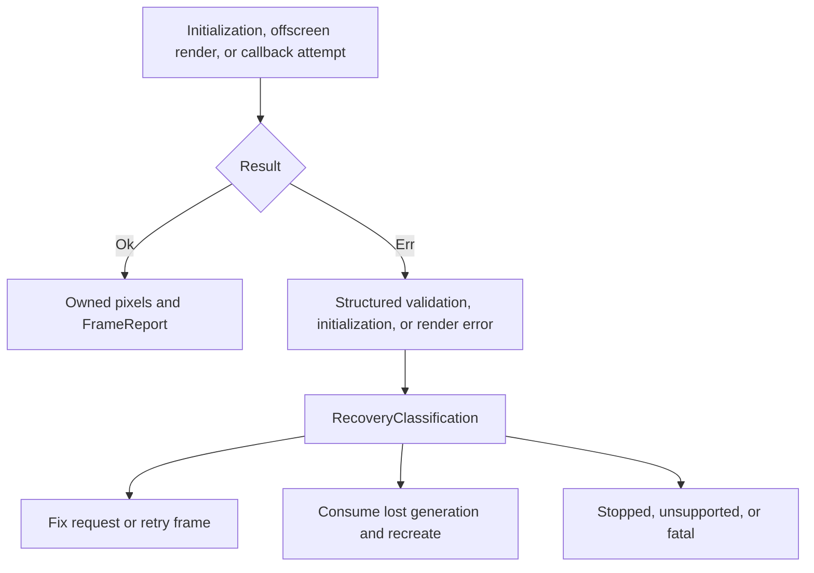

# Error and device-loss propagation

The renderer contract returns `Result<FrameReport, Renderer::Error>` directly
to the caller. `alpine-metal` now returns exhaustive `OffscreenError` values for
its pure descriptor, viewport, coordinate, byte-layout, capacity, and CPU-oracle
boundaries. Disabled lifecycle actions return `TransitionError` without partial
state mutation. `InitializationError` classifies unsupported platforms,
unavailable or unsupported devices, capability inspection, queue creation,
offline library loading, missing entry points, and pipeline creation. Native
error domain, code, and description values are copied into Alpine-owned memory.
`RenderError` separately classifies pure validation, unsupported targets,
submission-sequence exhaustion, texture limits, allocation stages, missing
encoders, terminal command failures, unexpected statuses, and readback length
or allocation failures. A committed failure increments observable submission
count but never returns pixels or a success report. Every error exposes a stable
recovery classification. Documented Metal command-domain codes distinguish
retryable memory pressure, unsupported access, fatal inconsistency, and device
loss. Device removal or access revocation invalidates the current backend
generation; later work is rejected until the owner consumes it through guarded
recovery into the next generation. Explicit shutdown similarly rejects later
work without hidden native activity. If cumulative accounting cannot represent
an already committed attempt, the backend stops admission so an unrecorded
submission sequence cannot continue.

Native surface descriptor, unsupported-platform, main-thread, device,
renderer-initialization, drawable validation, portable transition, presentation
correlation, driver, and bounded-retry errors are structured independently.
Callback failures are stored for the application to remove, increment terminal
failure evidence, include renderer recovery guidance when applicable, and pause
pacing. A dropped drawable is not reported as presented; it increments a
separate counter and retries the newest available immutable scene. A committed
attempt that becomes stale records a superseded terminal result and retains the
same immutable scene for a current-epoch retry, while the physical observation
counter remains distinct from current-state qualification. Device loss records
the failed committed attempt, invalidates the Metal backend generation, and
rejects later surface attempts before another native submission. Automatic
backend recreation remains outside this slice. Cancellation is a distinct
portable and native terminal result, never an alias for stale work or execution
failure. Precommit shutdown releases immediately. A committed native attempt is
cancelled only after shutdown enters its draining state and the asynchronous
Metal boundary has reached command completion, and it cannot increment
qualified-presentation evidence.
Dirty work closed before `Prepare` receives separate pending-cancellation
evidence with its requested revision and surface epoch, rather than a fabricated
attempt identity or commit count.
