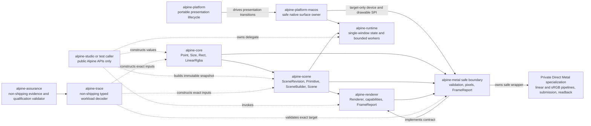

# Implemented system

The workspace currently has nine Rust shipping library crates and one shipping
application crate. `alpine-core`,
`alpine-scene`, `alpine-renderer`, and `alpine-platform` are fully safe and have
no external dependencies. `alpine-core` has no workspace dependencies.
`alpine-scene` depends on `alpine-core`, `alpine-renderer` depends on
`alpine-scene`, `alpine-platform` is dependency-free, and `alpine-metal`
depends on the core, scene, and renderer crates.
On Apple Silicon macOS only, `alpine-metal` uses narrowly featured, exact-version
`block2`, `objc2`, `objc2-foundation`, `objc2-metal`, and `dispatch2` bindings. Other
targets neither compile nor link those dependencies.
`alpine-platform-macos` depends on the portable platform, core, scene, and Metal
crates. On Apple Silicon macOS only, it uses narrowly featured, exact-version
`block2`, `objc2`, `objc2-app-kit`, `objc2-core-foundation`, `objc2-foundation`,
`objc2-metal`, and `objc2-quartz-core` bindings. The same target uses the exact-version,
narrowly featured `objc2-core-graphics` binding to own a standard sRGB color
space. Its safe application API exposes no native handle,
remains available on other targets, and returns a structured
unsupported-platform error without linking Apple frameworks.
Native event identity is a monotonic sequence, not a clock. Event-driven frames
separately retain a process-monotonic origin through synchronous application
handling, latest-wins admission, display-link submission, non-blocking GPU
terminal observation, and the drawable presented handler. Terminal snapshots
expose bounded handle-free stage durations while preserving the display link's
independent target and observed presentation timestamps.
As accepted by [Decision #329](https://github.com/dbuddha/alpine-gpui/issues/329),
release profiling normally emits these identities through allocation-free
dynamic Instruments signposts. An exact process-start opt-in may additionally
mirror the same copied numeric points to a lazily created macOS unified-log
`PersistedProfile` category when Instruments is unavailable. The default route
emits and retains nothing, and the persisted route is diagnostic-only until its
observer cost is calibrated; neither route changes invalidation, frame pacing,
native ownership, or presentation evidence.
`alpine-text` owns the local-only text domain behind safe Alpine values. It
uses exact-version, default-feature-minimized Ropey and Unicode Segmentation
dependencies selected by [Decision #139](https://github.com/dbuddha/alpine-gpui/issues/139)
after Crop 0.4.3 failed the accepted nested-slice and UTF-16 boundary corpus.
Canonical coordinates are UTF-8 byte offsets. Every rope conversion is checked
for bounds and byte-to-character round-trip identity before mutation. Immutable
snapshots are copy-on-write, transactions are revision-bound and atomic,
selection transformation and undo/redo are deterministic, and retained history
has explicit entry and changed-byte ceilings. Global AppKit UTF-16, line-local
LSP UTF-16, line-column, and grapheme conversions return structured errors for
ambiguous boundaries. The one-file `Editor` fingerprints accepted disk bytes,
detects external replacement or deletion, and uses same-directory synchronized
temporary files plus atomic replacement on the v1 Unix platform family. It owns
no collaboration, replica, remote-operation, language-service, plugin, AI, or
native state.
`alpine-text-layout` is a safe portable boundary over immutable text snapshots.
It maps one fixed-height viewport to visible lines plus bounded overscan, owns
current-frame and previous-frame copied line layouts, confirms every streaming
fingerprint candidate with exact rope-range equality, and materializes text only
on a shaping miss. The combined layout payload and owned vector-capacity
metadata have a configurable hard ceiling, with 32 MiB as the default. Its A8
glyph atlas starts empty, grows geometrically, resolves retained glyphs through
a deterministic power-of-two open-addressed index at no more than 50 percent
load, reserves metadata before ownership mutation, removes least-recently-used
entries, coalesces returned rectangles, captures pixel mutations in at most 64
sorted disjoint dirty-row ranges without heap allocation, accounts exact pixel,
entry, free-region, and index capacity, defaults to a 16 MiB hard ceiling, and
releases all storage under explicit pressure. Its audited Apple
Silicon boundary shapes and rasterizes through CoreText and CoreGraphics while
returning copied Alpine values. `alpine-scene` stores clips, quads, glyphs, and
ordered paint operations in separate immutable arrays, and the Metal path
samples the scene-owned A8 atlas without exposing native handles.
`alpine-runtime` depends on core, scene, and the safe cross-target
`alpine-platform-macos` facade. It owns one foreground application delegate,
monotonic workspace and document revisions, dirty-only scene construction, and
fixed standard worker threads connected by bounded request and result channels.
Worker results carry workspace, document, and process-local sequence identity;
stale worker results are rejected before delegate mutation. Independent local
sources use a separate fixed-capacity, byte-accounted producer queue and carry
application-owned identity for exact delegate admission across revisions. Both
sources share bounded fair foreground draining and coalesced run-loop wake, while
only the delegate can invalidate a frame. The runtime exposes no native handle
and adds no general async executor, timer poller, or reactive graph.
`alpine-studio` privately depends on exact-version, default-feature-disabled
`ignore` 0.4.33 for project-local recursive traversal. It uses only the serial
walker, disables global and parent ignore state, includes hidden paths except
`.git`, never follows symlinks, and exposes no dependency type outside the
application crate.
`alpine-studio` is the first shipping application. It owns exactly one local
document as either an unbound scratch `Buffer` or a path-bound `Editor`, plus
primary selection, IME composition, viewport state, two-frame layout cache, and
a hard-budgeted glyph atlas, as accepted by
[Decision #146](https://github.com/dbuddha/alpine-gpui/issues/146). One optional
process argument opens and validates
an existing UTF-8 file before native construction. Command-S reuses the
editor's conflict-aware atomic replacement and records structured save evidence
without changing document revision; scratch save is a deterministic no-op. Its
`AppDelegate` maps native events to checked local edits and builds only visible
text plus bounded overscan when dirty.

Studio privately compiles line-local syntax presentation for Rust, Markdown,
TOML, and JSON with plain text as the deterministic fallback. Syntax work is
admitted only for lines already selected by visible-range layout, stores ordered
UTF-16 spans for direct projection onto shaped glyph source positions, and
reuses exact current-frame or previous-frame content after fingerprint
confirmation. The cache has a 4 MiB logical metadata and span ceiling, each
line scans at most 64 KiB and retains at most 1,024 spans, and oversized or
over-complex lines degrade to unstyled text. This initial compiled lexer adds no
runtime grammar loading, plugin boundary, background work, dependency, native
handle, or syntax authority outside Alpine Studio.

Studio also owns a private local language-server process boundary under
Requirement #34 and Task #128. Construction canonicalizes one explicit local
executable and optional working directory, bounds argument count and bytes, and
never performs network or extension discovery. One fixed supervisor owns one
child plus dedicated standard threads for stdin, stdout, and stderr so foreground
submission never waits on process I/O. Control, input, output, write-result, and
foreground-event queues have fixed capacities. Input and copied output share a
16 MiB retained-payload ceiling, output is read in 64 KiB chunks, and overflow
terminates the affected child rather than growing or blocking rendering.
Workspace identity, process generation, epoch, and input sequence classify every
event; restart advances the epoch and stale events are discarded before a future
protocol layer can mutate editor state. Shutdown kills and waits for the child,
closes its pipes, joins every helper, and releases queued payloads. This slice
does not decode JSON-RPC, launch during startup, mutate Studio state, expose a
public API, or add a dependency, network client, plugin host, or async runtime.

Studio also owns the dependency-free byte-framing boundary for that local
Language Server Protocol path. It incrementally accepts ASCII headers and
byte-counted bodies, requires exactly one bounded `Content-Length`, accepts only
the specified UTF-8 JSON-RPC content type, and poisons the stream after malformed,
unsupported, oversized, allocation-failed, or truncated input. One header retains
at most 8 KiB, one message at most 16 MiB, and one admission returns at most 32
frames and 16 MiB of bodies. Fragmented and pipelined reads preserve exact bytes
and monotonic frame identity while current and peak buffer accounting remains
observable. This slice decodes no JSON and creates no language-service state
before the separately approved parser and revision-admission slices consume it.

Studio owns a private JSON-RPC peer core and pinned local-server compatibility
path under Tasks #205 and #208 and Research #204. An Alpine envelope visitor
rejects duplicate critical fields,
unsupported IDs, batches, invalid response shapes, wrong protocol versions,
excess depth, excess structural items, and excess raw string bytes before any
message can reach application state. One peer admits at most 64 monotonically
identified pending requests and accounts its exact retained vector and method
storage. Initialize, initialized, cancellation, shutdown, and exit are explicit
states; cancellation removes local admission, and a complete workspace and
document revision stamp is compared before a response is exposed. Outbound
messages are framed directly for the existing bounded process owner. A
checksum-pinned Apple Silicon rust-analyzer fixture qualifies initialize,
document open, bounded diagnostics, cancellation, stale rejection, restart, and
shutdown without adding discovery, download, network, or startup work.

Task #210 composes that path into one active Rust document. Studio sends a full
document `didOpen` and revision-monotonic whole-document incremental `didChange`
replacements matching rust-analyzer's declared synchronization capability, admits
diagnostics only for the exact workspace, document, buffer, selection, process
generation, process epoch, URI, and LSP document version, and clears prior
diagnostics before a newer edit can paint. Each foreground turn polls at most
eight process events, each frame projects at most 256 visible quad underlines,
and diagnostic payloads retain at most the existing 256 KiB language boundary.
Process callbacks publish one latest-generation wake through the runtime's
bounded external producer. A lock-free foreground latch preserves that wake if
shared result admission is temporarily saturated; unrelated current work then
recovers polling without a timer, blocking wait, idle redraw, or duplicate
document owner. Missing or failed servers leave editing and saving available and
surface only bounded local status.

Task #218 adds one private completion owner to that same active Rust session.
An explicit request captures workspace, document, buffer, selection, process,
request, URI, and LSP-version identity. Supersession cancels and locally revokes
the prior request; a bounded cancelled-ID tombstone classifies late responses
without allowing them to clear a newer admitted list. One response retains at
most 64 items and 256 KiB across labels, documentation, and edits, while frames
project at most eight rows. Plain and insert-replace edits map through checked
line-local UTF-16 coordinates and apply as one revision-bound undoable
transaction. Snippets, nonempty additional edits, ambiguous ranges, malformed
or oversized results, and queue saturation fail visibly without mutating the
document. Focus loss, editor change, restart, and shutdown release pending and
admitted completion state. The keyboard and accessibility dialog reuse the
dirty-only frame path, so one admitted result creates no subsequent idle frame.

Task #219 extends that same single-session owner with bounded hover, definition,
and references. Requests retain the complete workspace, document, buffer,
selection, process, protocol-version, and request identity; completion and
navigation supersede one another, and late responses cannot clear a newer
result. Hover retains at most 32 KiB and paints at most twelve lines. Source
navigation retains at most 256 locations and 128 KiB, paints at most twelve
rows, and admits only canonical non-symlinked local files under the current
workspace. Studio rechecks disk identity and maps the UTF-16 range against the
exact target snapshot before changing the active tab. Command-palette,
keyboard, scene, and accessibility paths share that owner and add no network,
remote URI, plugin, AI, cloud, telemetry, or general framework boundary.

Task #222 keeps configuration local, static, and off the input and render path.
One optional global JSON file and one optional project JSON file load through
the existing bounded worker pool. The coalescing owner permits one in-flight
generation; only the exact submitted and latest requested generation can
publish. The closed versioned decoder caps files, paths, depth, values, strings,
bindings, font names, and retained settings. Active state changes only after a
complete compiled-then-global-then-project candidate validates, so parse,
migration, concurrent-edit, stale-result, allocation, and settings-validation
failure preserve the previous snapshot and all document and workspace state.
No dynamic registry, watcher, timer, plugin, extension, executable config,
network, AI, cloud, account, or telemetry boundary exists.

Task #221 adds one private document and workspace symbol picker to that same
session. Requests retain exact workspace, document, buffer, selection, process,
protocol-version, request, and query-revision identity, and query supersession
cancels prior protocol ownership before resubmission. One response admits at
most 512 symbols, 32 hierarchy levels, 1 KiB labels, and 512 KiB of
symbol-owned state, while one frame projects at most twelve rows. Hierarchical
document symbols flatten in source order; workspace symbols require resolved
locations. Keyboard, IME, command, scene, and accessibility paths share the
same picker, and activation reuses canonical workspace-local path and checked
UTF-16 range validation. Focus loss, document change, restart, and shutdown
release the owner without startup work, idle redraw, a new process, network,
plugin, AI, cloud, telemetry, or public framework API.

Production typography uses the safe
CoreText service; deterministic test typography proves portable editor behavior
without claiming native validation. It runs through one `Application` until the
owned AppKit window closes and has no native handles, collaboration state,
extension host, telemetry, AI, or general async runtime.

Under [Decision #146](https://github.com/dbuddha/alpine-gpui/issues/146), the
repository-owned private-dogfood packager copies that same release executable
into a stable unsigned `Alpine Studio.app`; it adds no second application
runtime. The bundle declares the Apple Silicon macOS 15 product identity and
retains a timestamp-free manifest containing the exact source revision,
workspace version, executable checksum and size, target, profile, property-list
checksum, and signing state. A separate launcher passes at most one absolute
file or folder argument through the existing process entry point.

One optional process path now admits either the existing direct-file journey or
one canonical local folder. Production folder admission owns only the canonical
root and performs no directory enumeration before the first frame. The fixed
sidebar activates explicitly and submits one immediate-directory request on the
existing serial bounded worker. Each request inspects at most 16,384 entries,
retains at most 4,096 children and 1 MiB of path bytes, and never recurses.
The private cache retains at most 4,096 directory nodes, 65,536 entries, 8 MiB
of path bytes, 4 KiB per path, and 256 path components. Project-local ignore
rules are evaluated from root to the requested directory, hidden paths remain
eligible, `.git` is omitted, and symlinks are never traversed. Workspace, tree,
directory, and request generations reject stale publication. Prefix row counts
project at most 512 rows including three-row overscan without flattening the
complete project. A selected file is revalidated component by component under
the canonical root before the existing `Editor` opens it. Failures preserve the
current document and paint local status. File replacement advances a
Studio-owned monotonic document identity before runtime publication.

Studio also owns one bounded in-file find and replacement surface. Query and
replacement fields retain at most 4 KiB each. A literal background scan clones
the immutable buffer snapshot but materializes at most 16 MiB of UTF-8 text,
then retains at most 16,384 non-overlapping ranges or 256 KiB of exact metadata.
Document, buffer, and query-generation identity gate completion publication;
stale work cannot select or replace text. Frames project only visible matches
with a separate 2,048-range ceiling. Replace-all is one checked transaction,
refuses truncated results and more than 16 MiB of changed transaction bytes,
and adds no dependency, timer, polling loop, native handle, regex engine, or
startup work.

Studio owns one separate lazy quick-open inventory for an admitted local
workspace. Command-P is the only initial admission point, so direct-file
launch, folder construction, and the first frame perform no recursive walk.
The existing bounded worker builds one serial inventory of at most 250,000
inspected entries, 100,000 regular UTF-8 root-relative paths, 16 MiB of path
bytes, 4 KiB per path, and 256 levels. A second worker request ranks at most
1,024 index and score records for the current 4 KiB query. Workspace,
inventory, and query generations reject stale publication. Frames clone only
visible labels plus three overscan rows and at most 256 rows. Selection
revalidates every path component, rejects symlinks and canonical mismatch, and
then reuses the existing atomic tab-open path. There is no startup index,
watcher, parallel traversal, global ignore state, plugin API, or network path.

Studio now also owns an application-private bounded split-view tree under
[Requirement #32](https://github.com/dbuddha/alpine-gpui/issues/32) and
[Task #127](https://github.com/dbuddha/alpine-gpui/issues/127). The tree uses
fixed storage for at most four pane leaves and seven total nodes, so split,
focus, close, and geometry projection allocate no heap state. Row and column
splits use a fixed two-pixel divider, refuse leaves narrower than 120 pixels or
shorter than 80 pixels, retain monotonic pane identities, and preserve one
independent non-negative finite scroll offset per leaf. Every visible leaf
renders simultaneously from the same immutable active-document snapshot and
the existing bounded line-layout cache and glyph atlas. Only the focused leaf
accepts pointer selection, caret, and IME composition; pointer focus restores
that leaf's retained scroll before hit testing. The command palette provides
static split-right, split-down, focus-next, and close-pane commands. This slice
does not duplicate a buffer, create another document authority, add a layout
framework, or allocate work on startup. Independent pane tab groups and bounded
file-tree identities are retained in the session graph, and dirty text is
protected by the private recovery journal described below. Conflict-resolution
commands remain an unimplemented part of Task #127.

The native event handler returns one bounded `SurfaceResponse`. AppKit
Command-C and Command-X writes complete through a typed later event, allowing
Studio to defer cut mutation until native success. Command-V checks the native
UTF-8 byte length before allocating Alpine-owned text and reports unavailable,
oversize, or successful bounded text explicitly. `windowShouldClose` resolves
allow or cancel synchronously and fails closed when a handler is missing or
reentrant; only an admitted `windowWillClose` begins irreversible presentation
drain. Validation builds use an isolated pasteboard while shipping builds use
the general pasteboard, with identical conversion functions.
The non-shipping `alpine-trace` crate depends only on Alpine workspace crates
and owns typed, fail-closed conversion from versioned workload values into an
immutable scene and exact offscreen target. The non-shipping
`alpine-assurance` tool depends on audited `serde` and `toml` crates to parse
repository manifests, validate the evidence registry and qualification state,
pass serialized trace values into `alpine-trace`, and validate versioned
renderer A/A calibration records. It also validates accepted Zed-lab evidence
without importing raw GPL artifacts: one immutable record binds the lab, Zed,
Alpine, trace, patch, hosted artifact, physical machine, readback, coverage, and
mutation identities. The first accepted record composes hosted offline-shader
GPUI-to-CPU equivalence with physical Direct-Metal-to-CPU equivalence and
rejects timing or performance claims. Calibration validation requires exact
revision and environment identity. The non-shipping `alpine-ax-client` crate
owns the physical assurance process's only generated ApplicationServices
binding boundary. Its safe contract exposes bounded, generation-tagged tree,
observer, query, action, and stale-element values without native handles;
shipping crates do not depend on it. All CoreFoundation ownership and callback
unsafe code remains isolated in `native.rs`, while non-macOS builds retain only
an explicit unsupported contract.
workload and identical-revision identity, four or more distinct hardware
windows, twenty or more runs, balanced paired execution order, strict
separation of cold and warm samples, measurement stage and clock identity,
ordered window times, repository-normalized LF raw CSV structure, and
recomputed artifact SHA-256. Its deterministic integer report is descriptive
only and cannot establish an equivalence margin, sample size, confidence
interval, or performance claim.

The same non-shipping tool validates trusted-machine accessibility bundles
without widening Studio or platform APIs. A bundle binds exact repository,
Studio binary, harness, scenario, environment, AX tree, notification stream,
latency, residency, Inspector, VoiceOver, and post-close evidence by SHA-256.
Bounded JSON Lines preserve Unicode labels and bind each event to its external
source: AXObserver, AX action, AX query, NSWorkspace, or process observation.
Artifact traversal rejects symbolic links at every bundle-relative component,
and each text class has an independent byte and record ceiling. A separate
fixture-only command exercises the validator while physical commands reject
fixture manifests.
Physical latency and residency samples remain descriptive until separately
accepted A/A calibration activates a budget. The validator cannot grant or
bypass macOS Accessibility trust, automate human VoiceOver attestation, or
turn hosted selector invocation into external delivery evidence.

`alpine-core` uses private representations and validated constructors for
finite geometry, non-negative extents, rectangle intersection, and normalized
linear RGBA values. Read-only accessors preserve those invariants across crate
boundaries. `alpine-scene` freezes a
viewport, monotonically identified revision, and boxed painter-ordered primitive
slice. Its only primitive today is a solid axis-aligned quad.

`alpine-renderer` defines a monomorphized `Renderer` trait with backend-specific
`Target` and `Error` associated types. `render` borrows an immutable `Scene` and
mutable target, then returns a `FrameReport` containing submission, primitive,
omission, draw-call, upload, allocation, retention, and readback counts.
`MetalBackend` is the first implementation. Its
portable `OffscreenTarget` owns only the descriptor and latest completed image;
all native resources remain private. A failed render clears any stale target
image before returning its structured `RenderError`.

`alpine-platform` is an allocation-free, `no_std` transition system for one
presentation surface. It owns monotonic invalidation revisions, surface epochs,
visibility and size eligibility, display-link intent, opaque frame tokens,
phase-to-resource ownership, command and direct-presentation counts, terminal
classification, and shutdown drain state. Disabled, stale, exhausted, or
token-mismatched actions restore the exact prior state and return structured
errors.
It also owns an independent allocation-free `FrameSlotRing` for the accepted
asynchronous presentation design. Exactly three slots transition through free,
encoding, and submitted ownership. Opaque leases bind slot, monotonic sequence,
owner generation, frame token, revision, and surface epoch. Saturation is an
observable bounded admission result; terminal completion always releases the
exact lease but classifies publication as current only when generation,
revision, and epoch still match. The native macOS owner binds every committed
drawable submission to one exact portable slot lease and releases it only after
the Metal completion boundary reports a terminal result.

`alpine-platform-macos` now owns the first native object graph: the shared
`NSApplication`, one retained `NSWindow`, one custom `NSView`, one opaque
`CAMetalLayer`, one retained standard sRGB `CGColorSpace`, one system Metal
device, one retained main-thread-only delegate implementing both window and
display-link protocols, and one
`CAMetalDisplayLink` registered in the main run loop. Construction is admitted
only on the process main thread. The layer is framebuffer-only, display
synchronized, timeout-enabled, bounded to three drawables, and sized from a
validated logical extent and backing scale. AppKit resize, backing-property,
screen, occlusion, miniaturize, and restore callbacks produce one validated
effective configuration. Distinct geometry, scale, or screen identity updates
the layer and advances exactly one portable surface epoch; equivalent
notifications and visibility-only changes do not churn epochs. A zero physical
extent or non-visible window pauses pacing, while an eligible restore resumes
only if dirty work remains. Invalid native geometry leaves the last valid layer
extent intact, records a structured error, and fails closed as ineligible.

The display link starts paused, requests a two-frame render latency, resumes
only for visible dirty work backed by an owned pending or active frame, and
pauses after the newest revision reaches a terminal result. Its callback commits
and directly presents, then returns without waiting for GPU completion. Later
display-link callbacks poll only Alpine-owned terminal state on the main thread.
A delayed native
configuration notification cannot restart pacing after terminal failure unless
the driver owns replacement work. The native owner initializes the renderer
from the exact device installed on the layer and queues one immutable scene
plus clear value.
The current physical extent and scale become the render descriptor only inside
the admitted callback, preventing a queued scene from retaining an obsolete
target descriptor. The Metal backend validates the callback texture, commits
one command buffer, and calls the drawable's direct `present` method. A
presented handler distinguishes a nonzero physical presentation timestamp from
a compositor-dropped frame. Dropped frames retain or defer to the newest
pending immutable scene and retry within a hard 600-callback bound aligned with
the five-second native qualification window on the primary 120 Hz target.
Snapshots expose the current epoch, size and visibility eligibility, configured
SDR contract, extended-dynamic-range state, cumulative native allocation, and
terminal retained bytes without exposing a native handle. The implemented
presentation contract consumes linear sRGB shader values, blends in linear
space, stores to `BGRA8Unorm_sRGB`, declares the layer's standard sRGB color
space, and disables extended-dynamic-range compositing. Teardown first revokes
callback admission, classifies active work as cancelled, stops the renderer,
pauses and invalidates pacing, clears both weak delegate registrations, and
closes the retained window. Callback admission and rejection are counted
independently. A closing owner advances its generation, rejects new frame
admission, and keeps only drain callbacks alive until committed work terminates.
Stale completions release their exact leases but cannot publish success. Native
handles stay private. Physical multi-display qualification and onscreen pixel
capture remain unimplemented.

`alpine-metal` validates a
non-empty BGRA8 offscreen descriptor, proves its logical viewport and rounded
physical extent agree, computes compact and 256-byte-aligned readback layouts,
clips and lowers all current solid quads in painter order, and accounts for
omitted primitives and upload bytes. Its deterministic CPU oracle samples pixel
centers and evaluates linear source-over composition into premultiplied BGRA8.
Its single-frame lifecycle is an executable transition system corresponding to
AEP 0025's finite TLA+ model. On Apple Silicon macOS, `MetalBackend::new`
creates the default device and one command queue, requires Metal 3 and unified
memory, loads an embedded offline library, resolves fixed vertex and fragment
entry points, and creates two premultiplied-source-over pipelines. The existing
offscreen oracle retains linear `BGRA8Unorm`; native presentation uses
`BGRA8Unorm_sRGB` so Metal encodes linear RGB only after linear blending. The
native objects remain private and live exactly as long as the safe backend.
Linux and Windows expose the same safe constructor but return a structured
unsupported-platform error without linking Apple frameworks.
`MetalBackend::render_offscreen` validates a complete scene before native work,
allocates frame-local private texture, shared readback, and optional upload
resources, encodes one instanced quad draw and one texture-to-buffer blit in one
retained command buffer, commits once, and waits for terminal completion. Only
then does it remove row padding and return owned compact pixels plus a monotonic
`FrameReport`. Each accepted target is bounded by the Metal 3 guaranteed 16,384
pixel dimension. Every native attempt runs inside a frame-local Objective-C
autorelease pool; no native object escapes, while the owned image, copied error
data, and accounting report remain valid after the pool drains.
The target-only platform SPI also owns three private presentation-resource
slots. Each slot retains at most one committed command, one reusable shared
upload buffer, and one bounded completion signal. Presentation upload capacity
grows geometrically to 8 MiB per slot, never exceeds 24 MiB across the three
slots, records exact current and peak retention, and can shed free capacity on
pressure. A typed Metal completion block copies terminal status and native error
details into Alpine-owned state without exposing a handle. The split-phase SPI
can commit and directly present, return immediately, and later consume that
terminal state on the owner thread. The AppKit callback uses this split-phase
path directly. The synchronous compatibility wrapper remains only for narrow
renderer callers outside the production presentation loop. Offscreen readback
remains intentionally synchronous.
Glyph scenes retain one immutable full A8 base, at most 64 cumulative sorted
recovery-row overrides, and the latest revision's delta rows. This keeps every
latest-wins scene recoverable after dropped intermediate frames while a cache at
the immediately preceding revision uploads only the newest rows. Unaffected
recovery patches share byte storage and no glyph miss clones the complete atlas.
A compatible Metal cache keeps its private atlas buffer and blits rows from one
geometrically grown shared staging buffer per existing frame slot. Cache
revision publication occurs only after commit; terminal failure invalidates the
resident image. Terminal ownership prevents staging reuse while commands are in
flight, and pressure or sustained disuse reclaims capacity. Initialization,
atlas growth, storage or dimension mismatch, older-scene replay, device
recovery, and cumulative patch-limit rollover rebuild one full current image.
The next compatible revision resumes row deltas. CPU oracle sampling applies
the same row overrides directly, preserving renderer-independent pixel
evidence.
Every render call updates a generation-scoped `BackendAccounting` snapshot.
Validated cancellation performs no native allocation or submission. Shutdown is
synchronous and closes admission only after the current exclusive call returns.
Upload and draw counters advance only after their corresponding native stage
succeeds, so cancellation and earlier failures cannot report planned work as
completed work.
