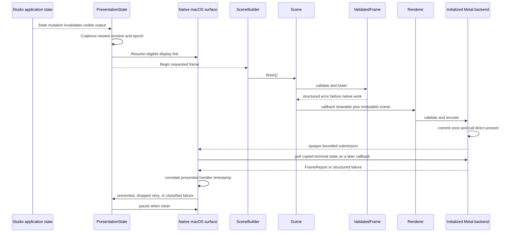

# Invalidation to present contract

Studio and `alpine-runtime` drive application events and state mutation. A native
surface connects portable invalidation through a callback-provided drawable to
Direct Metal and observed presentation. Scene construction remains application-owned.
The diagram shows the implemented presentation boundary; application mutation
stays above that boundary.

The portable contract is demand-driven: no clean or ineligible surface can
prepare a frame, and clean idle state requires paused pacing. The native surface
enacts resume, pause, and invalidate directives without introducing a
continuous redraw loop merely because a window exists. A compositor drop is
observable and triggers a bounded retry without overwriting a newer coalesced
scene.

Native surface construction uses a staged owner. Every acquired application,
device, renderer, window, view, layer, delegate, and display-link owner remains
inside that owner until construction commits. Dropping an incomplete owner first
revokes callback admission, pauses and invalidates any display link, clears its
delegate, orders out and closes any window, and only then releases retained
objects. A validation-only configuration injects failure after every stage and
tracks each Alpine acquisition and release. The instrumentation and injection
entry point are absent from shipping builds. Successful teardown and a
thirty-two-cycle owner soak require one acquisition and one release for every
tracked owner kind, one run-loop registration, link invalidation, delegate
revocation, and window close, no active lease, and no release-order violation.
