# Ownership from state to submission

Alpine Studio owns application state; `alpine-runtime` dispatches application
events and bounded worker completions. Portable invalidation and one-surface
attempt ownership live in `alpine-platform`. Scene construction remains
application-owned. Finishing a
`SceneBuilder` transfers builder storage into an immutable snapshot. A renderer
may borrow that snapshot for one call but may not retain application or view
objects.

```mermaid
flowchart LR
    state["Studio application state"]
    presentation["PresentationState<br/>revision, epoch, token, pacing intent"]
    builder["SceneBuilder<br/>single owner and mutable"]
    snapshot["Scene<br/>immutable owner of primitives"]
    plan["ValidatedFrame<br/>owns checked lowered quads"]
    lifecycle["FrameLifecycle<br/>pure ownership state"]
    renderer["MetalBackend<br/>owns initialized native resources"]
    resources["Frame-local resources<br/>texture, upload, readback"]
    accounting["BackendAccounting<br/>terminal work and retained bytes"]
    result["OffscreenFrame<br/>owned pixels and FrameReport"]

    state -. "invalidate" .-> presentation
    state -. "derive values" .-> builder
    presentation -->|"correlates callback attempt"| lifecycle
    builder -->|"finish consumes builder"| snapshot
    snapshot -->|"borrowed during validation"| plan
    plan -->|"immutable encoding input"| renderer
    lifecycle -. "constrains transitions" .-> renderer
    renderer -->|"owns until terminal completion"| resources
    resources -->|"records allocation and one release"| accounting
    resources -->|"padding removed after wait"| result
```

Binding ownership rules:

1. Renderer input is immutable for the duration of submission.
2. A renderer cannot retain application or view objects.
3. Native handles and GPU resources remain below the renderer boundary.
4. Scene values contain no native handles or backend-specific commands.
5. Scene construction and GPU submission remain separately measurable.
