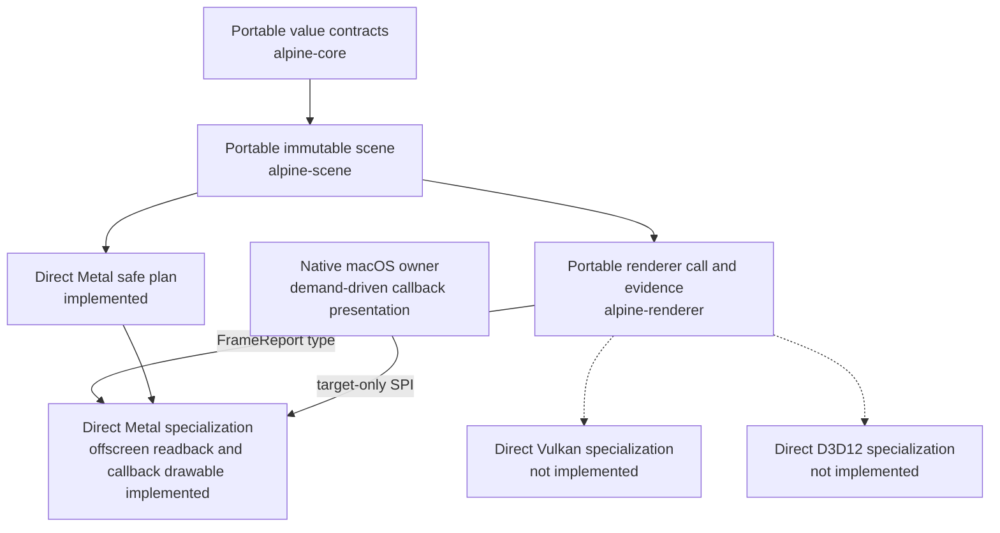

# Portable contracts and native specialization

Portable semantics stop at `Scene` and `Renderer`. Associated types prevent the
portable contract from dictating a target or error representation. A backend is
free to specialize formats, batching, atlases, synchronization, and
presentation while preserving observable behavior.

No portable abstraction may prevent a Metal-specific fast path. WGPU may be a
future differential oracle or optional compatibility backend, but it does not
define Metal behavior.
