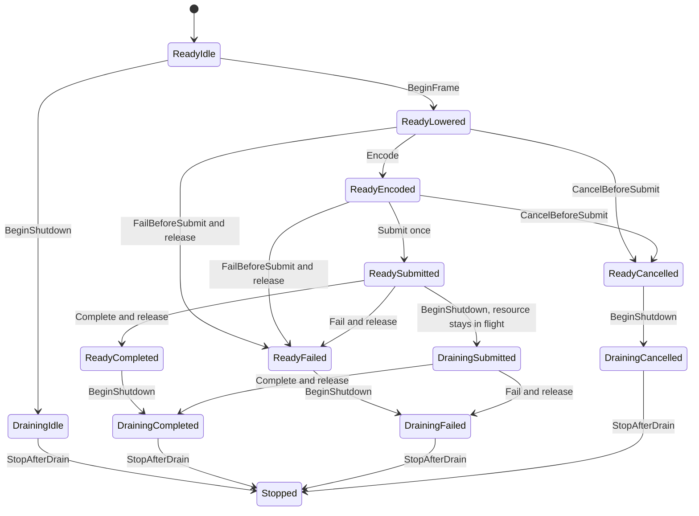

# Resource lifetime contract

The renderer trait deliberately leaves resource representation to each backend.
The Metal backend now retains one device, command queue, offline library, and
two render-pipeline states. Initialization releases every partially created
object on failure through ordinary Rust drops. The production constructor
rejects devices without the Metal 3 family or unified memory. Hosted macOS runners currently
expose a paravirtual device that fails that baseline, so native CI first asserts
the production rejection and then uses a test-only route that bypasses only the
capability decision to validate real queue, library, function, and pipeline
operations. That route is not compiled into shipping artifacts and does not
qualify the virtual device as supported. Each synchronous render owns one
private texture, one shared readback buffer, an optional immutable upload
buffer, one retained command buffer, and its encoders until terminal completion.
The callback path instead borrows the layer-owned drawable texture, allocates
only an optional upload buffer, retains the callback drawable until its
presented handler fires, and accounts the drawable's native allocation as
retained but not Alpine-allocated bytes. The same exact layer device owns the
renderer queue and pipeline. Every attempt commits and calls direct presentation
at most once. A skipped drawable is released before a replacement attempt
acquires another callback drawable.
No resource is reused or exposed while in flight. Frame-local resources then
drop exactly once. Native `allocatedSize` and buffer length values populate the
frame report; cumulative accounting must return to zero current retention at
every synchronous API boundary. A test-only owner probe independently checks
one acquisition and one release across partial allocation, encoder, command,
terminal failure, cancellation, shutdown, and repeated-frame paths. There is no
cache or eviction implementation.
`FrameLifecycle` is the executable pure-Rust counterpart of this accepted
single-frame protocol.

Creation failure is returned, not panicked. Resources cannot be evicted or
destroyed while referenced by in-flight work. Steady-state allocation, upload,
retention, and eviction must be observable and bounded.
