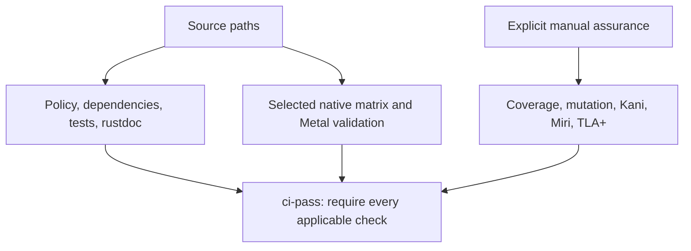

# Testing and evidence

Current unit tests cover valid and invalid values, rectangle intersection and
contact, color bounds, scene revision and painter order, empty scenes, checked
offscreen target and readback layouts, clipping and omission, CPU pixel-center
source-over semantics, deliberately reversed painter order, atomic lifecycle
rejection, and all terminal lifecycle paths. Initialization tests inject every
safe stage failure and assert exact release of partial state. Apple Silicon
tests create a real device, queue, library, and pipeline, then reject a corrupt
library and an absent shader entry point. They separately enforce the production
capability baseline so a hosted virtual GPU cannot be mistaken for qualified
physical hardware. Native rendering fixtures cover clear-only output, clipping,
coverage edges, painter order, translucent overlap, aligned padding removal,
two sequential submission identifiers, validation before submission, and the
Metal 3 texture limit. GPU bytes agree with the independent CPU oracle within
one channel value, while a deliberately disabled-blend control is detected.
Native fault controls cover each allocation, encoder, command, unexpected
status, readback mismatch, memory-pressure, permission, and device-loss class.
A 512-frame validation soak requires constant per-frame retained accounting,
balanced cumulative totals, and zero active owner probes after every return.
After 4,096 warmup frames, the isolated native memory soak records process
resident bytes every 16 frames across a 1,024-frame measurement window. The
complete 65-sample observation must remain within 16 host virtual-memory pages
of its first sample, and its final nine samples must plateau within one page.
Negative controls admit delayed but bounded allocator settlement while rejecting
excessive total growth and continued terminal growth. This distinguishes a
bounded allocator step from retention without claiming a qualified performance
budget. Samples are printed before qualification so a failure retains its full
distribution. The RSS probe itself is primed before warmup so its lazy
measurement allocation cannot contaminate the renderer baseline. Metal API and shader
validation cover the full suite first;
the process-memory sample then runs without validation-layer instrumentation so
debug allocations cannot be mistaken for shipping renderer retention. Exact
Alpine-owned retention remains the primary leak invariant.
Public integration tests exercise the safe offscreen contract without
crate-private access, render through the production constructor on supported
Apple Silicon, and reject Metal construction on portable targets. The checked-in
offline library is bound to its source, deployment
target, SDK, Xcode, and compiler identity by a strict manifest, SHA-256 checks,
a Metal-library magic check, and negative verifier fixtures. Kani proof harnesses
exhaust bounded geometry and color domains, complete `u16` readback extents, and
six arbitrary lifecycle actions plus symbolic frame-accounting updates against
the Rust implementation. The trace decoder additionally proves two-operation
painter-order and value preservation over bounded symbolic colors and extents,
plus fail-closed rejection of noncontiguous indices. TLA+ models
check finite value-admission, assurance, qualification, and renderer-lifecycle
designs, including known-fault controls. The evidence registry maps atomic AEP
claims to qualified artifacts, bounds, assumptions, exclusions, and dynamic
companions. Calibration fixtures exercise exact artifact identity, environment
qualification, minimum window and run counts, paired-order balance, and stable
fail-closed diagnostics. The boundary also binds sample class, warmup count,
measurement stage, clock, and window times while identifying fixtures as
synthetic and making no
hardware or performance claim. The repository
acceptance command validates policy and the registry, tests automation and core
contracts, then runs formatting, Clippy, all-target tests, doctests, and
rustdoc. Engineering guidance is plain Markdown; it has no separate book or
Wiki publication gate.
The macOS platform crate separately tests all descriptor boundaries and runs
seven harness-free integration executables on the process main thread. The
surface smoke test creates the complete native object graph, verifies layer
policy and paused pacing, then deterministically tears it down. The rollback
test injects every native initialization checkpoint and requires exact
per-owner release, callback revocation, display-link invalidation, window close,
and a closed lifecycle before each error returns. The presentation test runs an
active AppKit event loop, submits a deterministic solid-quad scene through the
callback drawable, observes a nonzero presented timestamp, exposes and retries
any compositor drops, then injects a pre-submit viewport failure and proves a
later valid revision recovers. It requires commit and direct-present counts to
match exactly and pacing to return to paused. The surface-epoch test drives a
real AppKit content resize and deterministic scale, display, visibility,
zero-size, invalid-geometry, restore, and close events through the same native
configuration boundary. It requires idempotent epochs, exact layer extents,
no hidden submission or allocation while ineligible, recovery without epoch
churn, and closed callback admission. Native color qualification additionally
checks the actual layer format, standard sRGB color-space identity, disabled
EDR state, linear offscreen bytes, sRGB presentation bytes after overlapping
linear blending, and a deliberately wrong direct-linear transfer control. The
native recovery executable injects a display change immediately after real
Metal commit and direct present, proves that the old epoch cannot qualify,
retries the retained scene across bounded later AppKit configuration churn
until a current epoch qualifies, and correlates every attempt with target
timestamps, native observation, counts, terminal retention, and recovery. It
separately injects Metal device removal after real command
completion and proves that the lost backend generation rejects later work
before a second native submission. The presented-handler observation and
post-commit configuration timing in this executable are deterministic
validation controls at the production Rust correlation seams, not evidence of
Core Animation scanout or physical notification timing. The lifecycle
executable holds a visible clean surface idle and requires stable callback,
submission, allocation, and retention counts; closes a hidden pending request
without native work; injects close at the exact post-commit lifecycle recheck;
requires distinct cancelled evidence and no qualification or retained bytes;
rejects a synthetic late display-link callback through the production admission
guard; ignores late AppKit configuration notifications without manufacturing a
driver failure after revocation; and
repeats complete native construction and exact ordered teardown thirty-two
times. Physical multi-display, onscreen pixel capture, actual post-commit AppKit
notification timing, process-level multi-hour platform soak, and fixed-hardware
wakeup or energy evidence remain unimplemented.
On a hosted macOS runner without a qualifying display, the same executable uses
an explicit direct-presentation evidence mode: every admitted drawable must
complete GPU work and receive one direct present call, every completed native
handler must report a drop, and the single-frame owner permits at most one
drawable still in flight at the bounded cutoff. That mode cannot qualify a
displayed frame, physical wakeup or energy behavior, or physical presentation
time. It can still require an explicitly paused display link and stable admitted
callback counts during a bounded clean-idle interval. Deterministic
validation controls can qualify state correlation and guarded recovery there,
but they remain labeled separately from physical display evidence.

Hosted CI selects checks from changed source paths and explicit manual inputs,
then propagates every applicable failure through `ci-pass`. PR opening, source
updates and reopening trigger code CI; title, body and label changes do not.
Ordinary CI retains workspace tests, doctests, rustdoc, dependency/license checks,
the source-selected Linux/macOS arm64/Windows matrix and native Metal validation.
Coverage, mutation, Kani, Miri and TLA+ are opt-in manual assurance; their bounded
claims do not substitute for native tests or physical acceptance. Nightly
assurance is manual, and only dependency advisories recur on the weekly schedule.

The selected Metal job installs Xcode's optional Metal toolchain when necessary,
compiles the shader source offline, records toolchain and artifact hashes, and
tests initialization and readback against that library. Unsafe Rust remains
isolated in audited native boundary files in the Metal, macOS platform,
CoreText layout and non-shipping AX client crates. The source-boundary check
includes Studio application sources. Every unsafe use needs a local safety
argument and relevant native validation.

The technical evidence registry validates offline. Ordinary development requires
no claim ID, issue hierarchy or Project access. A single failure router creates
or updates deduplicated issues for current-main failures and timeouts; successful,
skipped, canceled and superseded runs do not authorize publication. It rechecks
the main revision and run attempt immediately before publishing and does not
manage issue parents or declare product acceptance.

Tests must use the narrowest layer that proves the behavior. Renderer work will
require semantic scene checks, CPU geometry oracles, offscreen readback with
tolerances, lifecycle failure injection, and fixed-hardware distributions for
performance gates. Exact cross-GPU pixel hashes are not a sufficient oracle.
Coverage identifies unexercised code but does not prove correctness; mutation
tests whether assertions reject injected faults. Kani proves selected bounded
properties of Rust code. None of these substitutes for native driver behavior,
visual semantics, or qualified performance measurements.

The non-shipping golden-workload boundary implements
`alpine-scene-trace/v1`, `alpine-journey/v1`, and
`alpine-qualification/v1`. It validates immutable workload identity, ordered
operations and actions, comparison level, equivalence evidence, environment
identity, raw measurement references, assumptions, exclusions, and independent
hardware-window counts. A concrete `alpine-scene-trace/v1` solid quad carries
logical and physical viewport identity, scale, clear color, full-viewport clip,
geometry, linear color, and contiguous painter-order sequence. `alpine-trace`
decodes that data into `Scene` and `OffscreenDescriptor`; any unsupported clip,
operation, invalid value, target mismatch, or capacity excess fails. The
assurance CLI can render deterministic compact BGRA8 through the CPU oracle or
the production Direct Metal constructor. Unsupported operations and measurement
before correctness fail closed. A render command invalidates its requested
output before validation so rejected work cannot leave stale evidence behind.
These manifests make no performance claim by themselves. The separate
`alpine-aa-calibration/v1` boundary admits only identical-revision A/A evidence
with verified raw samples and qualified environments; its report remains
non-inferential until physical data supports a later statistical decision. No
shipping crate depends on either boundary.

The immutable version 1 solid-quad control is not widened or replaced. The
prepared `alpine-scene-trace/v2` boundary adds bounded clips, solid quads, one
immutable A8 atlas, monochrome glyphs, and identity-bound scroll and resize
pairs. `alpine-zed-lab-evidence/v2` composes an exact merged-main hosted
offline-metallib GPUI run with an exact physical runtime-source run. It binds
eight trace, workload, output, pair, adaptation, coverage, mutation, artifact,
shader, build, and environment identities. Alpine Direct Metal and GPUI Metal
must match exactly for every fixture; the independent CPU oracle admits at most
one channel value of declared tolerance. Runtime-source shader evidence is
supporting correctness evidence only. Adaptation timing, renderer timing,
memory, latency, and performance qualification remain false, so this boundary
admits E3 semantic equivalence but cannot produce an E4 comparison claim.

### Bounded Rust workspace-edit preparation, preview, and publication

Task #220 owns a private preparation and preview boundary for local
rust-analyzer formatting and rename results. The existing single Rust session
captures exact workspace, document, buffer, selection, process epoch, LSP
version, request, and operation identity. A command can request formatting or
open a bounded keyboard and IME rename field. Supersession, focus loss, editor
change, restart, and shutdown cancel the request before publication.

The foreground poll copies only the size-bounded raw response into one owned
wire value. Strict parsing, canonical file reads, UTF-16 mapping, independent
replacement construction, and prepared-edit retention run through the bounded
runtime worker rather than the AppKit event handler. Strict JSON admission rejects
duplicate object keys, unsupported resource operations, annotations, remote
URIs, malformed or overlapping UTF-16 ranges, duplicate canonical paths, and
every declared file, edit, inserted-text, file-text, and retained-byte excess.
Rename names and formatting options are bounded before request serialization.
The initialize payload advertises only the implemented static subset: rename
without prepare support, formatting without dynamic registration, document
changes without resource operations, and transactional workspace-edit failure
handling. Server-initiated `workspace/applyEdit` remains unsupported; Alpine
applies only the exact response to its own current rename or formatting request.

Preparation revalidates each canonical workspace path, reads only regular
existing UTF-8 files, converts UTF-16 ranges against immutable copy-on-write
snapshots, and constructs both a checked Alpine text transaction and an
independent forward-built String result. One current response produces one
revision-bound preview panel with at most eight visible paths and exact file and
edit counts. The panel is keyboard and IME exclusive, has one accessibility
dialog identity, creates one dirty frame per state transition, and retains no
timer or idle polling. Enter queues one prepared transaction on the existing
bounded worker. While publication owns that transaction, document mutation,
pointer and scroll mutation, accessibility actions, cancellation, and close are
refused; read-only accessibility queries remain available.

Publication revalidates every loaded target tab as clean and byte-exact, then
uses one bounded, checksummed Preparing/Prepared/Committed journal beside the
session state. Preparing is durable before adjacent stages are created;
Prepared is durable only after every stage is synced. Every replacement is
admitted against the exact original bytes immediately before rename. Before the
durable Committed marker, any failure rolls all targets back from adjacent
backups. A Preparing journal removes only tracked stages, a Prepared journal
rolls back installed files, and a Committed journal preserves the new files and
completes cleanup. Impossible artifact combinations retain the journal and fail
closed instead of guessing a recovery direction. Corrupt or oversized journals
also preserve target files. The protocol is capped at 32 files, 512 KiB of
journal storage, and 4 KiB per path, and creates no executor, timer, or
unbounded queue.

After disk commit, loaded active and inactive documents admit their checked
transactions without rereading or rewriting the files. The active document
retains one normal Alpine Text undo entry while becoming clean at the committed
revision. Exact persisted-byte mismatch is rejected before clean-state
publication. Local unit and recovery tests support the implementation on this
branch; hosted exact-head CI, pinned production-path rust-analyzer rename and
formatting, fault-injection breadth, mutation, and coverage evidence remain
required before Task #220 can close or this behavior can be classified E3.

### Bounded static command discovery

Alpine Studio owns a closed compile-time command registry and a private bounded
palette state. Command availability is derived from current Studio state, and
execution refreshes that availability before dispatching an existing typed
transition. Matching is deterministic and allocation ceilings cover query,
composition, results, visible rows, and diagnostics. There is no runtime
registration, plugin hook, closure registry, worker, timer, or public framework
API at this boundary. See AEP-0177.

Studio also owns one immutable active settings value under Requirement #36 and
Task #129. Compiled defaults use borrowed font and keymap storage and perform no
heap registration. A settings state resolves one complete candidate in fixed
compiled, global, then project order. Editor fields merge independently while
themes and keymaps replace as closed typed values; every layer is validated with
its source before mutation. Stale generations, invalid values, binding conflicts,
retained-byte excess, and revision exhaustion preserve the prior active value.
Accepted changes publish monotonic revision identity, source provenance, exact
current and peak retained bytes under a 64 KiB ceiling, and separate typography,
theme, and keymap effects. Direct shortcuts resolve to the existing closed
command vocabulary or one of three local editing actions, and the same binding
table supplies bounded shortcut labels for visible command-palette rows, so
dispatch and discovery cannot drift. File parsing, watching, migration, and
reload submission remain pending the separate serialization dependency decision;
there is still no runtime registration, executable discovery, plugin lookup, or
network work during startup.

### Bounded streaming local project search

Alpine Studio privately owns a lazy local project-search state machine. One
explicit Command-Shift-F or static command opens it; no inventory or content
read exists on direct-file launch, folder admission, first frame, or idle. A
serial project-local ignore-aware inventory admits at most 250,000 entries,
100,000 regular UTF-8 relative paths, and 16 MiB of path bytes. Content work
then advances through bounded worker continuations, each covering at most 64
files, 16 MiB read bytes, 256 matches, and 256 KiB of result data.

One query reads at most 512 MiB, one file at most 16 MiB, and retained results
at most 16,384 matches or 4 MiB. Invalid UTF-8, NUL-bearing, unreadable,
oversized, replaced, and non-regular files are skipped with separate counters.
Inventory, query, and request generations reject stale publication. A bounded
file buffer may move between worker continuations while one file has later
matches, but no result retains source contents and close releases foreground
search allocations. Selection revalidates the canonical path and exact current
buffer bytes before any tab mutation. The boundary adds no public API,
dependency, persistent index, watcher, regex engine, plugin path, network path,
telemetry, or startup work. See AEP-0180.
