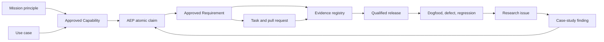

# Knowledge and requirements

Alpine separates durable knowledge from live work so each fact has one owner.

| Information | Authority |
| --- | --- |
| Mission principles | `docs/vision.md` |
| Stable user outcome | `docs/use-cases/` |
| Active investigation | GitHub Research issue |
| Accepted revision-pinned finding | `docs/case-studies/` |
| Outcome approval and status | GitHub Capability |
| Substantial design and atomic claims | AEP |
| Atomic acceptance contract | GitHub Requirement |
| Implementation | GitHub Task and pull request |
| Current implemented truth | `ARCHITECTURE.md` and rustdoc |
| Formal model and proof harness | `formal/tla/` and crate source |
| Qualified evidence mapping | `assurance/evidence.toml` |
| Results for one revision | GitHub checks and artifacts |
| Shipped qualification | GitHub Release |

Case-study findings motivate claims but are never verification evidence.
Formal results use separate labels for model-checked design and verified Rust
properties. The repository does not claim formal refinement unless a future
decision introduces and verifies an actual refinement proof.
