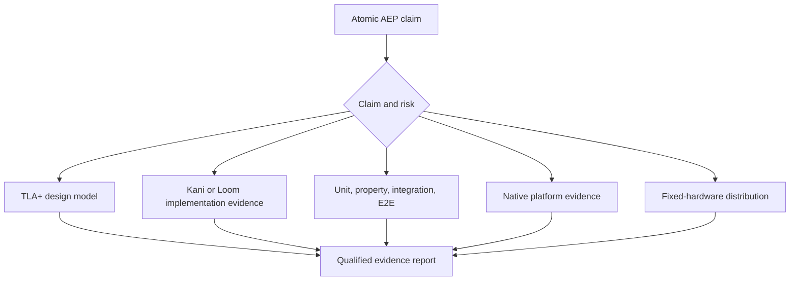

# Assurance strategy

No single technique establishes an Alpine capability. Evidence is selected by
the failure mode and recorded against atomic AEP claims.

| Layer | Establishes | Cannot establish |
| --- | --- | --- |
| TLA+ and TLC | Finite abstract safety, reachability, ordering, and liveness | Rust conformance, drivers, pixels, or elapsed time |
| Kani | Bounded properties of compiled sequential Rust | Trusted concurrency, native APIs, or performance |
| Loom | Explored Rust synchronization interleavings | Hidden synchronization or operating-system behavior |
| Unit and property tests | Executable examples and broad pure input coverage | Complete state spaces or native integration |
| Integration and E2E | Subsystem and user-journey behavior | Exhaustive interleavings or timing portability |
| Miri and fuzzing | Selected undefined behavior and unexpected input paths | Platform drivers or complete correctness |
| Mutation and coverage | Assertion strength and unexecuted code | Correct specifications |
| Native validation | Metal, windowing, input, IME, and accessibility behavior | General formal properties |
| Fixed hardware | Latency, throughput, energy, allocations, and memory | Correctness by itself |

Every formal artifact states its bounds, assumptions, exclusions, tool version,
and implementation companion. Every model has a known-bad configuration that
must produce a counterexample. Counterexamples become conventional regression
tests when they expose implementation behavior. Flaky tests are defects, and a
threshold or assumption is never weakened merely to obtain a green result.

Lean remains deferred. It becomes relevant only when Alpine has a mathematical
specification and a credible, testable refinement path that TLA+, Kani, Loom,
and native evidence cannot cover economically.
