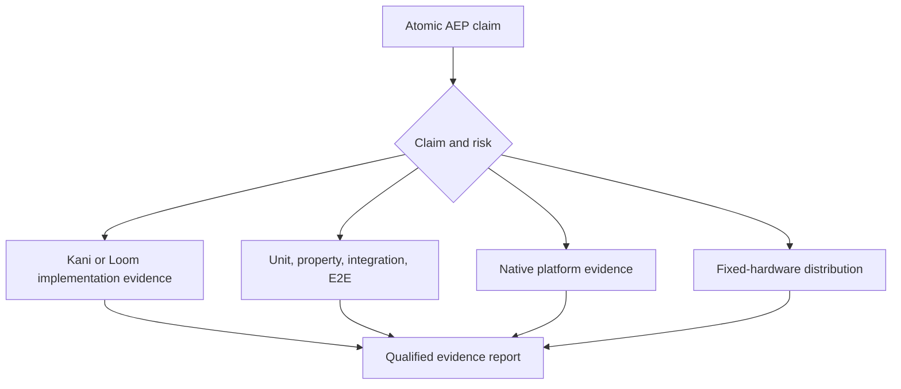

# Assurance strategy

No single technique establishes an Alpine capability. Evidence is selected by
the failure mode and recorded against atomic AEP claims.

| Layer | Establishes | Cannot establish |
| --- | --- | --- |
| Kani | Bounded properties of compiled sequential Rust | Trusted concurrency, native APIs, or performance |
| Loom | Explored Rust synchronization interleavings | Hidden synchronization or operating-system behavior |
| Unit and property tests | Executable examples and broad pure input coverage | Complete state spaces or native integration |
| Integration and E2E | Subsystem and user-journey behavior | Exhaustive interleavings or timing portability |
| Miri and fuzzing | Selected undefined behavior and unexpected input paths | Platform drivers or complete correctness |
| Mutation and coverage | Assertion strength and unexecuted code | Correct specifications |
| Native validation | Metal, windowing, input, IME, and accessibility behavior | General formal properties |
| Fixed hardware | Latency, throughput, energy, allocations, and memory | Correctness by itself |

Every formal artifact states its bounds, assumptions, exclusions, tool version,
and implementation companion. Optional proof controls must distinguish the specific fault they target.
Counterexamples become regression tests when they expose implementation behavior. Flaky tests are defects, and a
threshold or assumption is never weakened merely to obtain a green result.

Lean remains deferred. It becomes relevant only when Alpine has a mathematical
specification and a credible, testable refinement path that Kani, Loom,
and native evidence cannot cover economically.

## Alpine Studio product boundary

The editor-first build has an exact, versioned Apple Silicon normal and build
dependency closure in `assurance/alpine-studio-dependencies.txt`. The fast
repository gate rejects any unreviewed direct or transitive package in either
class, network-capable shipping source, excluded Cargo feature, or excluded
subsystem path. Build-only packages remain visible for supply-chain review even
when Cargo proves they are absent from normal runtime edges. This is an
allowlist, not a claim based only on searching for product names.

The macOS ARM64 CI lane additionally builds the release executable and rejects
network imports and embedded endpoint strings. It retains the binary SHA-256,
byte size, and audit result as a per-revision artifact. These checks establish
the static product boundary; native startup, idle, process, and connection
observation remain separate journey evidence and cannot be inferred from the
static audit alone. A reviewed local language-server dependency changes the
allowlist explicitly but does not weaken the network prohibition.

## Supported platform checks

Product acceptance targets Apple Silicon macOS. Product lint, workspace tests,
native execution and the release boundary audit run on `macos-26`; ordinary CI
has no Linux/Windows product matrix or mandatory cross-compilation targets.
Changes to unsupported-platform branches are not qualified by this workflow.

Native admission executes the combined platform and editor package selection
once and requires the full native-process completion receipt. Metal API/shader
validation remains a separate configuration. Failed, canceled or unexpectedly
skipped required native jobs block the protected `ci-pass` aggregate.
