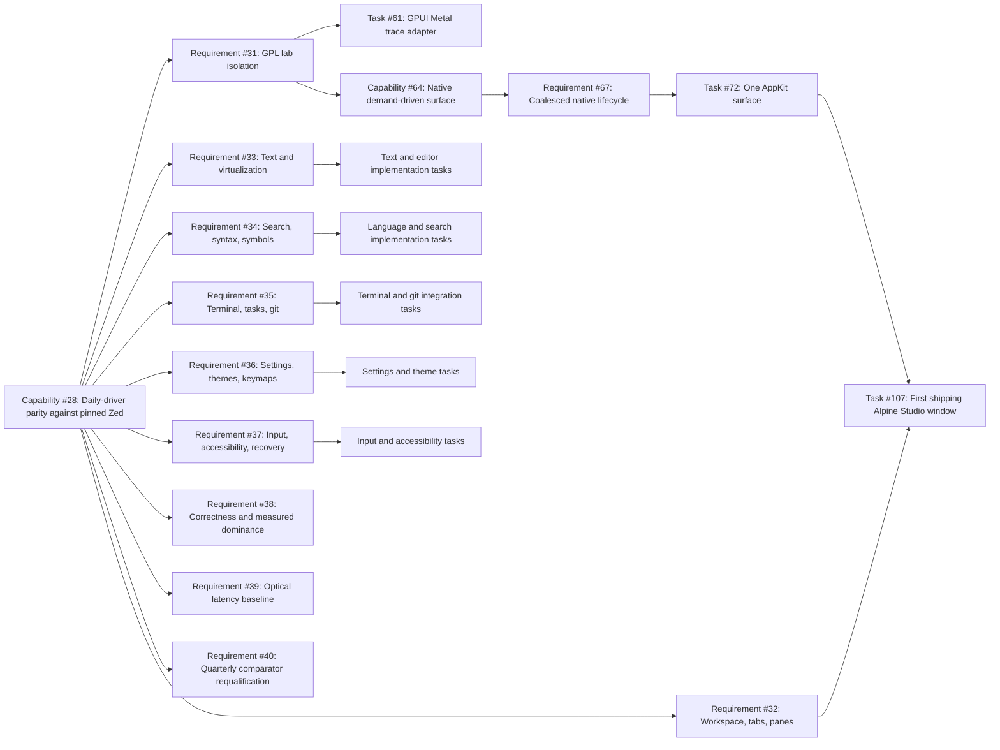

# Alpine Studio high-fidelity path

This is the work-facing map that drives the first Mac-only high-fidelity Alpine Studio
journey. It is tied to Capability #28 and the parity requirements around local
editor workflows.

## Outcome and date

The objective is to run Alpine Studio as a practical local daily-driver editor with
the selected capability parity set and with evidence-first gates before claiming
equivalence or performance improvement over Zed.

## Primary outcome definition

Alpine Studio can do stable, local, single-machine editor work at or above the
selected Zed v1.15.0 baselines in:

- local project open and restoration
- file tree and workspace navigation
- tabs, panes, splits, and history
- production text editing and large-file virtualization
- search and navigation
- language intelligence and diagnostics
- terminal, tasks, and local git workflows
- settings, themes, keymaps, and constrained local extension loading
- keyboard, pointer, focus, IME, accessibility, and recovery behavior
- deterministic native event loop and demand-driven rendering

All above must pass semantic, lifecycle, accessibility, memory, and native
evidence before release-level claims are made.

## Research evidence matrix

- [Research #27](https://github.com/dbuddha/alpine-gpui/issues/27) is the pinned historical comparator baseline for this capability stream.
- [Research #113](https://github.com/dbuddha/alpine-gpui/issues/113) defines the fixed comparator protocol and adaptation split requirements.
- [Research #114](https://github.com/dbuddha/alpine-gpui/issues/114) captures the Sublime local-first speed model and what to copy for local editor responsiveness.
- [Research #115](https://github.com/dbuddha/alpine-gpui/issues/115) defines adaptation protocol boundaries and versioning assumptions.
- [Research #116](https://github.com/dbuddha/alpine-gpui/issues/116) defines fixed-hardware qualification gates and evidence persistence.
- [Zed case study](../case-studies/zed-editor.md)
- [Zed GPUI renderer case study](../case-studies/zed-gpui.md)
- [Sublime case study](../case-studies/sublime-editor.md)

| Layer | Evidence anchors | Accept conditions |
| --- | --- | --- |
| Baseline comparator identity | [#27](https://github.com/dbuddha/alpine-gpui/issues/27), [#113](https://github.com/dbuddha/alpine-gpui/issues/113), [#115](https://github.com/dbuddha/alpine-gpui/issues/115), [#116](https://github.com/dbuddha/alpine-gpui/issues/116) | Stable workload IDs, protocol version pin, explicit hidden/occluded/idle assumptions, and evidence links for each major requirement. |
| Local editor speed model | [#114](https://github.com/dbuddha/alpine-gpui/issues/114), [docs/case-studies/sublime-editor.md](../case-studies/sublime-editor.md), [docs/case-studies/zed-editor.md](../case-studies/zed-editor.md) | Startup to first edit < 300 ms target, coalesced frame policy, bounded residency under sustained edit and large-file scroll. |
| Protocol and attribution split | [#113](https://github.com/dbuddha/alpine-gpui/issues/113), [#115](https://github.com/dbuddha/alpine-gpui/issues/115), [docs/case-studies/zed-gpui.md](../case-studies/zed-gpui.md), [docs/use-cases/alpine-studio-highfidelity.md](alpine-studio-highfidelity.md) | Three timing buckets, zero mixed-metric claims, and deterministic exclusion logs for adaptation overhead. |
| Fixed-hardware qualification | [#116](https://github.com/dbuddha/alpine-gpui/issues/116), [#39](https://github.com/dbuddha/alpine-gpui/issues/39), [#40](https://github.com/dbuddha/alpine-gpui/issues/40) | Warmup + steady-state windows, independent hardware hash per run, and closed behavior when confidence or convergence is incomplete. |

## Explicit exclusions for this version

- remote collaboration and shared live editing
- cloud accounts and hosted model services
- remote development workflows
- debugger toolchain integration
- public extension marketplace parity
- telemetry and business features
- Linux and Windows initial shipping
- no AI feature parity claim outside constrained local behavior

## Deliverable chain from now

## Work breakdown to first usable high-fidelity app

### Phase 1 foundations (already underway)

**Status:** partial; one open PR is implementing the run boundary.

- Close PR / Task #107 to deliver the first shipping one-window app.
- Ensure `NativeSurface::run`, shutdown semantics, and unsupported-host behavior are
  deterministic and covered by native E2E.
- Maintain strict module boundary so application code does not import native handles.

## Requirement graph status (what is approved and what is blocked)

The tracker is the execution owner:

- Approved and currently active: #28, #29, #31, #64, #67
- Open and not yet approved: #32, #33, #34, #35, #36, #37, #38, #39, #40
- Blocked implementation tasks waiting for explicit owner approval labels:
  - #72: needs `review:unsafe` approval for native AppKit/CAMetal ownership and dependency updates.
  - #107: needs explicit safe run-loop contract review and closure proof.
- Open capability #64 and approved Requirement #67 indicate we can proceed only where they intersect with current PR safety evidence.

## Exact work breakdown from now

### 1) Foundation and tracker lock (critical path)

1. Close #107 using `apps/alpine-studio` and `NativeSurface::run` contract:
   - deterministic close behavior, single owned AppKit surface, no polling redraw loop, deterministic callback and shutdown seam.
   - acceptance: structured errors for unsupported platform, thread, already-closing, and unexpected live-loop return.
2. Align #72 implementation with #67 claim set:
   - one native surface, visible/hidden/occluded/zero-size behavior, one drawable per coalesced revision.
   - acceptance: one command commit and one direct presentation at most per revision.
3. Merge foundation evidence into one closed Requirement slice:
   - public API tests, host-native E2E, injection for close/drain, leak/soak evidence.

### 2) Local workspace and navigation stack (Requirement #32)

- Implement persistent workspace/project metadata, folder open/restore, tabs/panes/splits.
- Implement deterministic crash-safe session restore and closure behavior.
- Add navigation history and command-based workspace switching.
- Add restoration and path-error invariants in unit/property/native E2E suites.
- Gate: no approval of #31 bypassed, but #32 must use existing #28/#29 evidence chain.

### 3) Editor core and IME (Requirement #33)

- Implement editing entities for multi-buffer, selection, undo/redo, cursor lifecycle.
- Add large-file and virtualized rendering paths with viewport bounds and bounded edit costs.
- Introduce IME composition and cancellation with composition correctness in native event ordering.
- Add semantic checks over deterministic corpora, offscreen visual smoke, and accessibility traversal.

### 4) Language and symbols stack (Requirement #34)

- Implement local syntax + symbol pipeline for approved file types.
- Add diagnostics, completion, hover, navigation, rename, and formatting with failure isolation.
- Keep language tools strictly bounded by local transport budgets and cancellation behavior.
- Add protocol fuzzing, deterministic mock server suites, and malformed response fallback behavior.

### 5) Developer workflow tools (Requirement #35)

- Add terminal process lifecycle and task cancellation semantics.
- Add local Git flow slices: status, diff, and simple hunk operations.
- Keep process, output buffers, and repo mutation bounded under load.
- Add cancellation, shutdown and leak evidence in native and E2E.

### 6) Settings, theming, and extension containment (Requirement #36)

- Add deterministic settings, theme, and keymap resolution with conflict diagnostics.
- Build constrained extension host with explicit allow-list, capability boundaries, and controlled startup cost.
- Add keymap and theme migration tests plus extension failure isolation.

### 7) Input and accessibility parity slice (Requirement #37)

- Add keyboard/pointer routing with focus correctness, IME composition events, clipboard, and drag.
- Add accessibility inspection and role/value/announcement checks for every approved journey.
- Add lifecycle recovery tests for sleep/wake, close, hidden/visible transitions, and shutdown.

### 8) Performance, latency, and memory lock (Requirements #38 and #39)

- Activate fixed-hardware A/A warmups before any dominance claim.
- Introduce paired raw-sample distributions for both latency and working-memory.
- Bind adaptation-cost decomposition so renderer-only, full-path, and journey-level comparisons are separable.
- Enforce threshold handling where inconclusive/incomplete/inaccurate results fail closed.

### 9) Quarterly comparator governance (Requirement #40)

- Keep comparator pin immutable by default.
- Use issue #27 pattern for radar detection only; full requalification only on explicit quarterly review and owner approval.
- Any new Zed release adoption must include updated case-study revision and re-ran workload calibration.

## What Alpine includes versus excludes for this first high-fidelity pass

### Included in scope

- Local project open, restore, navigation, tabs, splits.
- Production text editing with deterministic undo/redo and IME.
- Virtualized text rendering and multi-cursor behavior.
- Search/filter/navigation, language diagnostics, and local command flow.
- Terminal and local Git primitives.
- Settings, themes, keymaps, and constrained extension loading.
- Focus, pointer, clipboard, accessibility scaffolding, and lifecycle recovery.

### Explicitly excluded in this phase

- collaboration and shared live editing
- remote development and cloud accounts
- hosted AI and model services
- debugger integration
- public extension marketplace
- telemetry and business analytics
- Linux/Windows parity
- any exact visual or binary parity with upstream Zed
- automatic upstream sync or source ingestion

## Performance and memory strategy for this phase

Priority is to first keep semantic and accessibility gates green, then optimize only where behavior is preserved.

### GPUI + native render stack

1. Keep zero-idle behavior strict: the display link is paused when clean, hidden, occluded, zero-sized, or stopped.
2. Coalesce dirty revisions to one callback submission with latest-wins semantics.
3. Avoid full-scene invalidation: only redraw when immutable scene diff requires output.
4. Bind scene serialization to bounded geometry and primitive sets for stable decode and accounting.
5. Track allocation, draw, upload, retention, and readback in structured counters and keep retained bytes flat in steady state.
6. Reject long-lifetime command queue accumulation by requiring one terminal outcome for each submitted frame.
7. Use warmup + repeated-frame soak before measurement, then compare tail and regression bands on fixed hardware.
8. Bound font, glyph, and symbol caches with lifecycle-based eviction and measured pressure paths.
9. Make parser and language adapters failure-isolated; never let adapters own allocator growth.
10. Keep startup and first-frame assets preloaded minimally and lazy-load extras only after interaction.

### Measurement pipeline expected outcome

- `alpine-journey/v1`: semantic + accessibility + lifecycle alignment before timing.
- `alpine-scene-trace/v1`: renderer-only paired path with explicit adaptation-cost reporting.
- `alpine-qualification/v1`: raw distributions, exclusion logs, assumptions, and three independent windows for qualified claims.

### Phase 2 runtime structure and composition (blocking or near-blocking)

- Build workspace entities and persistent project state for #32.
- Add deterministic session restore and closure behavior with crash-safe state.
- Add command palette and navigation surfaces needed by local daily-driver use.
- Add explicit invariants and tests for invalidation to rendering and close races.

### Phase 3 editing, text, and IME core

- Implement editor slices for #33:
  - multi-buffer and selection lifecycle
  - large-file virtualization strategy
  - undo/redo and undo-group integrity
  - cursor and typing behavior under composition
- Validate through unit/property/integration tests and native a11y smoke.

### Phase 4 local language intelligence

- Implement #34:
  - symbol search and go-to-definition
  - completion flow and diagnostics
- Keep language service adapters bounded and failure-driven rather than silent.

### Phase 5 developer tooling workflows

- Implement #35:
  - command palette command execution and repeatable history
  - terminal sessions and process lifecycle
  - local git status, file operations, and diff-style review path

### Phase 6 environment shaping and settings

- Implement #36:
  - setting registry and migration path
  - theme and icon stack
  - keymap precedence and conflict paths
  - constrained local extension host for startup-critical extras only

### Phase 7 input correctness and accessibility

- Implement #37:
  - keyboard and pointer routing under focus changes
  - IME composition correctness and cancellation
  - clipboard and accessibility trees for shell/editor controls
  - recovery paths for close, sleep, wake, and shutdown

### Phase 8 proof and performance lock

- Complete #38, #39, and #40 with calibrated, fixed-hardware evidence.
- Add workload identity and provenance chain for every benchmark claim.
- Ensure no optimization claim can be made before semantic and accessibility gates pass.

## Evidence pipeline by slice

For every phase above:

- unit tests for state transition correctness
- property tests for bounded invariants
- integration tests for subsystem wiring
- native tests for platform behavior
- dedicated evidence mapping from requirement to tests, proofs, and artifacts
- adversarial review for concurrency, shutdown, failure, and unsafe paths

## Work and time estimate from current position

Estimated in this repo state with one owner and one active branch:

- **Minimum to first usable one-window high-fidelity app**: 10 to 14 weeks
- **Likely to production quality parity closure under Capability #28**: 6 to 9 months

Assumptions:

- one engineer, one branch, one CI lane
- no external API or design blockers
- native hardware qualification only after core behavior gates pass
- feature creep reduced by strict exclusion list

## Milestone dependency matrix for planning

| Milestone | Active open issues now | Primary owner chain |
| --- | --- | --- |
| M2 | #64 #67 #72 #107 | Foundation app runtime and native loop ownership |
| M3 | #32 | Workspace, tabs, panes, and restore |
| M4 | #33 #37 | Core text, IME, and accessibility |
| M5 | #34 #35 #36 | Feature-rich editor workflow |
| M7 | #38 #39 #40 | Measurement and release lock |

## Why this is the fastest safe route

This path locks correctness and lifecycle first. Without this, performance work can
create speedups by removing behavior. We do not allow that. For every fast path we
require the same scenario, same semantics, same lifecycle, and then compare.
