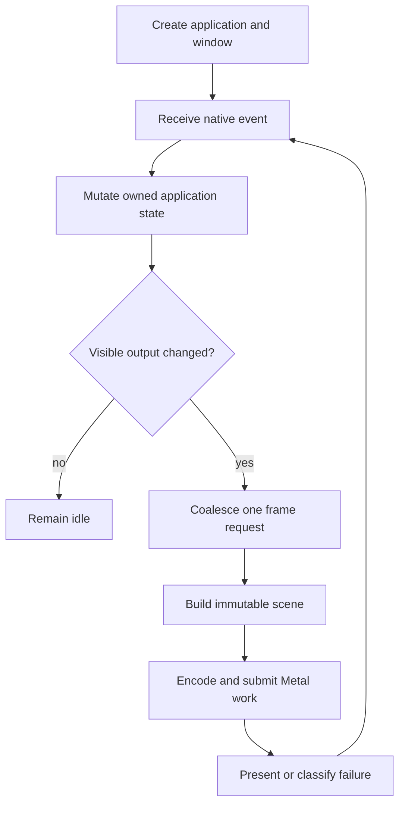

# Desktop application foundation

## Persona and outcome

A Rust application developer can create an Alpine application, open a native
Apple Silicon macOS window, mutate application state, present exactly the frames
required by visible changes, interact through native input and accessibility,
and test the same behavior without a display.

## Primary journey

## Alternate and failure paths

Surface loss, device loss, cancellation, sleep, wake, resize, minimize, restore,
and shutdown must preserve ownership and cannot destroy in-flight resources.
Unsupported capabilities and allocation failures become structured outcomes.
Input, focus, IME, and accessibility ordering must remain deterministic under
nondeterministic native event sequences.

## Acceptance direction

The complete journey needs model-checked lifecycle design, implementation-level
proofs for bounded pure transitions, Loom once synchronization exists, native
Metal and platform automation, semantic and offscreen visual oracles, qualified
performance and memory distributions, and an end-to-end dogfood application.
GitHub Capabilities and Requirements set the current acceptance contract.
